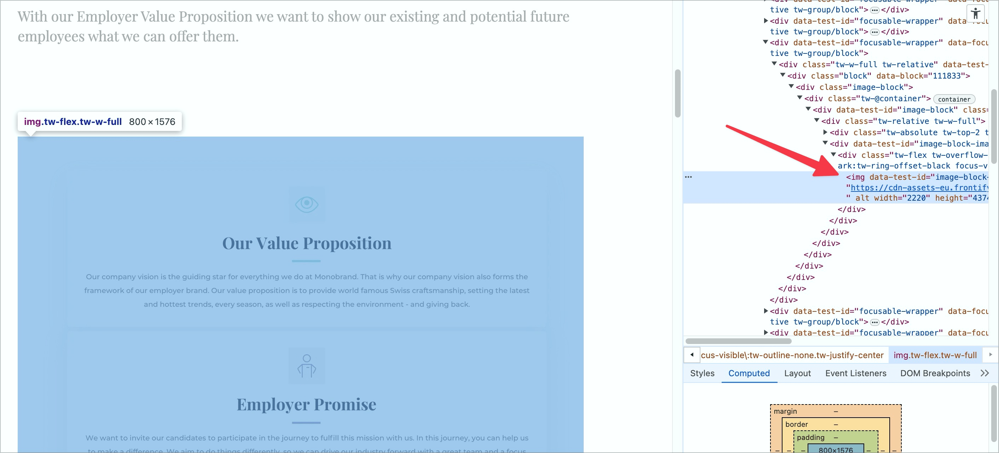

# ✅ Texte nicht als Grafiken

WCAG-Kriterium: [📜 1.4.5 Bilder von Text - AA](..)

## Beschreibung

Texte werden nicht nur als Grafiken eingebunden, denn diese lassen keine Anpassungen zu (z.B. Grösse skalieren, Vorder- und Hintergrund-Farben verändern, Schriftart ersetzen, etc.). Ausgenommen sind Texte, bei denen eine bestimmte Art der Präsentation für die vermittelte Information unentbehrlich ist (z.B. Logos oder Markennamen).

## Prüfmethode (in Kürze)

**Manuelle Prüfung:** Elemente durchsehen und Schriftgrafiken ermitteln.

## Prüfmethode für Web (ausführlich)

### Prüf-Schritte

1. Seite öffnen
1. Inhalte auf Schriftgrafiken absuchen
1. Sicherstellen, dass Schriftgrafiken nur in legitimen Situationen verwendet werden
    - **🙂 Beispiel:** Es sind keinerlei Schriftgrafiken vorhanden
    - **🙂 Beispiel:** Ein grafisch aufwändiges Logo ist als Schriftgrafik eingebunden
        - ⚠️ Dieses muss dann natürlich einen adäquaten Alternativtext aufweisen, siehe [✅ Informative Grafiken](/de/wcag/1.1.1-nicht-text-inhalt/informative-grafiken) bzw. [✅ Verlinktes Seiten-Logo](/de/wcag/1.1.1-nicht-text-inhalt/verlinktes-seiten-logo)
    - **🙄 Beispiel:** Eine Überschrift ist als Schriftgrafik, da sie einige visuelle Dekorationen aufweist
        - ⚠️ Bei sowas muss man sich immer fragen: legitimiert die rein ästhetische Optimierung eines Elements tatsächlich die Verringerung ihrer Barrierefreiheit?
    - **😡 Beispiel:** Ein komplexer Textinhalt (z.B. Paragrafen, Listen, etc.) ist komplett als Schriftgrafik umgesetzt

## Screenshots typischer Fälle

