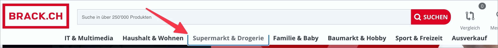

# Prüfpunkt: Tastaturfallen

## Beschreibung

Es treten keine Tastaturfallen auf. Alle Bedienelemente können mit der Tastatur erreicht und wieder verlassen werden. Die uneingeschränkte Navigation rückwärts mit `Shift`-`Tab` ist sichergestellt.

## Prüfmethode (in Kürze)

**Tastatur:** Durch Elemente navigieren mittels Tab-Taste und darauf achten, dass alle Elemente erreicht und wieder verlassen werden können.

## Prüfmethode für Web (ausführlich)

### Prüf-Schritte

1. Seite öffnen
1. Mit `Tab`-Taste durch die Seite navigieren und jeweils prüfen:
    - Können alle fokussierten Elemente (sowie Gruppen von Elementen) wieder verlassen werden?
        - **😡 Beispiel:** Bei `Tab` in einem online Code-Editor wird die aktuelle Zeile eingerückt.
        - **😡 Beispiel:** Bei `Tab` in einer Navigation (Link-Liste) springt der Fokus vom letzten Link zurück auf den ersten (bleibt innerhalb der Gruppe gefangen).
        - **🙂 Beispiel:** Der Fokus bleibt zwar auf die Inhalte eines gerade angezeigten Dialogs beschränkt, aber nach Bestätigen oder Abbrechen des Dialogs ist der Fokus wieder frei.
1. Mit `Shift`-`Tab` dasselbe rückwärts prüfen

## Screenshots typischer Fälle

### Fokus gefangen in Gruppe von Elementen

Nach dem letzten Element "Ausverkauf" springt man direkt zurück zum ersten Element "IT & Multimedia".