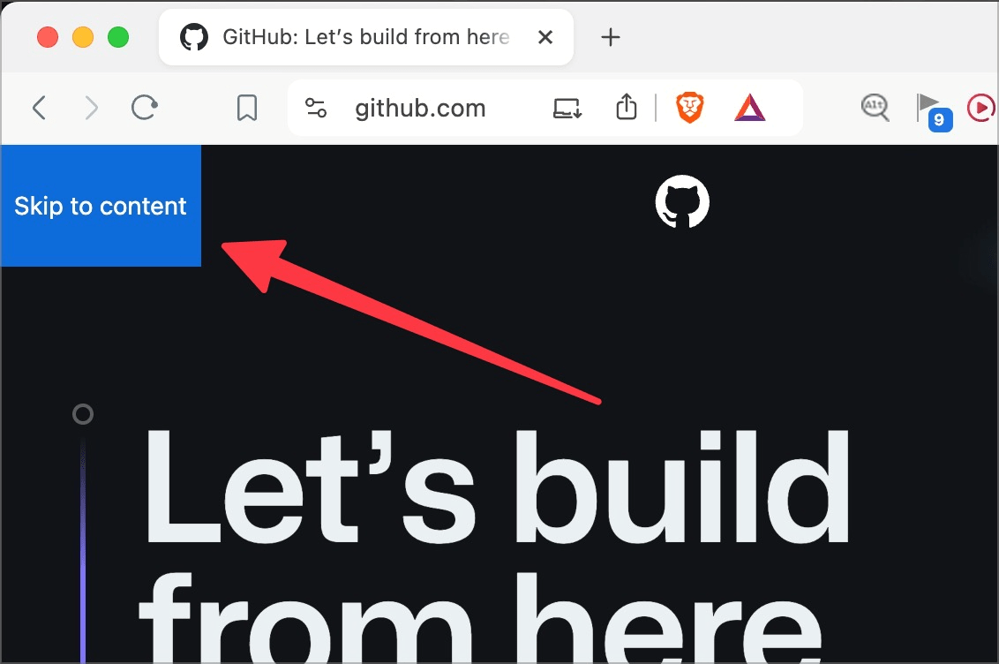

# Prüfpunkt: Sprunglinks

## Beschreibung

Sprunglinks ermöglichen das einfache Überspringen von sich wiederholenden Informationsblöcken (z.B. Navigation, Headerbereich) mit der Tastatur.

## Prüfmethode (in Kürze)

**Tastatur:** Nach Seiten-Laden direkt die Tab-Taste drücken und darauf achten, ob angewähltes Element ein Sprunglink ist, und ob er wie erwartet funktioniert.

## Prüfmethode für Web (ausführlich)

### Test-Schritte

1. Seite öffnen
1. `Tab`-Taste 1x betätigen
1. Sicher stellen, dass dadurch ein Sprunglink angezeigt wird, dessen Aktivierung zum Inhalt führt
    - **🙂 Beispiel:** Es wird links oben ein Sprunglink "Zum Inhalt springen" (o.ä.) angezeigt, dessen Betätigung zum Inhalt führt. → Dies bedeutet, dass der Fokus sich nun z.B. auf dem Inhalts-Container befindet (oder auf dem ersten Element des Inhalts, z.B. eine Überschrift). Weiteres Betätigen von `Tab` bewegt den Fokus durch die Inhalte.
        - **😡 Beispiel:** Der Fokus wird nicht (oder nicht korrekt) gesetzt. ⚠️ Manchmal z.B. wird nur der Viewport zum Inhalt gescrollt, aber der Fokus verharrt am Anfang der Seite, so dass beim weiteren Betätigen von `Tab` der Fokus trotzdem am Anfang der Seite startet.
    - **🙄 Beispiel:** Eine sehr einfache Webseite bietet keinen Sprunglink an. → Wenn z.B. der Kopfbereich kaum fokussierbare Elemente aufweist, schafft ein Sprunglink kaum Mehrwert.

⚠️ Es kann auch weitere Sprunglinks auf einer Seite haben, z.B. zur Suche, zum Fussbereich, etc. Dies kann je nach Webseite sinnvoll sein, aber man sollte es nicht übertreiben!

## Screenshots typischer Fälle

