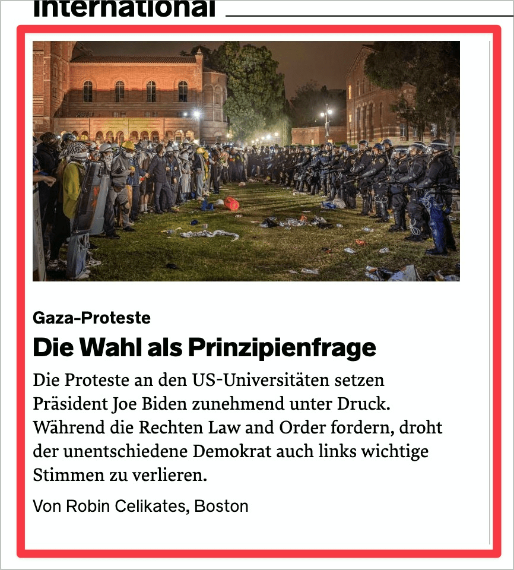

# Prüfpunkt: Mehrfache Links

## Beschreibung

Mehrfache, unterschiedliche Links (z.B. eine Überschrift, eine Grafik und ein zusätzlicher Textlink) auf dasselbe Ziel werden vermieden.

## Prüfmethode (in Kürze)

**Screenreader:** Links auflisten und prüfen, ob mehrfache Verlinkungen vorhanden sind.

## Prüfmethode für Web (ausführlich)

### Prüf-Schritte

1. Seite öffnen
1. Ausschau halten nach mehreren Links, die auf dasselbe Ziel zeigen (mit Maus drüber hovern, im Zweifelsfall die Links besuchen):
    - **🙂 Beispiel:** Eine Card (✅-12) ist so umgesetzt, dass sie vom Screenreader 🏷️-13 als ein einziger Link angesagt wird
    - **🙄 Beispiel:** Eine Card ist zwar als einziger Link umgesetzt, die einzelnen Inhalts-Elemente werden aber vom Screenreader als einzelne Links angesagt (z.B. "Link News Überschrift Ebene 3", "Link Bild X", "Link ...")
    - **😡 Beispiel:** Mehrere Inhalts-Elemente einer Card sind jeweils als Link umgesetzt

## Screenshots typischer Fälle

