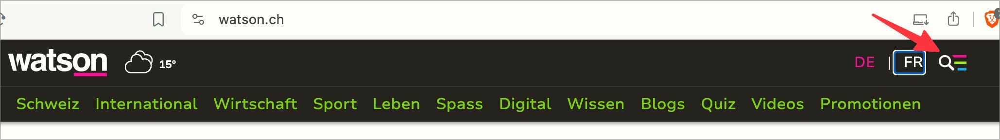

# ✅ Mit der Tastatur bedienbar

WCAG-Kriterium: [📜 2.1.1 Tastatur - A](..)

## Beschreibung

Inhalte/Funktionalitäten (Seitenfunktionalitäten, Seitenelemente, Formularfelder, Kontrollelemente, Schalter, Links, Dialoge, Multimedia-Steuerungen, etc.) sind mit der Tastatur alleine (d.h. ohne Zeigegerät) erreichbar und können erwartungsgemäss bedient werden.

## Prüfmethode (in Kürze)

**Tastatur:** Durch Elemente navigieren mittels `Tab`-Taste, mit ihnen interagieren und darauf achten, dass sie sich erwartungsgemäss verhalten: Aktivieren mittels `Enter`- oder `Leer`-Taste, weitere Interaktions-Möglichkeiten oftmals mittels `Pfeil`-Tasten.

## Prüfmethode für Web (ausführlich)

### Test-Schritte

1. Seite öffnen
1. Mit `Tab`-Taste durch die Seite navigieren und jeweils prüfen:
    - Sind alle interaktiven Elemente fokussierbar?
        - **🙂 Beispiel:** Alle nativen interaktiven HTML-Elemente sind von Natur aus fokussierbar (z.B. `<button>` oder `<a href>`).
        - **😡 Beispiel:** Ein custom Link oder Schalter (``) ist nicht fokussierbar.
        - **🙄 Beispiel:** Ein custom Link oder Schalter (``) ist fokussierbar.
            - ⚠️ Es sollten aber besser native HTML-Elemente eingesetzt werden!
        - **😡 Beispiel:** Ein JavaScript-Widget ist ggf. nicht fokussierbar.
    - Falls Fokus schlecht (oder gar nicht) sichtbar → [🏷️ NerdeFocus Extension](/de/tags/nerdefocus-extension) aktivieren
1. Sicherstellen, dass alle interaktiven Elemente mit Tastatur alleine bedienbar sind:
    - Links und Schalter mit `Enter`-Taste aktivierbar?
        - **🙂 Beispiel:** Alle nativen interaktiven HTML-Elemente sind von Natur aus aktivierbar (z.B. `<button>` oder `<a href>`).
        - **😡 Beispiel:** Ein custom Link oder Schalter (``) ist ggf. nicht aktivierbar.
        - **😡 Beispiel:** Ein JavaScript-Widget ist ggf. nicht aktivierbar.
    - Alle Formular-Elemente erwartungsgemäss bedienbar?
        - **🙂 Beispiel:** Alle nativen Formular-Elemente sind von Natur aus bedienbar (z.B. mit `Hoch`/`Runter` kann Wert gewählt werden in einem `<select>` oder in einer Gruppe von Radiobuttons, mit `Leer` können Checkboxen an-/abgewählt werden).
        - **😡 Beispiel:** Die custom Implementation einer Checkbox kann weder mit `Enter` noch `Leer`
an-/abgewählt werden.
        - **😡 Beispiel:** Die custom Implementation einer ausklappbaren Liste von Werten kann mit `Hoch`/`Runter` nicht bedient werden.
    - JavaScript-Widgets erwartungsgemäss steuerbar?
        - Für Tastatur-Bedienung geläufiger JavaScript-Widgets siehe:
            - Akkordeons: [✅ Akkordeons](/de/wcag/4.1.2a-erweiterte-steuerelemente-widgets/akkordeons)
            - Autocompletes: [✅ Autocompletes (Comboboxen)](/de/wcag/4.1.2a-erweiterte-steuerelemente-widgets/autocompletes-comboboxen)
            - Datepicker: [✅ Datepicker / Timepicker](/de/wcag/4.1.2a-erweiterte-steuerelemente-widgets/datepicker-timepicker)
            - Dialoge: [✅ Dialoge](/de/wcag/4.1.2a-erweiterte-steuerelemente-widgets/dialoge)
            - Aufklapp-Elemente (Dropdowns): [✅ Dropdowns (Aufklapp-Elemente)](/de/wcag/4.1.2a-erweiterte-steuerelemente-widgets/dropdowns-aufklapp-elemente)
            - Karusselle: [✅ Karusselle](/de/wcag/4.1.2a-erweiterte-steuerelemente-widgets/karusselle)
            - Tabs: [✅ Tabs / Tablisten](/de/wcag/4.1.2a-erweiterte-steuerelemente-widgets/tabs-tablisten)
            - Tooltips: [✅ Tooltips / Toggletips](/de/wcag/4.1.2a-erweiterte-steuerelemente-widgets/tooltips-toggletips)
            - Cards: [✅-112 ⚠️](javascript: alert('Wie gesagt: Verlinkung fehlgeschlagen... 🙄 Wahrscheinlich hast du eine falsche oder veraltete ID verwendet?')){title='Verlinkung fehlgeschlagen!'}
            - Weitere JavaScript-Widgets: [✅-108 ⚠️](javascript: alert('Wie gesagt: Verlinkung fehlgeschlagen... 🙄 Wahrscheinlich hast du eine falsche oder veraltete ID verwendet?')){title='Verlinkung fehlgeschlagen!'}

### Verwandte Prüfpunkte

- Bei Tastatur-Fallen: [✅ Tastaturfallen](/de/wcag/2.1.2-keine-tastaturfalle/tastaturfallen)
- Bei mangelhafter Fokus-Reihenfolge: [✅ Fokus-Reihenfolge](/de/wcag/2.4.3-fokus-reihenfolge/fokus-reihenfolge)
- Bei mangelhafter Fokus-Führung: [✅ Fokus-Führung](/de/wcag/2.4.3-fokus-reihenfolge/fokus-fuehrung)
- Wenn Tastatur-Fokus nicht sichtbar: [✅ Tastatur-Fokus sichtbar](/de/wcag/2.4.7-fokus-sichtbar/tastatur-fokus-sichtbar)

## Screenshots typischer Fälle

### Element nicht fokussierbar

Das Element zum Ausklappen des Hamburger-Menüs kann nicht fokussiert werden.
