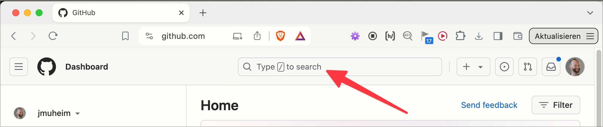
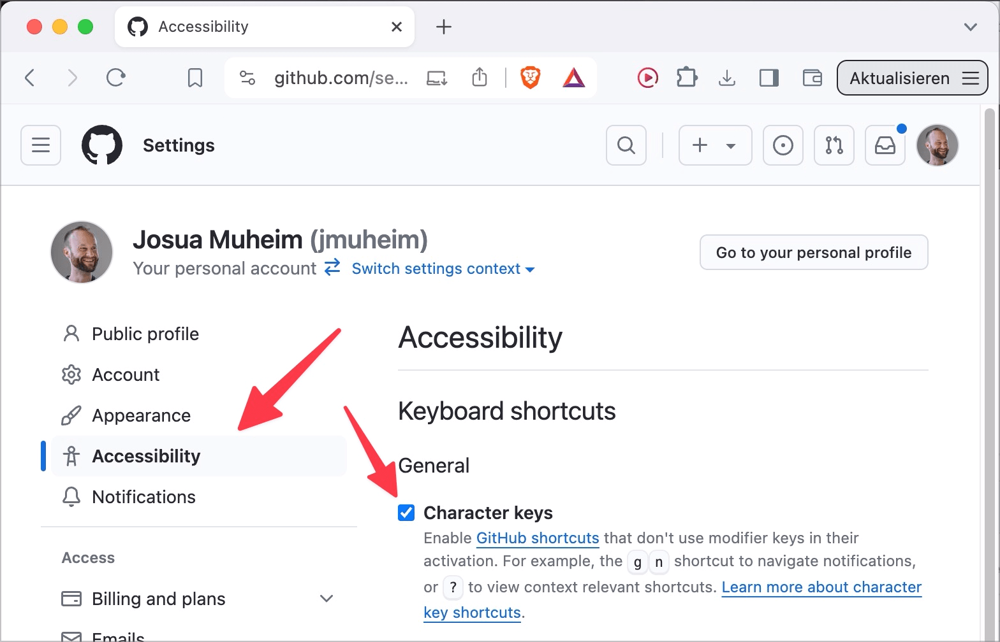

# ✅ Einzeltasten-Kurzbefehle

WCAG-Kriterium: [📜 2.1.4 Tastaturkurzbefehle - A](..)

## Beschreibung

Einzeltasten-Kurzbefehle (bestehend aus einer einzelnen Buchstaben-, Interpunktions-, Zahlen- oder Symbolzeichentaste) sind entweder deaktivierbar oder veränderbar oder nur bei Fokus aktiv.

## Prüfmethode (in Kürze)

**Bookmarklet "Tastatur-Kurzbefehle auslösen":** Ausführen und auf Veränderungen der Inhalte achten: Hat sich irgendwo ein Element verändert, oder ist eines neu aufgetaucht bzw. verschwunden? Wurde der Fokus irgendwohin gesetzt?

## Prüfmethode für Web (ausführlich)

### Prüf-Schritte

1. Seite öffnen
1. [🏷️ Trigger Character Key Shortcuts Bookmarklet](/de/tags/trigger-character-key-shortcuts-bookmarklet) aktivieren
1. Prüfen, ob irgendeine Funktionalität ausgeführt wurde
    - ⚠️ Dies wird erkennbar, wenn sich visuell irgend etwas auf der Seite verändert, z.B. wenn der Fokus in ein Element gesetzt oder ein Element ausgeklappt wird
1. Falls eine Funktionalität ausgeführt wurde: Können die entsprechenden Kurzbefehle irgendwie deaktiviert oder verändert werden?
    - **🙂 Beispiel:** Eine Webseite erlaubt es, den Fokus mittels `/` direkt ins Suchfeld zu setzen; dies kann aber einfach deaktiviert (oder geändert werden), ohne Einloggen (z.B. via kleinem Popup)
        - **🙄 Beispiel:** Man kann es in den Einstellungen des eingeloggten Nutzers deaktivieren (oder ändern) → ⚠️ Dazu muss man sich ggf. erst einmal registrieren und einloggen, was bereits eine Hürde sein kann
        - **😡 Beispiel:** Man kann es nicht deaktivieren

## Prüfmethode für Mobile (Ergänzungen zu Web)

Wird oft vergessen, aber auch Mobile Apps müssen komplett mit Tastatur gesteuert werden können.

## Prüfmethode für PDF (Ergänzungen zu Web)

Für PDFs nicht relevant.

## Details zum blinden Testen

Grundsätzlich testbar, wenn man bewusst in den "Application Modus" wechselt (`Insert`+`Space`), welcher alle Tastenanschläge direkt an den Browser weiter gibt.

## Screenshots typischer Fälle

## Videos

Keine Videos verfügbar.
