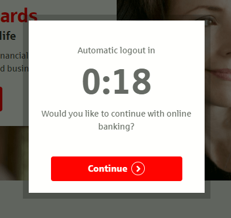
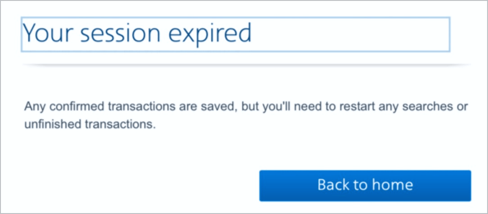

# Prüfpunkt: Timeout-Zeitintervalle

## Beschreibung

Timeout-Zeitintervalle sind anpassbar oder können deaktiviert werden. Es ist ein deutlicher Hinweis auf diese Möglichkeiten erforderlich. Für die Anpassungsmöglichkeiten gilt: Entweder ist das Timeout auf mindestens den zehnfachen Wert der Standardeinstellung möglich oder es erfolgt eine Warnung, bevor das Timeout abläuft, und es werden mindestens 20 Sekunden zur Verfügung gestellt, um mit einer einfachen Aktion (z.B. "Drücken Sie die Leertaste") die verfügbare Zeit zu verlängern. Diese Option muss mindestens zehn Mal bestehen.

## Prüfmethode (in Kürze)

**Manuelle Prüfung:** Prozesse durchlaufen und darauf achten, dass sie sich erwartungsgemäss verhalten: Können Zeitintervalle angepasst werden? Sind sie frühzeitig erfahrbar und verlängerbar (auch mittels Tastatur bzw. Screenreader)? Ggf. Rücksprache mit Seitenbetreiber halten, um keine Zeitintervalle zu übersehen.

## Prüfmethode für Web (ausführlich)

### Prüf-Schritte

1. Seite öffnen
1. Ausschau halten nach möglichen Timeouts und diese (wenn möglich) auslösen
    - ⚠️ Dies ist oft nicht manuell möglich bzw. pragmatisch; ggf. muss mit dem Seitenbetreiber abgeklärt werden, welche Timeouts vorhanden sind und wie sie funktionieren.
1. Sicherstellen, dass die Timeouts barrierefrei umgesetzt sind (oder eine bewilligte Ausnahme darstellen)
    - **🙂 Beispiel:** Eine Seite warnt mind. 20 Sekunden vor Ablauf der Sitzung, dass diese bald abläuft, und erlaubt das einfache Verlängern (z.B. mittels eines Schalters "Sitzung verlängern"); dies muss mind. 10x hinter einander möglich sein
        - **😡 Beispiel:** Die Seite warnt zwar, man kann aber nur wenige Male verlängern
        - **😡 Beispiel:** Die Seite warnt zwar, es gibt aber keine Möglichkeit zu Verlängerung
        - **😡 Beispiel:** Die Seite warnt **nicht** bzw. beendet die Session einfach
    - **🙂 Beispiel:** Eine Seite weist darauf hin, dass eine Sitzung ablaufen kann, und bietet die Möglichkeit an, die Sitzung auf mind. das 10-fache der Standard-Einstellung zu verlängern (oder 20h insgesamt)
        - **😡 Beispiel:** Die Möglichkeit besteht, das Timeout auf maximal das dreifache zu verlängern (z.B. 30min statt 10min)
            - ⚠️ Wenn das Dreifache aber mind. 20h ergibt, ist es natürlich wieder okay
        - **🙂 Beispiel:** Die Möglichkeit besteht, das Timeout komplett zu deaktivieren
    - **🙂 Beispiel:** Eine Online-Auktion wird in exakt 3min und 21sec beendet; dieses Timeout kann **nicht** verändert werden (da dies den Sinn einer Auktion ad absurdum führen würde)

## Screenshots typischer Fälle

