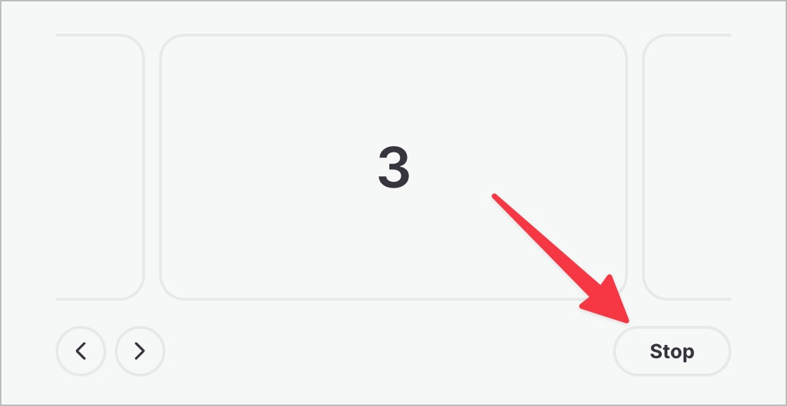

# ✅ Dauerhaft animierte Inhalte

WCAG-Kriterium: [📜 2.2.2 Pausieren, stoppen, ausblenden - A](..)

## Beschreibung

Dauerhaft animierte Inhalte (länger als fünf Sekunden) können mittels gut sichtbarer Bedienelemente pausiert, gestoppt oder ausgeblendet werden. Als dauerhaft animiert gelten Inhalte, die sich bewegen und/oder automatisch aktualisieren, die blinken oder scrollen. Sie beginnen automatisch und werden parallel zu anderen Inhalten dargestellt.

## Prüfmethode (in Kürze)

**Manuelle Prüfung:** Inhalte durchsehen, mit ihnen interagieren und darauf achten, dass sie sich erwartungsgemäss verhalten: Können animierte Inhalte pausiert, gestoppt oder ausgeblendet werden?

## Prüfmethode für Web (ausführlich)

### Test-Schritte

1. Seite öffnen
1. Sicherstellen, dass keine dauerhaft animierten Elemente vorhanden sind:
    - **🙂 Beispiel:** Ein News-Ticker oder Lauftext-Werbebanner verfügt über einen "Pausieren"-Schalter.
        - **😡 Beispiel:** Das Element kann nicht pausiert werden.
    - **🙂 Beispiel:** Ein Karussell, welches automatisch regelmässig zur nächsten Folie wechselt, kann mittels "Pausieren"-Schalter pausiert werden.
        - **🙄 Beispiel:** Das Element hat keinen "Pausieren"-Schalter; sobald man jedoch manuell zu einer anderen Folie wechselt (z.B. durch Klicken auf "Nächste Folie"), passiert auch kein automatisches Wechseln mehr. → Wir empfehlen trotzdem, einen "Pausieren"-Schalter anzubieten, da dies expliziter ist.
        - **😡 Beispiel:** Das Element kann nicht pausiert werden.
    - **🙂 Beispiel:** Ein blinkender Werbe-Banner kann pausiert werden. Das komplette Entfernen des Werbe-Banners mittels Klick auf "X" kann demselben Zweck dienen.
        - **😡 Beispiel:** Das Werbe-Banner kann nicht pausiert werden.
    - **🙄 Beispiel:** Ein automatisch abspielendes Video kann pausiert werden.
        - ⚠️ Wir raten generell davon ab, Videos automatisch abzuspielen, insbesondere weil deren Audio auch den Audio-Kanal eines Screenreaders behelligen kann, was enorm störend sein kann.
        - **🙄 Beispiel:** Das Video kann nicht pausiert werden, dauert aber höchstens 5 Sekunden.
        - **😡 Beispiel:** Das Video kann nicht pausiert werden.

## Screenshots typischer Fälle

