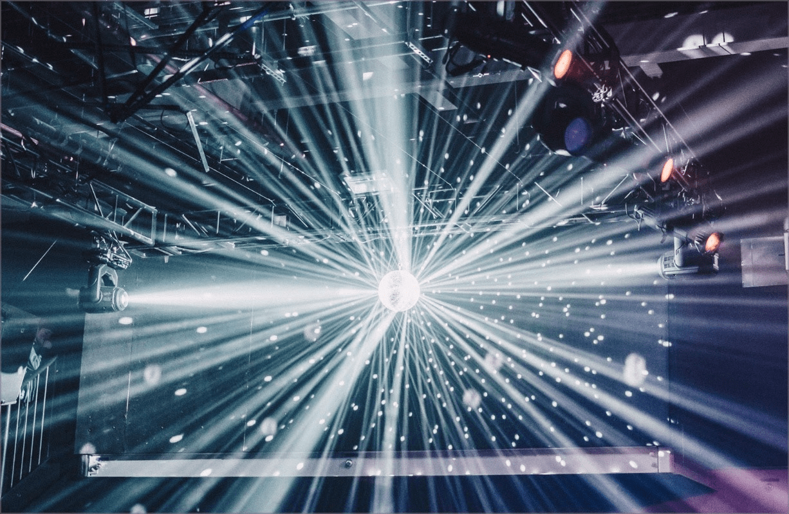

# ✅ Dreimaliges Blitzen

## Beschreibung

Es gibt keine Elemente, die öfter als dreimal in einer Sekunde blitzen, oder der Blitz ist unterhalb eines definierten Grenzwerts für Blitze.

## Prüfmethode (in Kürze)

**Photosensitive Epilepsy Analysis Tool (PEAT):** Im Zweifelsfall Screencapture-Video als .avi erstellen und mit Prüftool analysieren.

## Prüfmethode für Web (ausführlich)

### Test-Schritte

1. Seite öffnen
1. Sicherstellen, dass Inhalte nicht öfter als 3x pro Sekunde blitzen
    - **😡 Beispiel:** Der schwarze Hintergrund einer Webseite blitzt mehrfach jede Sekunde (Strobo-Effekt)
        - ⚠️ Selbst wenn das Blitzen deutlich seltener auftritt (und keine lichtempfindliche Anfallsleiden auslöst), raten wir von solchen Effekten ab.
    - **😡 Beispiel:** Ein als Horror-Film aufgemachtes Werbe-Video zeigt eine Szene, in welcher eine nächtliche Szene während einer Sekunde mehrfach vom Leuchten eines Blitzes erhellt wird.

⚠️ Zugegeben, diese Anforderung wurde in unserer jahrelangen Testtätigkeit kaum je verletzt. Im Zweifelsfall sollte aber auf professionelle Tools wie etwa das [Photosensitive Epilepsy Analysis Tool (PEAT)](https://trace.umd.edu/peat/) zurückgegriffen werden.

## Screenshots typischer Fälle

