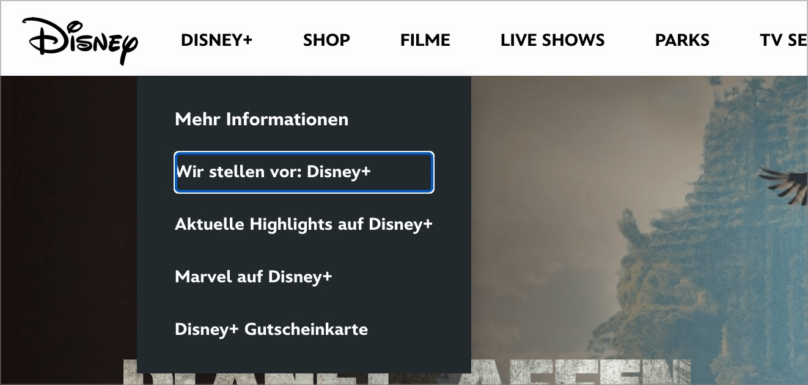

# ✅ Unternavigationspunkte überspringen

WCAG-Kriterium: [📜 2.4.1 Blöcke überspringen - A](..)

## Beschreibung

Unter-Navigationspunkte können mit der Tastatur übersprungen werden. Unter-Navigationen werden entweder erst auf Auslösen geöffnet (z.B. mittels `Enter`- oder `Pfeil-nach-unten`-Taste), oder Unter-Navigationen werden zwar bereits bei Fokus angezeigt, aber es muss nicht mit den Unter-Navigationspunkten interagiert werden (Schliessen derselben durch `Esc`-Taste, oder mit der `Tab`-Taste wird zum nächsten Haupt-Navigationspunkt gesprungen; Hinein-Navigieren in die Unter-Navigation nur mit `Pfeil`-Tasten).

## Prüfmethode (in Kürze)

**Tastatur:** Durch Elemente navigieren mittels Tab-Taste, mit ihnen interagieren und darauf achten, dass Unternavigationspunkte übersprungen werden können.

## Prüfmethode für Web (ausführlich)

### Test-Schritte

1. Seite öffnen
1. Mit `Tab-Taste` durch ausklappbare Elemente navigieren
1. Sicher stellen, dass Inhalte von ausklappbaren Elementen bei `Tab`-Navigation übersprungen werden können
    - **🙂 Beispiel:** Ausklappbare Sub-Elemente in einer Navigation werden nur auf Wunsch des Nutzers ausgeklappt (also bei Klicken bzw. Betätigung der `Enter`-Taste)
        - **🙄 Beispiel:** Die Sub-Elemente werden bereits bei Fokus des Eltern-Elements ausgeklappt, sie können aber mittels Betätigen von `Esc` (oder eines "X"-Schalters) wieder geschlossen werden. ⚠️ Wir empfehlen trotzdem, bei Fokus nichts automatisch zu öffnen, da das manuelle Schliessen Zusatzaufwand bedeutet (gerade bei mehreren solchen Elementen).
            - **🙄 Beispiel:** Die Sub-Elemente können nicht geschlossen werden, aber erneutes Drücken von `Tab` setzt den Fokus **nicht** in die Sub-Elemente hinein, sondern zum nächsten Parent-Element; Navigation durch die Sub-Elemente passiert dann via Pfeiltasten. ⚠️ Wir empfehlen, Navigation via Pfeiltasten nur in Desktop-Software-ähnlichen Elementen einzusetzen (z.B. das Menü in Google Docs); für klassische Webseiten reicht die `Tab`-Taste meistens vollauf.
            - **😡 Beispiel:** Die Sub-Elemente können nicht geschlossen (und auch nicht auf andere Art und Weise übersprungen) werden, sprich: man muss sich durch alle Elemente hindurch bewegen mit der `Tab`-Taste (was mühsam und zeitraubend ist).

## Prüfmethode für Mobile (Ergänzungen zu Web)

Kann in hybriden Mobile Apps vorkommen, sowie auch auf Mobile Webseiten.

## Prüfmethode für PDF (Ergänzungen zu Web)

Für PDF nicht relevant.

## Details zum blinden Testen

Im Fokus-Modus kann dies durchaus geprüft werden.

## Screenshots typischer Fälle

## Videos

Keine Videos verfügbar.
