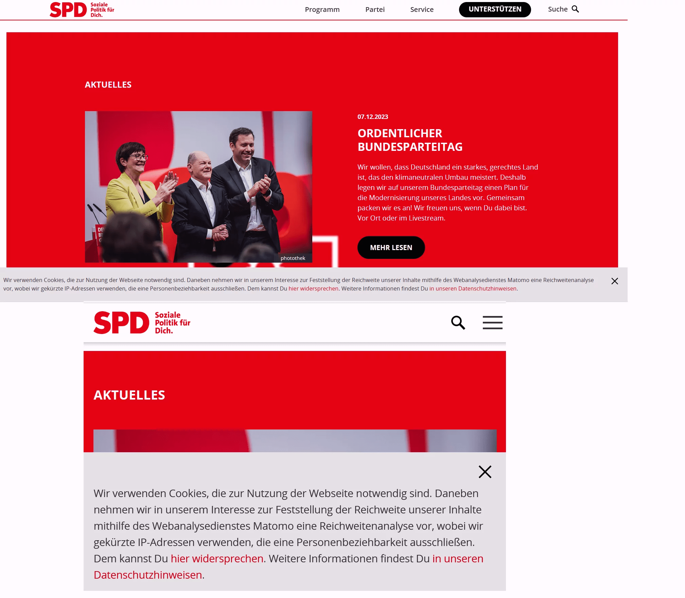

# ✅ Tastatur-Fokus nicht verdeckt

WCAG-Kriterium: [📜 2.4.11 Fokus nicht verdeckt (Minimum) - AA](..)

## Beschreibung

Der Tastatur-Fokus ist beim Navigieren stets gut sichtbar und höchstens teilweise durch andere Elemente verdeckt.

## Prüfmethode (in Kürze)

**Tastatur:** Durch Elemente navigieren mittels Tab-Taste und darauf achten, dass der Fokus gut sichtbar ist.

## Prüfmethode für Web (ausführlich)

### Prüf-Schritte

1. Seite öffnen
1. Mit `Tab`-Taste durch die Seite navigieren
1. Sicherstellen, dass das fokussierte Element nicht von anderen Elementen überdeckt ist
    - **🙂 Beispiel:** Der Fokus ist stets gut sichtbar.
    - **🙄 Beispiel:** Das fokussierte Element ist teilweise verdeckt, z.B. von einem Werbebanner, welcher über dem Seiteninhalt schwebt.
    - **😡 Beispiel:** Ein Sticky Header oder Footer verdeckt das fokussierte Element komplett.

## Prüfmethode für Mobile (Ergänzungen zu Web)

Sowohl auf Web-Views als auch native Inhalte 1:1 übertragbar.

## Prüfmethode für PDF (Ergänzungen zu Web)

Für PDF nicht relevant.

## Details zum blinden Testen

Nein.

## Screenshots typischer Fälle

