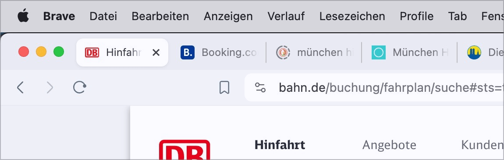
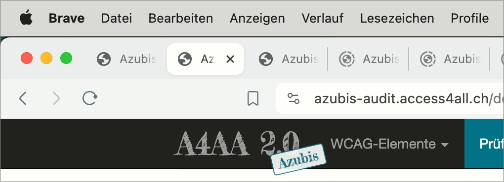

# ✅ Aussagekräftiger Titel

WCAG-Kriterium: [📜 2.4.2 Seite mit Titel - A](..)

## Beschreibung

Seiten haben einen eindeutigen, aussagekräftigen Titel, der Thema oder Zweck der Seite sowie den Betreiber enthält (Muster: "Thema/Zweck der Seite - Seitenbetreiberin")

## Prüfmethode (in Kürze)

**Manuelle Prüfung:** Seiten durchsehen und darauf achten, dass deren Titel den Erwarungen entsprechen: Thema/Zweck vorhanden? Betreiberin vorhanden?

## Prüfmethode für Web (ausführlich)

### Prüf-Schritte

1. Startseite öffnen
1. Ihren Titel ermitteln:
    - Chrome zeigt den Titel im Tab an (ggf. mit Maus drüber hovern, falls Titel abgeschnitten)
        - Alternativ kann via [🏷️ DOM Inspektor](/de/tags/dom-inspektor) im `<head>` das `<title>`-Attribut untersucht werden
2. Sicherstellen, dass der Titel den Erwartungen entspricht:
    - Hauptthema vorhanden? Name des Betreibers vorhanden?
        - **🙂 Beispiel:** "Willkommen bei der Bernasconi AG!"
        - **🙂 Beispiel:** "Bernasconi AG - Startseite"
        - **🙂 Beispiel:** "Bernasconi AG"
        - **😡 Beispiel:** "Willkommen"
        - **😡 Beispiel:** "Startseite"
3. Für verschiedene Unterseiten wiederholen!
    - **🙂 Beispiel:** "Kontakt - Bernasconi AG"
    - **🙄 Beispiel:** "Bernasconi AG: Kontakt"
        - ⚠️ Sich wiederholender Teil (Seitenbetreiber) am Anfang ist suboptimal, da redundant für Screenreader
    - **🙂 Beispiel:** "Über die Bernasconi AG"
    - **😡 Beispiel:** "Kontakt"
    - **😡 Beispiel:** "Über uns"

## Screenshots typischer Fälle

### Einzelner Tab

Hier fehlt der Name der Seiten-Betreiber:in (Deutsche Bahn).

### Viele Tabs neben einander

Auch für visuelle Nutzer ist es hier sinnvoll, dass der Thema der Seite am Anfang des Titels steht.

Als Vergleich:

