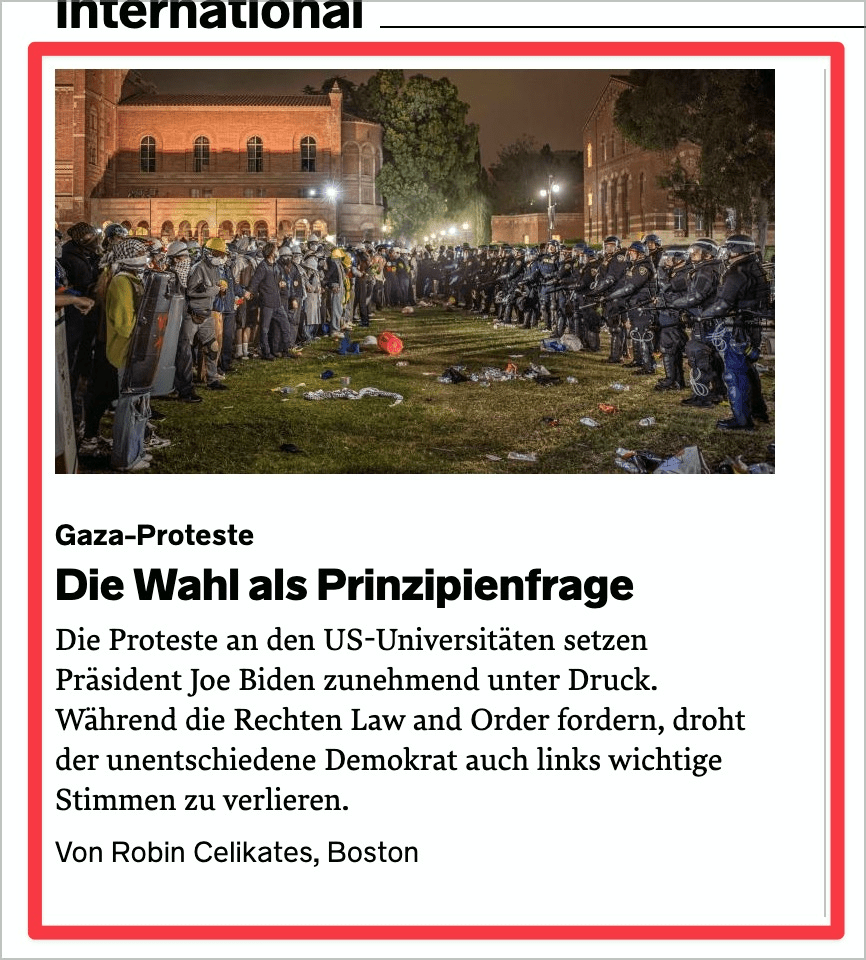

# ✅ Mehrfache Links

WCAG-Kriterium: [📜 2.4.4 Linkzweck (im Kontext) - A](..)

## Beschreibung

Mehrfache, unterschiedliche Links (z.B. eine Überschrift, eine Grafik und ein zusätzlicher Textlink) auf dasselbe Ziel werden vermieden.

## Prüfmethode (in Kürze)

**Screenreader:** Links auflisten und prüfen, ob mehrfache Verlinkungen vorhanden sind.

## Prüfmethode für Web (ausführlich)

### Prüf-Schritte

1. Seite öffnen
1. Ausschau halten nach mehreren Links, die auf dasselbe Ziel zeigen (mit Maus drüber hovern, im Zweifelsfall die Links besuchen):
    - **🙂 Beispiel:** Eine Card ([✅ Komplexe Grafiken](/de/wcag/1.1.1-nicht-text-inhalt/komplexe-grafiken)) ist so umgesetzt, dass sie vom Screenreader [🏷️ NVDA Screenreader](/de/tags/nvda-screenreader) als ein einziger Link angesagt wird
    - **🙄 Beispiel:** Eine Card ist zwar als einziger Link umgesetzt, die einzelnen Inhalts-Elemente werden aber vom Screenreader als einzelne Links angesagt (z.B. "Link News Überschrift Ebene 3", "Link Bild X", "Link ...")
    - **😡 Beispiel:** Mehrere Inhalts-Elemente einer Card sind jeweils als Link umgesetzt

## Prüfmethode für Mobile (Ergänzungen zu Web)

Links gibt es natürlich auch auf Mobile Webseiten und hybriden Apps.

In Mobile Apps werden solche Elemente manchmal auch als Schalter umgesetzt; streng genommen muss man das dann auch anwenden (obwohl es im engeren Sinn keine Links sind).

## Prüfmethode für PDF (Ergänzungen zu Web)

Redundante Links sind auch in PDFs zu vermeiden.

## Details zum blinden Testen

Problemlos per Screenreader [🏷️ NVDA Screenreader](/de/tags/nvda-screenreader) prüfbar.

## Screenshots typischer Fälle

## Videos

Keine Videos verfügbar.
