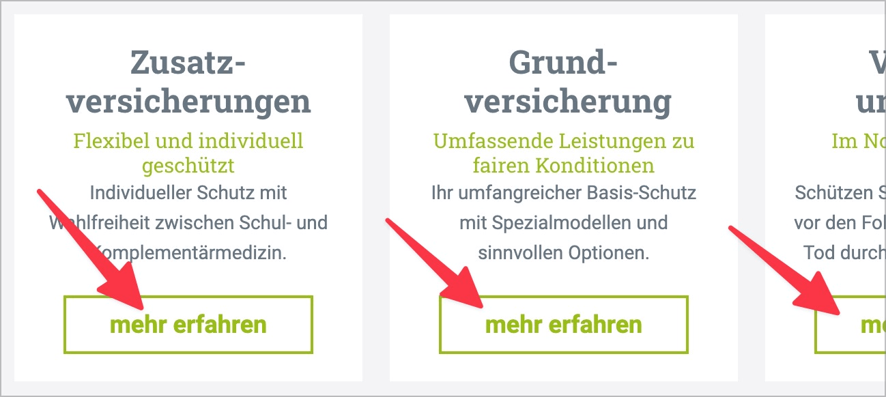

# ✅ Selbstsprechende Links

WCAG-Kriterium: [📜 2.4.4 Linkzweck (im Kontext) - A](..)

## Beschreibung

Link-Texte sind selbstsprechend, d.h. aus sich selbst heraus oder über den Kontext (gleiches `
`-Element, gleiches Listenelement, gleiche Tabellenzelle, Spalten- oder Zeilenüberschrift in Tabelle) verständlich.

## Prüfmethode (in Kürze)

**Screenreader:** Links auflisten und prüfen, ob diese selbstsprechend sind.

## Prüfmethode für Web (ausführlich)

### Prüf-Schritte

1. Seite öffnen
1. Link-Liste in Screenreader **🏷️-13 NVDA Screenreader** anzeigen lassen (`Insert`-`F7`, dann `Alt`-`L`)
1. Sicherstellen, dass Links selbstsprechend sind:
    - **🙂 Beispiel:** "Mehr zum Thema X"
    - **🙂 Beispiel:** "Kontakt"
    - **🙄 Beispiel:** "Mehr" / "Weiter" o.ä. → wenn nur ein einziger Link mit diesem Namen existiert, kann es je nach Kontext okay sein
    - **😡 Beispiel:** "Mehr" / "Weiter" o.ä. → wenn mehrere Links mit diesem Namen existieren
    - **😡 Beispiel:** "hier"
    - **😡 Beispiel:** Generell mehrfach vorkommende Links

## Screenshots typischer Fälle

