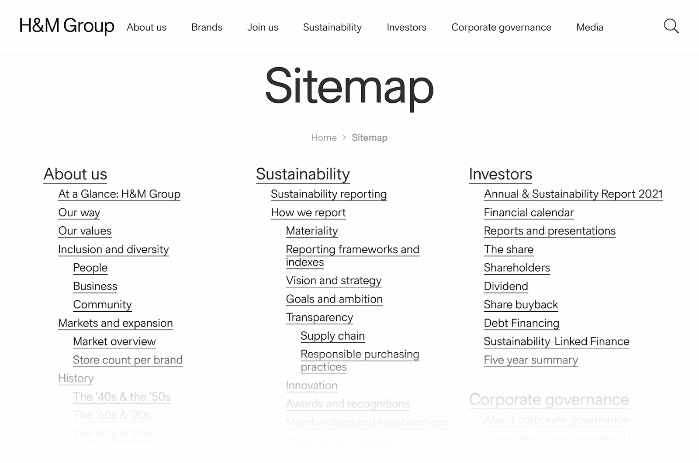
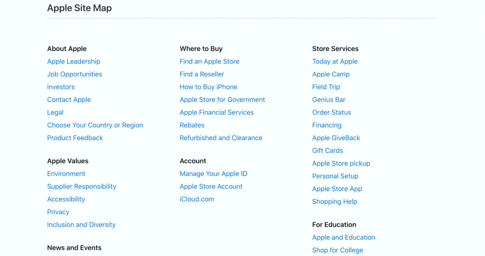

# ✅ Navigations-Methoden

## Beschreibung

Es existieren mindestens zwei der folgenden drei Methoden, um Zugang zu Inhalten zu bekommen: Navigation, Suchfunktion, Sitemap.

## Prüfmethode (in Kürze)

**Manuelle Prüfung:** Webauftritt durchsehen und prüfen, ob eine Suchfunktion oder Sitemap existiert.

## Prüfmethode für Web (ausführlich)

### Test-Schritte

1. Seite öffnen
1. Prüfen, ob die Seite mindestens 2 der 3 möglichen Methoden anbietet:
    - Navigation
    - Sitemap
    - Suche

## Screenshots typischer Fälle

