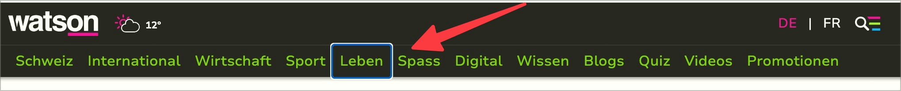
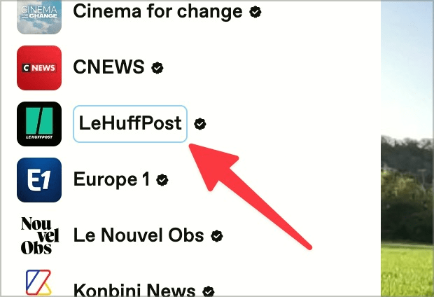
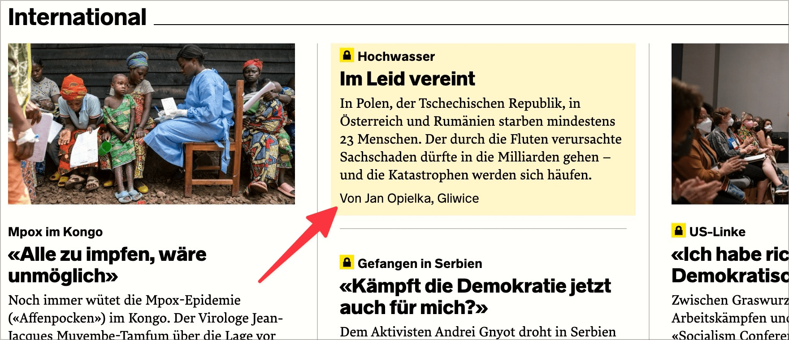

# ✅ Tastatur-Fokus sichtbar

WCAG-Kriterium: [📜 2.4.7 Fokus sichtbar - AA](..)

## Beschreibung

Der Tastatur-Fokus ist genügend sichtbar, z.B. durch einen gut sichtbaren Rahmen (für alle fokussierbaren Elemente wie Links, Schaltflächen, Radio-Buttons, Checkboxen, Ausklapplisten, verlinkte grafische Elemente, etc.).

## Prüfmethode (in Kürze)

**Tastatur:** Durch Elemente navigieren mittels Tab-Taste und darauf achten, dass Fokus sichtbar ist.

## Prüfmethode für Web (ausführlich)

### Prüf-Schritte

1. Seite öffnen
1. Mit `Tab`-Taste durch die Seite navigieren und jeweils prüfen:
    - Sind alle interaktiven Elemente bei Fokus gut als fokussiert erkennbar?
        - **🙂 Beispiel:** Umrandung, deutlich erkennbarer Farbwechsel, o.ä.
        - **😡 Beispiel:** Kaum oder gar nicht sichtbarer Fokus.
            - ⚠️ Kann auch daran liegen, dass Elemente gar nicht fokussierbar sind (siehe [✅ Mit der Tastatur bedienbar](/de/wcag/2.1.1-tastatur/mit-der-tastatur-bedienbar)).

### ⚠️ WCAG 2.1 vs. 2.2

Mindest-Kontrast bei Fokus-Styles wird erst ab WCAG 2.2 und nur ab Level AAA gefordert! Dennoch versuchen wir stets zu überzeugen, dass dies generell wünschenswert ist.

## Prüfmethode für Mobile (Ergänzungen zu Web)

Wird oft vergessen, aber auch Mobile Apps müssen komplett mit Tastatur gesteuert werden können. Entsprechend benötigt es überall einen gut sichtbaren Fokus (sowohl in nativen / hybriden Apps als auch in Mobile Webseiten).

## Prüfmethode für PDF (Ergänzungen zu Web)

Dieser Prüfpunkt ist nur auf PDF-Formulare anwendbar.

### Prüf-Schritte
1. PDF mit [🏷️ Adobe Reader](/de/tags/adobe-reader) öffnen
1. Mit Tab durch das Formular tabben und überprüfen, ob fokussierte Formularfelder gut erkennbar sind.

## Details zum blinden Testen

Nein.

## Screenshots typischer Fälle

### Clearly visible focus

### Poorly visible focus

## Videos

- [🎬 Interaktive Elemente ohne sichtbaren Fokus (Focus-Reset) - Watson](/de/videos/interaktive-elemente-ohne-sichtbaren-fokus-focus-reset-watson)
