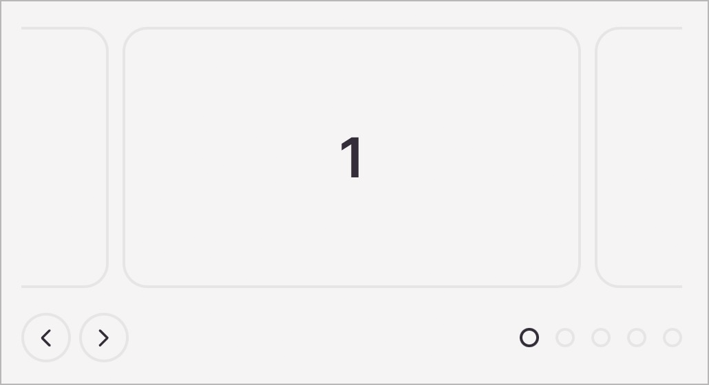

# ✅ Alternative für Pfad- und Mehrfach-Punkt-Zeigergesten

WCAG-Kriterium: [📜 2.5.1 Zeigergesten - A](..)

## Beschreibung

Für pfadbasierte oder Mehrpunkt-Zeigergesten existieren Alternativen, die mit einfachen Zeigergesten bedienbar sind (etwa Klicken, Doppelklicken, oder Klicken-und-Halten).

## Prüfmethode (in Kürze)

**Manuelle Prüfung:** Elemente durchsehen, mit ihnen interagieren und sicherstellen, dass gleichwertige alternative Eingabemethoden vorhanden sind.

## Prüfmethode für Web (ausführlich)

### Test-Schritte

1. Seite mit pfadbasierten oder Mehrpunkt-Zeigergesten-Funktionalitäten öffnen
1. Sicherstellen, dass diese auch mit einfachen Zeigergesten (etwa Klicken, Doppelklicken, oder Klicken-und-Halten) bedienbar sind bzw. ob ein alternatives Bedien-Element zur Verfügung steht
    - **🙂 Beispiel:** Ein Seiten-Menü kann per Wischgeste von linkem Bildrand nach rechts eingeblendet werden; zusätzlich existiert ein Schaltfläche "Menü anzeigen".
        - **😡 Beispiel:** Es existiert keine solche Schaltfläche.
    - **🙂 Beispiel:** Die aktuell angezeigte Folie in einem Karussell kann per Wischgeste nach links oder rechts geändert werden; zusätzlich existieren Schaltflächen "Nächste Folie" bzw. "Vorherige Folie".
        - **😡 Beispiel:** Es existieren keine solche Schaltflächen.
    - **🙂 Beispiel:** Eine Karte kann mittels Spreizgeste vergrössert oder verkleinert werden; zusätzlich existieren Schaltflächen "Vergrössern" bzw. "Verkleinern".
        - **😡 Beispiel:** Es existieren keine solche Schaltflächen.
    - **🙂 Beispiel:** In einem Projektmanagement-Werkzeug mit diversen Spalten können die Arbeitspakete mittels Wischgeste in die nächste bzw. vorhergehende Spalte verschoben werden; zudem ein Element markiert und mit Schaltflächen "Nach links" (bzw. "Nach rechts") verschoben werden.
        - **😡 Beispiel:** Es existieren keine solche Schaltflächen.

## Prüfmethode für Mobile (Ergänzungen zu Web)

Sowohl auf Web-Views als auch native Inhalte 1:1 übertragbar.

## Prüfmethode für PDF (Ergänzungen zu Web)

Für PDF nicht relevant.

## Details zum blinden Testen

Kaum. Es handelt sich hier um sehr visuelle Eingabe-Methoden; für Screenreader müssen natürlich ebenfalls alternative Bedienungs-Möglichkeiten bestehen (diese werden aber meist über [📜-2.1.1 Tastatur](/de/wcag/2.1.1-tastatur) angeboten).

## Screenshots typischer Fälle

## Videos

Keine Videos verfügbar.
