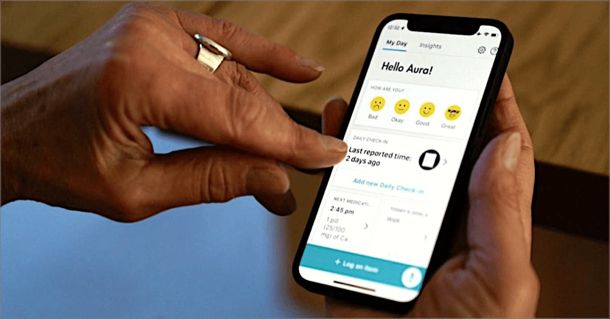

# ✅ Zeigereingaben abbrechbar

WCAG-Kriterium: [📜 2.5.2 Abbruch von Zeigegerät-Eingaben - A](..)

## Beschreibung

Zeigereingaben sind abbrechbar oder können rückgängig gemacht werden.

## Prüfmethode (in Kürze)

**Bookmarklet "Down-Events auslösen":** Ausführen und auf Veränderungen achten. Wenn ein Down-Event ausgelöst wurde, prüfen, ob eine Ausnahme zutrifft (Abort, Undo, Up Reversal, Essential).

## Prüfmethode für Web (ausführlich)

### Test-Schritte

1. Seite öffnen
1. Mit Funktionalitäten interagieren
1. Sicherstellen, dass Aktionen abbrechbar sind (oder rückgängig gemacht werden können)
    - **🙂 Beispiel:** Eine Telefon-App bietet eine "Stumm"-Schaltfläche an, die direkt neben der "Auflegen"-Schaltfläche liegt. Das Klicken auf "Auflegen" kann abgebrochen werden (da die Funktion nicht auf den `down`-Event reagiert), indem der Finger von der Schaltfläche weg bewegt wird, bevor er den Screen verlässt (`up`).
        - **🙄 Beispiel:** Das Klicken kann **nicht** abgebrochen werden (da die Funktion auf den `down`-Event reagiert), aber ein Dialog fragt dann explizit nach, ob man tatsächlich auflegen möchte. → ⚠️ Gegen einen solchen Dialog ist generell nichts einzuwenden, aber wir empfehlen dennoch, auf `up`-Events zu reagieren (wäre ja doof, wenn der Dialog dasselbe Problem aufweist und man sich ein zweites Mal "vertippt").
        - **😡 Beispiel:** Das Klicken kann **nicht** abgebrochen werden.
    - **🙂 Beispiel:** Ein Texteditor bietet viele Schaltflächen an zum Formatieren von Text. Das Klicken auf eine Schaltfläche (z.B. "Fett") kann abgebrochen werden.
        - **🙄 Beispiel:** Das Klicken kann **nicht** abgebrochen werden, aber ein erneutes Drücken stellt den vorherigen Zustand wieder her (fett vs. nicht fett). → ⚠️ Auch hier: wir empfehlen, auf `up`-Events zu reagieren (nicht immer wird durch erneutes Drücken nämlich exakt der Ursprungszustand wieder hergestellt, z.B. wenn ein Text markiert war, der nur teilweise fett war).
            - **🙄 Beispiel:** Es existiert eine "Rückgängig"-Funktion. → ⚠️ Auch das ist immer eine gute Idee! Aber dennoch ggf. nur ein mässiger Ersatz für ein generelles Problem.

## Prüfmethode für Mobile (Ergänzungen zu Web)

Sowohl auf Web-Views als auch native Inhalte 1:1 übertragbar.

## Prüfmethode für PDF (Ergänzungen zu Web)

Für PDFs nicht anwendbar.

## Details zum blinden Testen

Nein.

## Screenshots typischer Fälle

## Videos

Keine Videos verfügbar.
