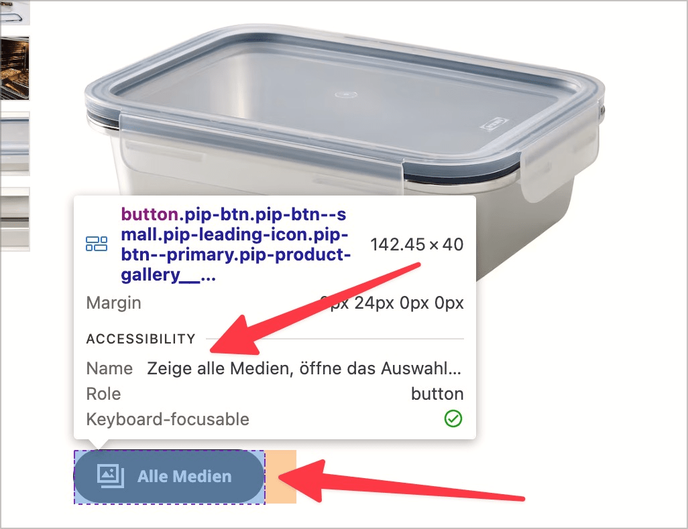
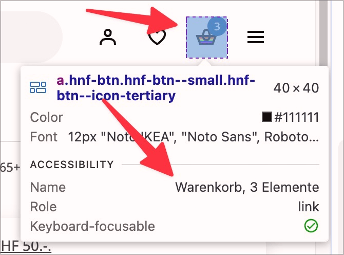

# ✅ Zugängliche Beschriftung

WCAG-Kriterium: [📜 2.5.3 Beschriftung im zugänglichen Namen - A](..)

## Beschreibung

Die zugängliche Beschriftung eines Bedienelements entspricht exakt der visuellen oder beinhaltet sie (ermöglicht v.a. Sprachsteuerung).

## Prüfmethode (in Kürze)

**Screenreader:** Durch Bedienelemente navigieren mittels Tab-Taste und prüfen, ob Ausgabe der visuellen Beschriftung entspricht.

## Prüfmethode für Web (ausführlich)

### Test-Schritte

1. Seite öffnen
1. Mit [🏷️ NVDA Screenreader](/de/tags/nvda-screenreader) durch die Seite navigieren
    - Auch der [🏷️ DOM Inspektor](/de/tags/dom-inspektor) kann aufschlussreiche Informationen liefern: wenn man über ein Element hovert, dann wird dessen zugänglicher Name angezeigt
1. Sicherstellen, dass der zugängliche Name eines Elements identisch ist mit dem visuell sichtbaren Namen (oder diesen beinhaltet)
    - **🙂 Beispiel:** Eine Schaltfläche hat die visuelle Beschriftung "Abschicken"; dies wird vom Screenreader auch so ausgegeben.
        - **🙄 Beispiel:** Der Screenreader gibt "Nachricht abschicken" aus (die zugängliche Beschriftung beinhaltet die visuelle Beschriftung). → ⚠️ Wir empfehlen, das Nutzer-Erleben für alle Nutzer-Gruppen möglichst einheitlich zu gestalten.
        - **😡 Beispiel:** Der Screenreader gibt "Versenden" aus.
    - **🙂 Beispiel:** Eine Checkbox hat das visuelle Label "AGBs akzeptieren"; dies wird vom Screenreader auch so ausgegeben.
        - **😡 Beispiel:** Der Screenreader gibt "Hier klicken, um die AGBs zu akzeptieren" aus (die zugängliche Beschriftung beinhaltet die visuelle Beschriftung **nicht**: das Wort "zu" ist zu viel).
        - **😡 Beispiel:** Der Screenreader gibt "Allgemeine Geschäftsbedingungen akzeptieren" aus.
    - **🙄 Beispiel:** Eine Schaltfläche hat ein rein visuelles Symbol eines Einkaufswagens mit dem Alternativtext "Warenkorb" (und ohne sichtbare Beschriftung); dies wird vom Screenreader auch so ausgegeben. → ⚠️ Hier wird es zum Glücksspiel: der Alternativtext könnte auch "Einkaufswagen" sein! Ähnlich ist es bei einem "Nutzer"-Symbol, welcher als "Login", "Einloggen", "Nutzerbereich", "Mein Konto" o.ä. beschriftet sein könnte.

## Prüfmethode für Mobile (Ergänzungen zu Web)

Sowohl auf Web-Views als auch native Inhalte 1:1 übertragbar.

## Prüfmethode für PDF (Ergänzungen zu Web)

Für PDFs nicht anwendbar.

## Details zum blinden Testen

Nein.

## Screenshots typischer Fälle

## Videos

Keine Videos verfügbar.
