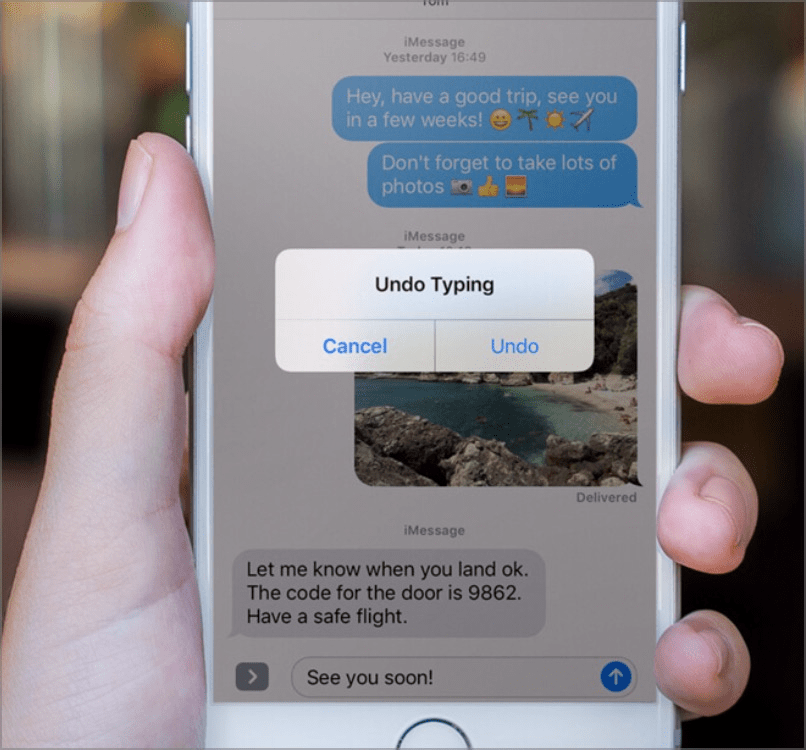

# ✅ Alternativen für Bewegungsaktivierung

WCAG-Kriterium: [📜 2.5.4 Bewegungsaktivierung - A](..)

## Beschreibung

Durch Bewegungsaktivierung (z.B. Gerätebewegung oder Erkennung von Gesten per Video) ausgeführte Funktionalität kann auch durch konventionelle Eingabemethoden angesteuert und deaktiviert werden.

## Prüfmethode (in Kürze)

**Manuelle Prüfung:** Elemente durchsehen, mit ihnen interagieren und sicherstellen, dass mit ihnen auch durch konventionelle Eingabemethoden gleichwertig interagiert werden kann.

## Prüfmethode für Web (ausführlich)

### Test-Schritte

1. Seite mit Bewegungsaktivierungs-Funktionalitäten öffnen
1. Sicherstellen, dass diese auch durch konventionelle Eingabemethoden bedienbar sind
    - **🙂 Beispiel:** Texteingabe in einem Textfeld kann durch Schütteln des Smartphones rückgängig gemacht werden; zusätzlich existiert ein Schalter "Rückgängig machen".
        **😡 Beispiel:** Es existiert kein solcher Schalter.
    - **🙂 Beispiel:** Eine Präsentation kann nach links bzw. rechts gesteuert werden per Wischgesten, welche durch eine Videokamera erkannt werden; zusätzlich gibt es die Schalter "Nächste Folie" bzw. "Vorherige Folie".
        **😡 Beispiel:** Es existieren keine solchen Schalter.

## Prüfmethode für Mobile (Ergänzungen zu Web)

Sowohl auf Web-Views als auch native Inhalte 1:1 übertragbar.

## Prüfmethode für PDF (Ergänzungen zu Web)

Für PDF nicht anwendbar.

## Details zum blinden Testen

Schwierig testbar: wenn man von der Funktionalität weiss, kann man aber zumindest herauszufinden versuchen, ob diese auch durch konventionelle Methoden angeboten wird.

## Screenshots typischer Fälle

## Videos

Keine Videos verfügbar.
