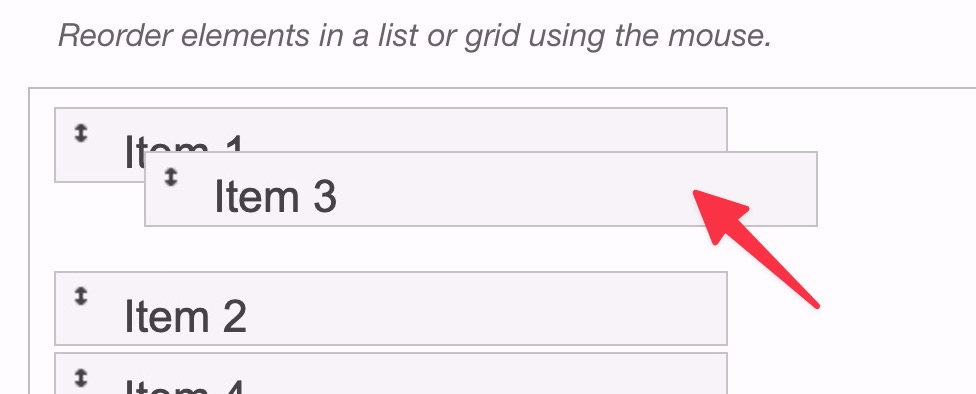
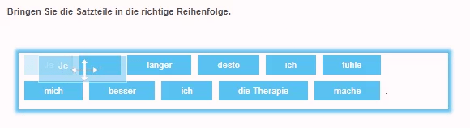
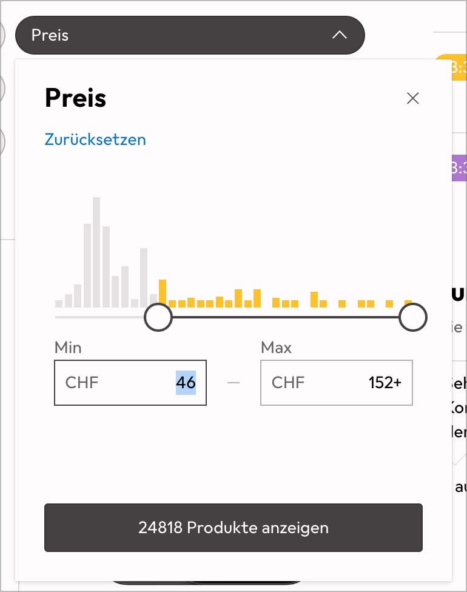
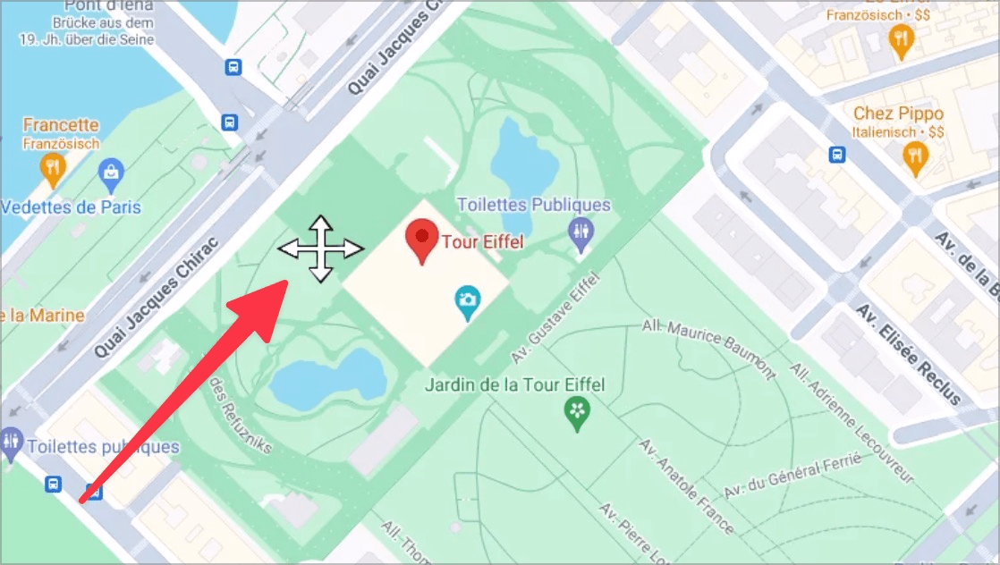
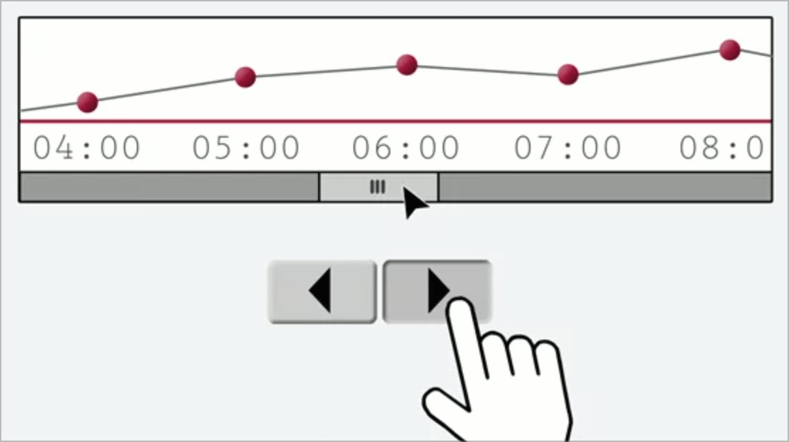
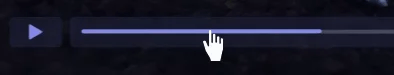

# ✅ Alternative zu Ziehbewegungen

WCAG-Kriterium: [📜 2.5.7 Ziehende Bewegungen - AA](..)

## Beschreibung

Für Ziehbewegungen (Drag & Drop) existieren Alternativen, die mit einfachen Zeigergesten bedienbar sind (etwa Klicken, Doppelklicken, oder Klicken-und-Halten).

## Prüfmethode (in Kürze)

**Tastatur:** Darauf achten, dass Ziehbewegungen auch mit einfachen Zeigergesten bedienbar sind (etwa Klicken, Doppelklicken, oder Klicken-und-Halten).

## Prüfmethode für Web (ausführlich)

### Prüf-Schritte

1. Seite mit Ziehbewegungs-Funktionalitäten öffnen
1. Sicherstellen, dass diese auch mit einfachen Zeigergesten (etwa Klicken, Doppelklicken, oder Klicken-und-Halten) bedienbar sind bzw. ob ein alternatives Bedien-Element zur Verfügung steht
    - **🙂 Beispiel:** Eine Kachel-Ansicht (z.B. Startseite eines e-Bankings) erlaubt, die einzelnen Kacheln per Drag&Drop zu verschieben; sie bietet zudem pro Kachel ein zusätzliches Dropdown mit Befehlen wie "An den Anfang verschieben", "An Position 3 verschieben", etc.
        - **🙄 Beispiel:** Die Kachel-Ansicht selber bietet keine Alternative; jede Kachel kann aber einzeln in einer Detailansicht bearbeitet werden, und in diesem Formular findet sich ein Dropdown mit solchen Befehlen. → ⚠️ Ist umständlicher als obige Lösung, deshalb weniger zu empfehlen.
        - **😡 Beispiel:** Die Kacheln können nicht verschoben werden mit einfachen Zeigergesten.
    - **🙂 Beispiel:** Der sichtbare Ausschnitt einer interaktiven Karte (z.B. Google Maps) kann per Ziehbewegung verschoben werden; zusätzlich hat es vier Schalter, um den Ausschnitt schrittweise nach oben, unten, links und rechts zu bewegen.
        - **😡 Beispiel:** Die Karte kann als ganzes fokussiert werden und mittels Pfeiltasten kann der sichtbare Ausschnitt ebenfalls verschoben werden. → ⚠️ Dies erfüllt zwar [📜-2.1.1 Tastatur](/de/wcag/2.1.1-tastatur), aber das reicht nicht (man kann nicht davon ausgehen, dass der Nutzer eine klassische Tastatur zur Verfügung hat).
        - **😡 Beispiel:** Der sichtbare Ausschnitt kann nicht verändert werden mit einfachen Zeigergesten.
    - **🙂 Beispiel:** Mittels eines Schiebereglers kann ein Zahlenwert ausgewählt werden (z.B. ein Prozentwert zwischen 1 und 100); der Wert kann aber auch direkt in ein Eingabefeld eingegeben werden. → ⚠️ Hier erfüllt die automatisch eingeblendete On-Screen-Tastatur die eigentliche Anforderung.
    - **🙂 Beispiel:** In einem Projektmanagement-Werkzeug mit diversen Spalten können die Arbeitspakete mittels Ziehbewegung in eine beliebige Spalte verschoben werden; zudem für jedes Element ein Ausklapp-Menü geöffnet und Schaltflächen wie "In vorherige Spalte", "In Spalte X" oder "In letzte Spalte" ausgewählt werden.
        - **😡 Beispiel:** Es existieren keine solche Schaltflächen.

## Screenshots typischer Fälle

