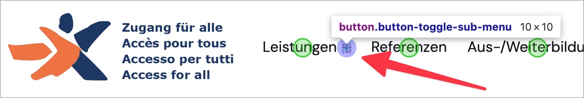
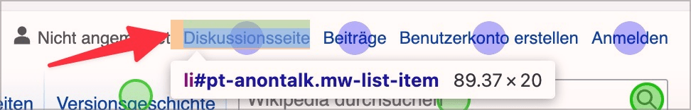
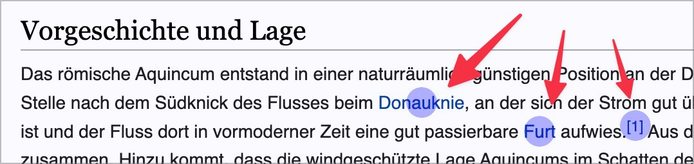
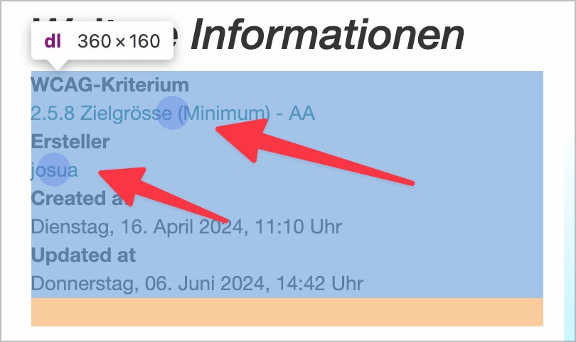
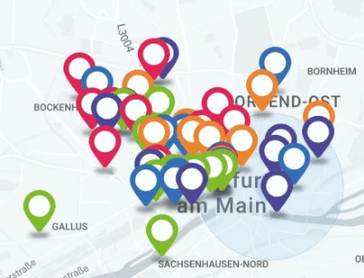
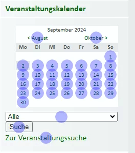

# ✅ Zielgrösse und Abstand

WCAG-Kriterium: [📜 2.5.8 Zielgrösse (Minimum) - AA](..)

## Beschreibung

Aktivierbare Elemente weisen die geforderte Mindestgrösse oder genügend Abstand auf.

## Prüfmethode (in Kürze)

**Bookmarklet "Target-Size"**: Ausführen und mit Seite abgleichen: Gibt es Elemente, die zu klein sind und zu wenig Abstand haben?

## Prüfmethode für Web (ausführlich)

### Prüf-Schritte

1. Seite öffnen
1. [🏷️ Target Size Bookmarklet](/de/tags/target-size-bookmarklet) ausführen
    - ⚠️ Bei Grenzfällen kann via [🏷️ DOM Inspektor](/de/tags/dom-inspektor) die genaue Grösse eines Elements angezeigt werden: einfach über ein Element hovern in der Baum-Ansicht!
1. Sicherstellen, dass angezeigte Verstösse (blaue Kreise) **keine** Ausnahmen darstellen
    - **🙂 Beispiel:** Schalter und Links sind mind. `24x24px` gross
    - **🙄 Beispiel:** Ein Schalter ist `19x19px` gross, hat aber einen Abstand von mind. `5px` zu angrenzenden interaktiven Elementen
        - ⚠️ Ist laut WCAG explizit erlaubt; wir ermuntern unsere Kunden aber natürlich, interaktive Elemente generell besser etwas grösser zu designen!
    - **😡 Beispiel:** Ein Schalter ist `19x19px` gross; gleich daneben (ohne Abstand) befindet sich ein weiterer Schalter.
    - **🙂 Beispiel:** Links in einem Fliesstext (also in einem Paragrafen, aber auch in einer Liste o.ä.) sind `20px` hoch.
        - **⚠️ Erlaubte Ausnahme:** In Fliesstext gilt die Anforderung nicht!
    - **🙂 Beispiel:** Eine Karte der Schweiz zeigt alle Ortschaften als klickbare Bereiche an; einzelne Ortschaften sind so klein, dass ihr klickbarer Bereich kleiner ist als `24x24px`.
        - **⚠️ Erlaubte Ausnahme:** Die Grösse ist hier essenziell für die Funktion!

## Prüfmethode für Mobile (Ergänzungen zu Web)

Sowohl auf Web-Views als auch native Inhalte 1:1 übertragbar.

## Prüfmethode für PDF (Ergänzungen zu Web)

Für PDF nicht relevant.

## Details zum blinden Testen

Nein.

## Screenshots typischer Fälle

