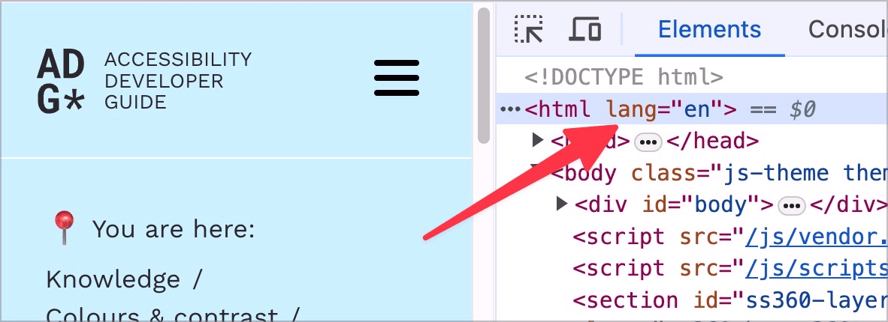
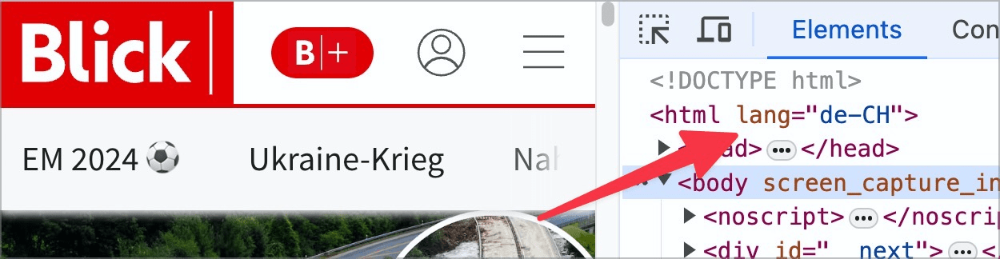
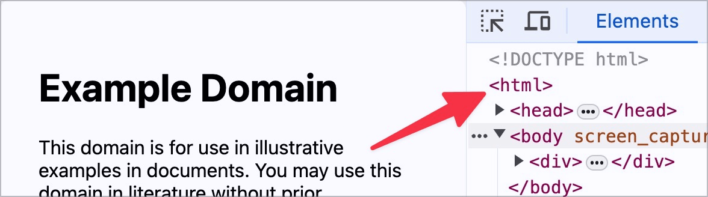

# ✅ Sprachdeklaration

WCAG-Kriterium: [📜 3.1.1 Sprache der Seite - A](..)

## Beschreibung

Die Sprachdeklaration ist vorhanden und korrekt.

## Prüfmethode (in Kürze)

**Manuelle Prüfung:** Seiten durchsehen und darauf achten, dass sie das korrekte `lang`-Attribut im `<html>`-Tag gesetzt haben.

## Prüfmethode für Web (ausführlich)

### Prüf-Schritte

1. Seite öffnen
1. Mit [🏷️ DOM Inspektor](/de/tags/dom-inspektor) das `<html>`-Tag der Seite inspizieren
1. Sicherstellen, dass ein korrektes `lang`-Attribut gesetzt ist:
    - **🙂 Beispiel:** Die Seite hat deutsche Inhalte; es ist `lang="de"`, `lang="de-CH"` o.ä. gesetzt
        - **😡 Beispiel:** Es ist ein falsches `lang`-Attribut gesetzt, z.B. `lang="en"` oder `lang="xx"`
        - **😡 Beispiel:** Es ist kein `lang`-Attribut gesetzt

⚠️ Dies gilt nur für die Aussprache der Inhalte: der Screenreader kann so den korrekten Synthesizer aktivieren. Informationen über die Elemente (semantische Information) wird aber weiterhin stets in der Sprache des Betriebssystems ausgegeben.

## Screenshots typischer Fälle

