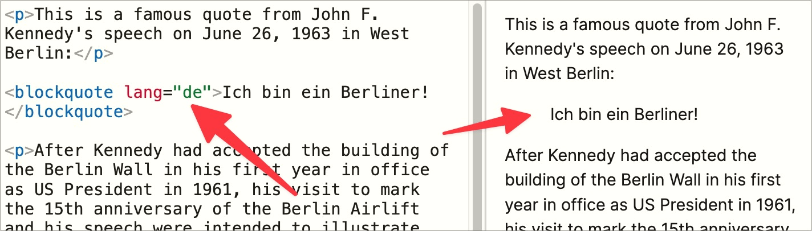

# ✅ Sprachwechsel

WCAG-Kriterium: [📜 3.1.2 Sprache von Teilen - AA](..)

## Beschreibung

Sprachwechsel bei längeren Textpassagen werden angegeben: Anderssprachige Textabschnitte sind mit dem `lang`-Attribut ausgezeichnet. Bei kurzen anderssprachigen Textpassagen (einzelne Wörter) wird auf den Sprachwechsel verzichtet.

## Prüfmethode (in Kürze)

**Manuelle Prüfung:** Seiten durchsehen und darauf achten, dass Inhalte mit Sprachwechsel das korrekte `lang`-Attribut gesetzt haben.

## Prüfmethode für Web (ausführlich)

### Prüf-Schritte

1. Seite öffnen
1. Ausschau halten nach Inhalten, die in einer anderen Sprache als der Seitensprache sind
1. Mittels [🏷️ DOM Inspektor](/de/tags/dom-inspektor) sicherstellen, dass diese Inhalte ein korrektes `lang`-Attribut aufweisen
    - **🙂 Beispiel:** Eine englischsprachige Webseite über John F. Kennedy zitiert seine bekannte Aussage "Ich bin ein Berliner!"; seine Aussage hat ein `lang="de"`-Attribut
        - **🙂 Beispiel:** Sie hat keinerlei `lang`-Attribut
            - ⚠️ Dies führt dazu, dass das deutsche Zitat in englischem Akzent vom Screenreader vorgetragen wird. Dies ist definitiv falsch - auch wenn es der tatsächlichen Aussprache von Kennedy erstaunlich nahe kommt! 😉
    - **🙂 Beispiel:** Eine Webseite ist multi-lingual, weshalb im Kopfbereich ein Sprachwahl-Menü angeboten wird: jeder Menü-Eintrag hat ein passendes `lang`-Attribut, z.B. "Seite in Deutsch anschauen" hat `lang="de"` oder "Visit website in English" hat `lang="en"`
        - **😡 Beispiel:** Die Menü-Einträge haben kein `lang`-Attribut
    - **🙂 Beispiel:** Eine Seite nutzt Anglizismen; diese sind **nicht** durch ein `lang`-Attribut bezeichnet
        - ⚠️ Einzelne Wörter (z.B. auch ein englischer Name o.ä.) oder auch sehr kurze Zitate in einem Fliesstext müssen nicht als Fremdsprache markiert werden

## Prüfmethode für Mobile (Ergänzungen zu Web)

Auf Web-Views 1:1 übertragbar.

## Prüfmethode für PDF (Ergänzungen zu Web)

### Prüf-Schritte
1. PDF mit [🏷️ Adobe Reader](/de/tags/adobe-reader) öffnen
1. Ausschau halten nach Inhalten, die in einer anderen Sprache als der Seitensprache sind
1. Mit [🏷️ NVDA Screenreader](/de/tags/nvda-screenreader) vorlesen lassen

## Details zum blinden Testen

Ja: wenn der Screenreader die fremdsprachigen Inhalte in einem seltsamen Akzent ausspricht, ist wohl die Sprache falsch gesetzt worden. Vorsicht: wenn für die benötigte Sprache kein Synthesizer installiert ist, dann wird die Standard-Sprache verwendet!

## Screenshots typischer Fälle

