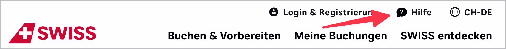

# ✅ Konsistente Hilfe

WCAG-Kriterium: [📜 3.2.6 Konsistente Hilfe - A](..)

## Beschreibung

Hilfestellungen werden über Prozesse und Unter-Seiten hinweg konsistent angeboten.

## Prüfmethode (in Kürze)

**Manuelle Prüfung:** Prozesse und Unter-Seiten durchsehen und Positionierung der Hilfestellungen beurteilen.

## Prüfmethode für Web (ausführlich)

### Prüf-Schritte

1. Seite öffnen
1. Unterseiten durchstöbern und angebotene Prozesse durchlaufen (z.B. Flugticket bestellen)
1. Sicherstellen, dass Hilfsangebote (wenn vorhanden) immer am gleichen Ort gefunden werden können
    - **🙂 Beispiel:** Das Bestellen eines Flugtickets geht über mehrere Schritte hinweg (Destination eingeben, Datum wählen, persönliche Angaben eingeben, Kreditkarte angeben, etc.); ein Link "Hilfe" wird stets im Kopfbereich angezeigt
        - **🙂 Beispiel:** Ein Chat-Dialog wird stets unten rechts eingeblendet
        - **😡 Beispiel:** Bei gewissen Prozessschritten wird man auf andere Seitenbereiche weitergeleitet (z.B. Miles&More-Angebote), welche zwar ähnlich aussehen, aber die Hilfe fehlt plötzlich (oder ist woanders platziert) → ⚠️ In der Praxis werden solche voneinander abgegrenzte, aber ähnlich aussehende Inhalte oft von unterschiedlichen Anbietern umgesetzt. Insofern ist hier nicht immer offensichtlich, ob bzw. wann man dieses Erfolgskriterium einfordern kann.
    - **🙂 Beispiel:** Im Fussbereich einer Webseite befindet sich immer ein Link zu einem Kontaktformular oder ein Telefon für Hilfe
        - **😡 Beispiel:** Auf diversen Unterseiten fehlen diese Informationen

## Screenshots typischer Fälle

