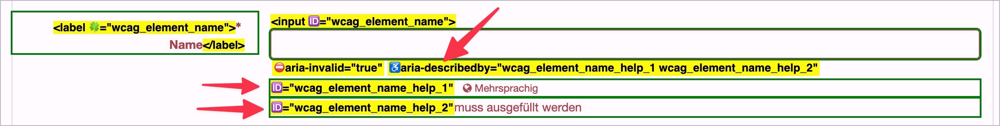

# ✅ Fehlermeldungen in Formularen

WCAG-Kriterium: [📜 3.3.1 Fehlerkennzeichnung - A](..)

## Beschreibung

Fehlermeldungen in Formularen sind barrierefrei umgesetzt: Eingabefehler können auf unterschiedlichen Wahrnehmungs-Kanälen erfahren werden (also z.B. nicht nur visuell, sondern auch mit Screenreader) und die zugehörigen Eingabefelder können identifiziert werden.

## Prüfmethode (in Kürze)

Mit Formular interagieren und prüfen, ob Fehler auch mit Screenreader erfahrbar sind und fehlerhafte Elemente identifiziert werden können.

## Prüfmethode für Web (ausführlich)

### Prüf-Schritte

1. Seite mit Formular-Elementen öffnen
1. Formular fehlerhaft abschicken (z.B. Pflichtfeld leer lassen, Email falsch eingeben, etc.)
1. [🏷️ Forms Bookmarklet](/de/tags/werkzeuge/bookmarklets/forms-bookmarklet) ausführen (oder mit [🏷️ DOM Inspektor](/de/tags/document-object-model-dom/dom-inspektor) untersuchen)
1. Sicherstellen, dass Fehler-Meldungen wahrnehmbar sind
    - **🙂 Beispiel:** Eingabefelder in einem Formular sind schwarz umrandet (`1px black`); wenn sie fehlerhaft sind, sind sie dicker und rot umrandet (`2px red`)
        - **🙂 Beispiel:** Wenn sie fehlerhaft sind, weisen wird ein zusätzliches Symbol daneben angezeigt (z.B. ein Ausrufezeichen).
        - **🙄 Beispiel:** Wenn sie fehlerhaft sind, sind sie nur rot umrandet (`1px red`), wobei der Kontrast zwischen Schwarz und Rot mind. `3:1` beträgt. → ⚠️ Wir empfehlen stets, ein weiteres visuelles Merkmal (statt nur farblichen Unterschied) bereit zu stellen (z.B. ein visuelles Symbol).
    - **🙂 Beispiel:** Das Nutzer-Login schlägt fehl und es wird oberhalb des Login-Formulars eine allgemeine Meldung "Wir konnten Sie nicht einloggen" angezeigt; der Tastatur-Fokus fokussiert die Meldung, wodurch sie vom Screenreader angesagt wird. → ⚠️ Dies macht insb. nach einem Page-Reload (klassisches Formular) Sinn.
        - **🙂 Beispiel:** Statt die Meldung zu fokussieren, ist sie als Status-Meldung ([✅ Statusmeldungen](/de/wcag/4.1.3-statusmeldungen/statusmeldungen)) umgesetzt, wodurch sie vom Screenreader angesagt wird. → ⚠️ Dies macht insb. bei AJAX (Single-Page-App) Sinn.
        - **🙂 Beispiel:** Die Meldung wird im `<title>` eingefügt, wodurch sie vom Screenreader angesagt wird. → ⚠️ Nur bei Page-Reload zu empfehlen, nicht bei AJAX.
        - 😡 Die Meldung ist visuell erkennbar, wird vom Screenreader nicht angesagt (bzw. muss erst vom Nutzer gesucht werden)
    - **🙂 Beispiel:** Ein Feld wird visuell mit einem Asterisk (*) als Pflichtfeld gekennzeichnet und am Anfang des Formulars steht eine Erklärung wie "Mit * bezeichnete Felder sind Pflicht"; die Erklärung ist mit `aria-describedby` mit dem Asterisk des Pflichtfelds verknüpft (und wird deshalb vom Screenreader bei Fokus des Pflichtfelds ausgegeben).
        - **😡 Beispiel:** Die Erklärung ist **nicht** verknüpft (und wird deshalb vom Screenreader **nicht** ausgegeben).
1. Sicherstellen, dass fehlerhafte Eingabefelder identifiziert werden können (also dass Fehlermeldungen korrekt mit ihnen verbunden sind)
    - **🙂 Beispiel:** Nach Abschicken eines fehlerhaft ausgefüllten Formulars wird unterhalb eines Eingabefelds ein Fehler als `
` angezeigt (z.B. ein "Ihre Email-Adresse ist fehlerhaft!"). Der Paragraf ist via `aria-describedby` mit dem Eingabefeld verbunden.
        - **😡 Beispiel:** Der Text ist **nicht** verbunden.
    - **🙂 Beispiel:** Unter einem fehlerhaften Passwort-Feld befindet sich eine Liste (`<ul>`) mit verletzten Anforderungen (z.B. dass es mind. 8 Buchstaben haben muss, mind. 1 Sonderzeichen, etc.). Die Liste ist via `aria-describedby` mit dem Passwort-Feld verbunden.
        - **😡 Beispiel:** Die Liste ist **nicht** verbunden.
    - **🙂 Beispiel:** Bei einer Gruppe von Radiobuttons muss eine Option gewählt werden, aber es wurde keine gewählt; der entsprechende Hinweis `
` "Bitte wählen Sie eine Option" ist via `aria-describedby` mit dem umgebenden `<fieldset>`/`<legend>` verbunden.
        - **😡 Beispiel:** Der Hinweis ist **nicht** verbunden.
    - **🙂 Beispiel:** Ein Feld wird visuell mit einem Asterisk (*) als Pflichtfeld gekennzeichnet; das Feld weist zusätzlich ein `required`-Attribut (oder `aria-required`) auf.
        - **🙂 Beispiel:** Das Feld weist zusätzlich einen visuell versteckten Text "Pflichtfeld" o.ä. auf.
        - **😡 Beispiel:** Das Feld weist keinerlei nicht-visuell wahrnehmbaren Hinweis auf.

### Nachprüfen mit Screenreader

Bei komplexen Formularen oder zweifelhaftem Code (z.B. Einsatz von `aria-label`) sollte besser mit [🏷️ NVDA Screenreader](/de/tags/werkzeuge/screenreader/desktop-screenreader/nvda-screenreader) nachgeprüft werden:

- `Tab` (oder auch `F` oder `I`) drücken, um von Eingabefeld zu Eingabefeld zu springen
- Dann sicherstellen, dass der Screenreader alle Fehlermeldungen für's Feld vorliest

⚠️ Denn: viele Fehler findet man oft auch ohne Screenreader, z.B. wenn die Semantik komplett fehlt oder offensichtlich falsch ist. Wenn Semantik aber grundsätzlich **vorhanden scheint**, lässt sich deren Korrektheit und Sinnhaftigkeit oft nur mit Screenreader final beurteilen.

### Nur Plain-Text via aria-describedby

Elemente, die via `aria-describedby` ([🏷️ aria-describedby](/de/tags/aria-attribute/aria-describedby)) mit einem Element verknüpft sind, werden nur als Plain-Text ausgegeben. Information über enthaltene Semantik wird ausgegeben (z.B. ein Link "AGBs lesen" in einem Paragraf wird nur als "AGBs lesen" angesagt, nicht als "Link AGBs lesen"). Insofern müssen solche beschreibenden Texte so geschrieben werden, dass sie auch ohne semantische Info verständlich bleiben.

## Screenshots typischer Fälle

## Videos

- [🎬 Fehlermeldungen werden nicht ausgegeben (Fokus nicht versetzt, nicht verknüpft) - Atupri](/videos/fehlermeldungen-werden-nicht-ausgegeben-fokus-nicht-versetzt-nicht-verknuepft-atupri)