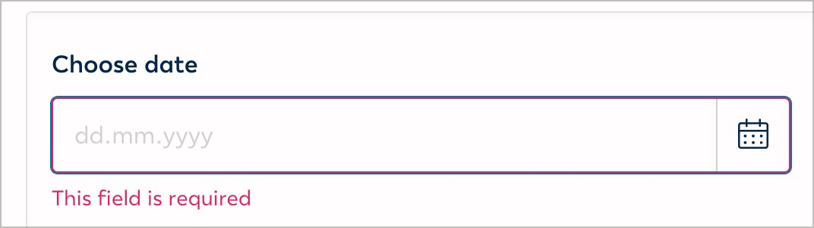
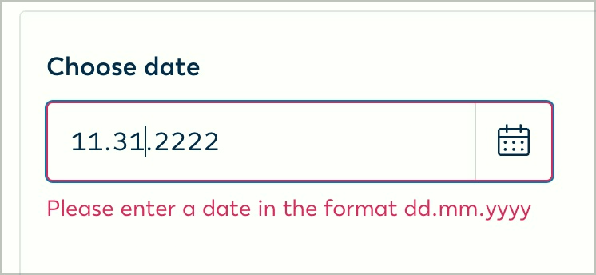

# ✅ Formatangaben

## Beschreibung

Formatangaben bei Formularfeldern sind zugänglich und mit den zugehörigen Eingabefeldern eindeutig verknüpft, d.h. zusätzlich angegebene Hinweise zu Eingabeformaten sind auch durch assistierende Technologien korrekt erfassbar.

## Prüfmethode (in Kürze)

**Screenreader:** Durch Pflichtfelder navigieren mittels Tab-Taste und prüfen, ob Formatangaben und zusätzliche Hinweise ausgegeben werden.

## Prüfmethode für Web (ausführlich)

### Prüf-Schritte

1. Seite mit Formular-Elementen öffnen
1. Sicherstellen, dass Formatangaben korrekt mit Formular-Elementen verbunden sind
    - ⚠️ Die WCAG machen keine Aussage darüber, ob Formatangaben von Anfang an sichtbar sind oder erst nach Abschicken des Formulars als Fehlermeldungen eingeblendet werden; es sollte sich aber für Sehende wie auch Blinde gleich verhalten.
    - **🙂 Beispiel:** Unter einem Datums-Feld befindet sich ein `
` mit Angaben zum Format (z.B. "Format: DD.MM.YYYY"). Der Paragraf ist via `aria-describedby` mit dem Text-Feld verbunden.
        - **😡 Beispiel:** Der Paragraf ist **nicht** verbunden.
    - **🙂 Beispiel:** Bei einem Datums-Feld befindet sich zuerst keine Angabe zum Format; erst nach Abschicken eines fehlerhaften Datums wird eine entsprechende Meldung angezeigt (z.B. "Das Datum muss das Format DD.MM.YYYY aufweisen")
        - ⚠️ Wenn stattdessen eine wenig aufschlussreiche Meldung angesagt wird (z.B. "Das Datumsformat ist nicht korrekt"), dann ist dies eher ein Fall für **✅-97 Informative Fehlermeldungen**
    - **🙂 Beispiel:** Unter einem Passwort-Feld befindet sich eine Liste (`<ul>`) mit Anforderungen (z.B. dass es mind. 8 Buchstaben haben muss, mind. 1 Sonderzeichen, etc.). Die Liste ist via `aria-describedby` mit dem Passwort-Feld verbunden.
        - **😡 Beispiel:** Die Liste ist **nicht** verbunden.

### Nachprüfen mit Screenreader

Bei komplexen Formularen oder zweifelhaftem Code (z.B. Einsatz von `aria-label`) sollte besser mit **🏷️-13 NVDA Screenreader** nachgeprüft werden:

- `Tab` (oder auch `F` oder `I`) drücken, um von Eingabefeld zu Eingabefeld zu springen
- Dann sicherstellen, dass der Screenreader alle relevante Information für's Feld vorliest

⚠️ Denn: viele Fehler findet man oft auch ohne Screenreader, z.B. wenn die Semantik komplett fehlt oder offensichtlich falsch ist. Wenn Semantik aber grundsätzlich **vorhanden scheint**, lässt sich deren Korrektheit und Sinnhaftigkeit oft nur mit Screenreader final beurteilen.

### Nur Plain-Text via aria-describedby

Elemente, die via `aria-describedby` (**🏷️-29 aria-describedby**) mit einem Element verknüpft sind, werden nur als Plain-Text ausgegeben. Information über enthaltene Semantik wird ausgegeben (z.B. ein Link "AGBs lesen" in einem Paragraf wird nur als "AGBs lesen" angesagt, nicht als "Link AGBs lesen"). Insofern müssen solche beschreibenden Texte so geschrieben werden, dass sie auch ohne semantische Info verständlich bleiben.

## Screenshots typischer Fälle

