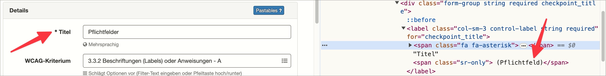

# ✅ Pflichtfelder

WCAG-Kriterium: [📜 3.3.2 Beschriftungen (Labels) oder Anweisungen - A](..)

## Beschreibung

Pflichtfelder sind zugänglich ausgezeichnet, sowohl auf visueller wie nicht-visueller Ebene, z.B. mit `required`-Attribut.

## Prüfmethode (in Kürze)

**Screenreader:** Durch Pflichtfelder navigieren mittels Tab-Taste und prüfen, ob diese als solche ausgegeben werden.

## Prüfmethode für Web (ausführlich)

### Prüf-Schritte

1. Seite mit Formular-Elementen öffnen
1. Pflichtfelder mit [🏷️ DOM Inspektor](/de/tags/dom-inspektor) untersuchen
1. Sicherstellen, dass Pflichtfelder korrekt ausgezeichnet sind
    - **🙂 Beispiel:** Ein Pflichtfeld hat ein Label "Vorname (Pflichtfeld)"
    - **🙂 Beispiel:** Ein Pflichtfeld hat ein `required`- oder `aria-required`-Attribut
    - **🙂 Beispiel:** Ein Pflichtfeld hat ein Label "Vorname *", wobei der Asterisk erklärt wird (z.B. über ein `aria-describedby` oder einen visuell versteckten Text, siehe [🏷️ Inhalte rein visuell verstecken](/de/tags/inhalte-rein-visuell-verstecken)), sodass der Screenreader z.B. "Vorname Eingabe erforderlich" ansagt
        - ⚠️ Der Asterisk kann vom Screenreader als solcher angesagt werden; noch schöner aber ist, wenn er **nicht** angesagt wird
        - ⚠️ Auch visuelle Nutzer freuen sich über eine Erklärung des Asterisk (z.B. via Fussnote); dies ist aber keine strikte Anforderung
        - **😡 Beispiel:** Ein Label "Vorname *" hat zwar eine Erklärung, diese ist aber nicht korrekt mit dem Eingabefeld verbunden (z.B. fehlendes `aria-describedby`, siehe [✅ Text-Elemente zwischen Eingabefeldern](/de/wcag/1.3.1c-formular-beziehungen/text-elemente-zwischen-eingabefeldern) sowie [✅ Fehlermeldungen in Formularen](/de/wcag/3.3.1-fehlerkennzeichnung/fehlermeldungen-in-formularen))
        - **😡 Beispiel:** Ein Label "Vorname *" hat keinerlei Erklärung
    - **🙄 Beispiel:** Ein Textfeld wird erst nach Abschicken als Pflichtfeld erkennbar (z.B. aufgrund einer Fehlermeldung)
        - ⚠️ Dies ist tolerabel, solange es sowohl für Screenreader wie auch visuell gleich ist.

### Nachprüfen mit Screenreader

Bei komplexen Formularen oder zweifelhaftem Code (z.B. Einsatz von `aria-label`) sollte besser mit [🏷️ NVDA Screenreader](/de/tags/nvda-screenreader) nachgeprüft werden:

- `Tab` (oder auch `F` oder `I`) drücken, um von Eingabefeld zu Eingabefeld zu springen
- Dann sicherstellen, dass der Screenreader alle Pflichtfelder als solche ansagt

⚠️ Denn: viele Fehler findet man oft auch ohne Screenreader, z.B. wenn die Semantik komplett fehlt oder offensichtlich falsch ist. Wenn Semantik aber grundsätzlich **vorhanden scheint**, lässt sich deren Korrektheit und Sinnhaftigkeit oft nur mit Screenreader final beurteilen.

## Prüfmethode für Mobile (Ergänzungen zu Web)

Sowohl auf Web-Views als auch native Inhalte 1:1 übertragbar; zum Prüfen einfach zum Eingabefeld wischen: wenn es direkt zusammen mit der Angabe "Pflichtfeld" angesagt wird, ist es gut gelöst (wenn man für die Angabe nochmal wischen muss, dann nicht).

## Prüfmethode für PDF (Ergänzungen zu Web)

### Prüf-Schritte
1. PDF mit [🏷️ Adobe Reader](/de/tags/adobe-reader) öffnen
1. Mit [🏷️ NVDA Screenreader](/de/tags/nvda-screenreader) vorlesen lassen
1. Prüfen, ob Pflichtfelder als Pflichtfelder angesagt werden.

## Details zum blinden Testen

Pflichtangaben für Formular-Elemente sind für Blinde besonders wichtig!

## Screenshots typischer Fälle

