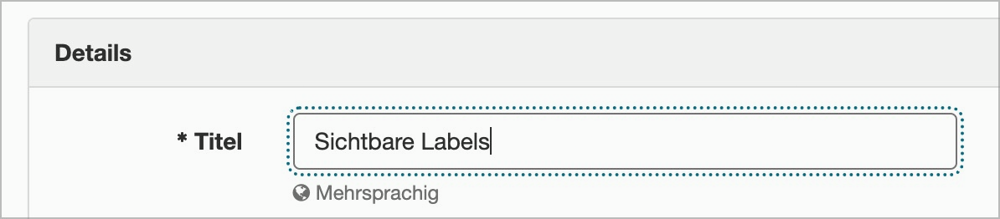

# ✅ Sichtbare Labels

WCAG-Kriterium: [📜 3.3.2 Beschriftungen (Labels) oder Anweisungen - A](..)

## Beschreibung

Formularfelder verfügen über visuell sichtbare Labels. Die alleinige Verwendung von `placeholder`-Attributen zur Beschriftung von Formularfeldern wird vermieden.

## Prüfmethode (in Kürze)

**Tastatur:** Durch Eingabefelder navigieren mittels Tab-Taste und darauf achten, dass sie immer ein Label haben und dass dieses auch bei Fokus sichtbar bleibt.

## Prüfmethode für Web (ausführlich)

### Prüf-Schritte

1. Seite mit Formular-Elementen öffnen
1. Durch Eingabefelder navigieren mit `Tab`
1. Sicherstellen, dass Labels sichtbar sind (und bleiben)
    - ⚠️ Die WCAG sagen nichts darüber aus, wie gross ein Label sein muss; wir ermuntern Kunden aber, lieber grössere als kleinere Labels zu verwenden (gerade beim Float-Label-Pattern kann das Label sehr klein sein, da es sich ggf. "in den Rahmen" des Eingabefelds einfügt)
    - **🙂 Beispiel:** Ein Label "Vorname" steht neben dem Eingabefeld
        - ⚠️ Die WCAG sagen nichts darüber aus, ob das Label rechts, links, ober- oder unterhalb dargestellt werden muss. Auch ob der Screenreader zuerst das Label und dann das Eingabefeld (oder umgekehrt) antrifft ist nicht explizit beschrieben; es sollte aber in sich konsistent und stimmig sein.
    - **🙂 Beispiel:** Ein Label "Vorname" steht innerhalb des Eingabefelds; bei Klick ins Feld bewegt sich das Label zur Seite (bleibt aber sichtbar → Float-Label-Pattern)
        - **😡 Beispiel:** Das Label verschwindet bei Klick ins Eingabefeld bzw. sobald man etwas eingibt (typisches Verhalten von `placeholder`)
        - ⚠️ Wenn ein Ausklapp-Element (z.B. ein `<select>`) beim Ausklappen sein eigenes Label temporär verdeckt, ist dies aber kein Problem!

## Prüfmethode für Mobile (Ergänzungen zu Web)

Sowohl auf Web-Views als auch native Inhalte 1:1 übertragbar; zum Prüfen einfach zum fehlerhaften Eingabefeld wischen und damit interagieren.

## Prüfmethode für PDF (Ergänzungen zu Web)

### Prüf-Schritte
1. PDF mit [🏷️ Adobe Reader](/de/tags/adobe-reader) öffnen
1. Durch Eingabefelder navigieren mit `Tab`
1. Sichtprüfung, ob alle Eingabefelder sichtbare Labels haben.

## Details zum blinden Testen

Nein.

## Screenshots typischer Fälle

## Videos

Keine Videos verfügbar.
