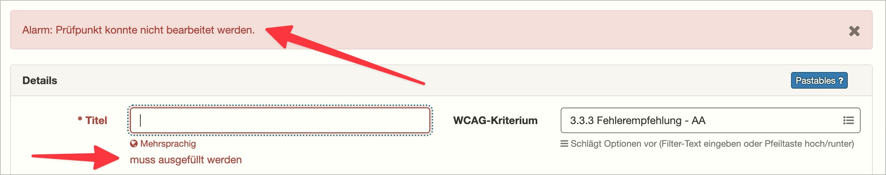
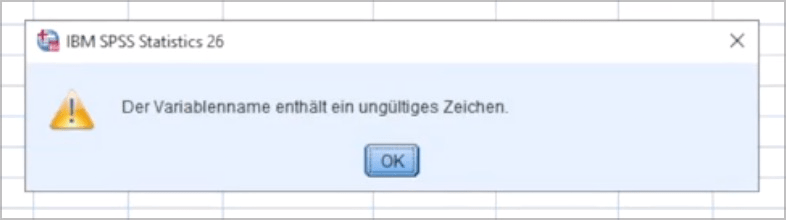

# ✅ Informative Fehlermeldungen

WCAG-Kriterium: [📜 3.3.3 Vorschlag bei Fehler - AA](..)

## Beschreibung

Fehlermeldungen sind informativ und mit den zugehörigen Eingabefeldern eindeutig verknüpft: Es sind Korrekturempfehlungen vorhanden, wenn falsche Benutzereingaben erfolgen.

## Prüfmethode (in Kürze)

**Manuelle Prüfung:** Fehlermeldungen durchsehen und Informationsgehalt beurteilen.

## Prüfmethode für Web (ausführlich)

### Prüf-Schritte

1. Seite mit Formular öffnen
1. Formular fehlerhaft abschicken (z.B. Pflichtfeld leer lassen, Email falsch eingeben, etc.)
1. Sicherstellen, dass Fehler-Meldungen aussagekräftig sind
    - **🙂 Beispiel:** Ein Pflichtfeld wurde leer abgeschickt; ein Fehler "Bitte geben Sie etwas ein" oder "Dies ist ein Pflichtfeld" o.ä. wird angezeigt
        - **😡 Beispiel:** Das Feld wird rot umrandet, mit einem Symbol (z.B. Ausrufezeichen) hervorgehoben oder sonstwie visuell verändert; ansonsten wird aber kein zusätzlicher Hinweistext angezeigt (vgl. [✅ Nicht Farbe allein](/de/wcag/1.4.1-benutzung-von-farbe/nicht-farbe-allein))
        - **😡 Beispiel:** Es wird "Das Feld ist ungültig" o.ä. angezeigt
    - **🙂 Beispiel:** Ein Datumsfeld wurde manuell falsch ausgefüllt; ein Fehler "Das Datum muss das Format DD/MM/YYYY haben" o.ä. wird angezeigt
        - **🙄 Beispiel:** Es wird nur "Das Datum ist ungültig" o.ä. angezeigt; das geforderte Format ist aber bereits anderswo ersichtlich (z.B. im Label)
            - ⚠️ Das `placeholder`-Attribut kann dafür genutzt werden, ein Eingabeformat anzugeben. Da dieses aber bei der Eingabe visuell verschwindet (und beim Re-Display eines fehlerhaft abgeschickten Formulars entsprechend ebenfalls nicht mehr sichtbar ist), ist es nicht ausreichend für die Erfüllung dieses Prüfpunkts!
        - **😡 Beispiel:** Es wird nur "Das Datum ist ungültig" o.ä. angezeigt; das geforderte Format ist sonst **nirgendwo** ersichtlich
    - **🙂 Beispiel:** Beim Registrieren eines Nutzerkontos wurde ein zu wenig sicheres Passwort eingegeben; entsprechende Fehler werden angezeigt (z.B. "Mind. 8 Buchstaben gefordert" oder "Enthält keine Sonderzeichen" o.ä.)
        - **🙄 Beispiel:** Ein wenig aussagekräftiger Fehler "Das Passwort ist zu einfach" wird angezeigt; aus dem Kontext heraus ist aber gut ersichtlich, was die Anforderungen ans Passwort sind (vgl. [✅ Fehlermeldungen in Formularen](/de/wcag/3.3.1-fehlerkennzeichnung/fehlermeldungen-in-formularen))
        - **😡 Beispiel:** Es wird "Das Passwort ist zu einfach" angezeigt; aus dem Kontext heraus ist zudem **nicht** ersichtlich, was die Anforderungen ans Passwort sind
    - **😡 Beispiel:** Es wird nur eine allgemeine Fehlermeldung am Anfang des Formulars angezeigt, z.B. "Überprüfen Sie Ihre Eingaben"; welche Eingabefelder aber tatsächlich revidiert werden sollen, bleibt unklar
    - **🙂 Beispiel:** Beim Einloggen wird ein Fehler "Die eingegebene Kombination von Nutzer und Passwort existiert nicht" agezeigt
        - **🙂 Beispiel:** Es wird "Das Einloggen ist aktuell aufgrund von Wartungsarbeiten nicht möglich" angezeigt
        - **🙄 Beispiel:** Es wird "Einloggen nicht erfolgreich" angezeigt → es ist unklar, ob die Eingabe falsch war, oder das Einloggen generell nicht möglich ist

## Prüfmethode für Mobile (Ergänzungen zu Web)

Sowohl auf Web-Views als auch native Inhalte 1:1 übertragbar.

## Prüfmethode für PDF (Ergänzungen zu Web)

### Prüf-Schritte
1. PDF mit [🏷️ Adobe Reader](/de/tags/adobe-reader) öffnen
1. Mit [🏷️ NVDA Screenreader](/de/tags/nvda-screenreader) vorlesen lassen
1. Prüfen, dass Fehlermeldungen ausreichend informativ sind.
1. Ein Feld fehlerhaft oder unvollständig ausfüllen und weitertabben. Dabei überprüfen, ob die ausgegebene Fehlermeldung ausreichend informativ ist.

## Details zum blinden Testen

Wenn die Fehlermeldungen korrekt mit den Eingabefeldern verknüpft sind, ist dieser Prüfpunkt mit Screenreader gut testbar. Ansonsten kann es etwas mühsam werden, weil man manuell auf die Suche nach Fehlermeldungen gehen muss.

## Screenshots typischer Fälle

## Videos

Keine Videos verfügbar.
