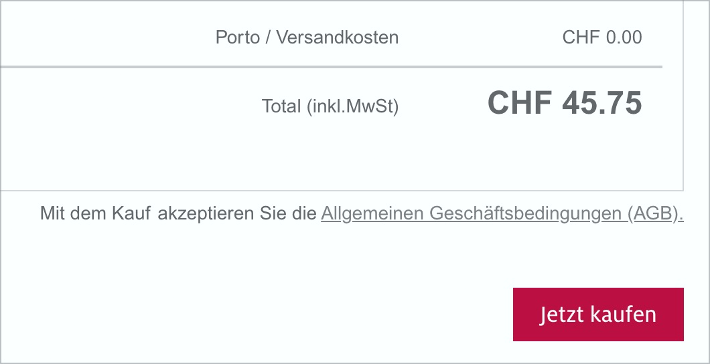

# ✅ Nutzereingaben überprüfbar

WCAG-Kriterium: [📜 3.3.4 Fehlervermeidung (rechtlich, finanziell, Daten) - AA](..)

## Beschreibung

Nutzereingaben müssen überprüfbar sein vor Prozess-Abschluss mit finanziellen/rechtlichen Folgen. Es ist sichergestellt, dass die Gelegenheit besteht, eingegebenen Daten zu überprüfen und gegebenenfalls zu korrigieren, bevor ein endgültiger Abschluss erfolgt.

## Prüfmethode (in Kürze)

**Manuelle Prüfung:** Prozesse durchlaufen und darauf achten, dass vor Abschluss eine Zusammenfassung der Daten (mit Möglichkeit zur Korrektur) angezeigt wird.

## Prüfmethode für Web (ausführlich)

### Prüf-Schritte

1. Seite mit Prozess (z.B. Checkout in Onlineshop) öffnen
1. Prozess durchlaufen
1. Sicherstellen, dass vor definitivem Abschicken der Bestellung eine Zusammenfassung aller relevanten Daten angezeigt wird
    - **🙂 Beispiel:** In einem Onlineshop wird vor Prozessabschluss eine Liste aller zu bestellenden Artikel angezeigt, sowie Infos über die Liefer- und Rechnungsadresse, etc.; die Angaben können nun bei Bedarf nochmal geändert werden und erst durch Betätigen eines "Jetzt bestellen!"-Schalters wird die Bestellung final ausgelöst.
        - **😡 Beispiel:** Es wird keine Zusammenfassung angezeigt, oder die Zusammenfassung listet nicht alle relevanten Informationen auf.

## Screenshots typischer Fälle

