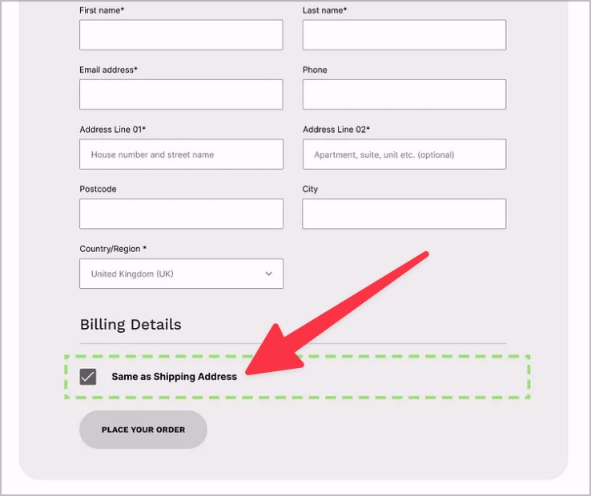

# ✅ Redundante Eingabe

## Beschreibung

Persönliche Daten müssen nicht mehrfach eingegeben werden, sondern sind bei mehrmaliger Abfrage z.B. über eine Checkbox oder Liste auswählbar.

## Prüfmethode (in Kürze)

**Manuelle Prüfung:** Prozesse durchsehen und sicher stellen, dass persönliche Daten nicht mehrfach eingegeben werden müssen.

## Prüfmethode für Web (ausführlich)

### Prüf-Schritte

1. Seite öffnen
1. Angebotene Prozesse durchlaufen (z.B. Buch bestellen)
1. Sicherstellen, dass Daten nicht mehrfach eingegeben werden müssen
    - **🙂 Beispiel:** Nach Eingabe der Lieferadresse bietet ein Onlineshop an, dieselbe auch als Rechnungsadresse zu verwenden
        - **😡 Beispiel:** Die Rechnungsadresse muss erneut manuell eingegeben werden
    - **🙂 Beispiel:** Beim Registrieren eines neuen Nutzers muss das Passwort doppelt eingegeben werden
        - **⚠️ Erlaubte Ausnahme:** Aus Gründen der Sicherheit macht das durchaus Sinn
    - **🙂 Beispiel:** Nach Abschicken eines Suchformulars wird das erneut angezeigte Suchfeld wieder mit dem Suchbegriff vor-ausgefüllt

## Screenshots typischer Fälle

