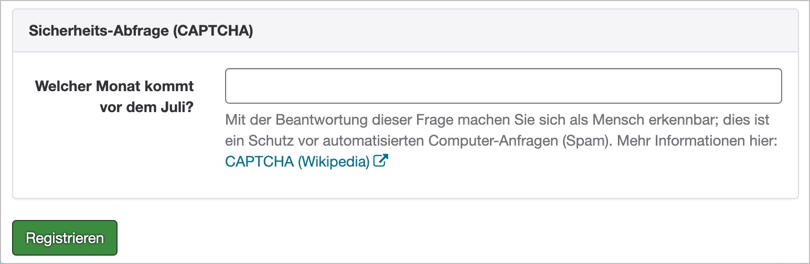
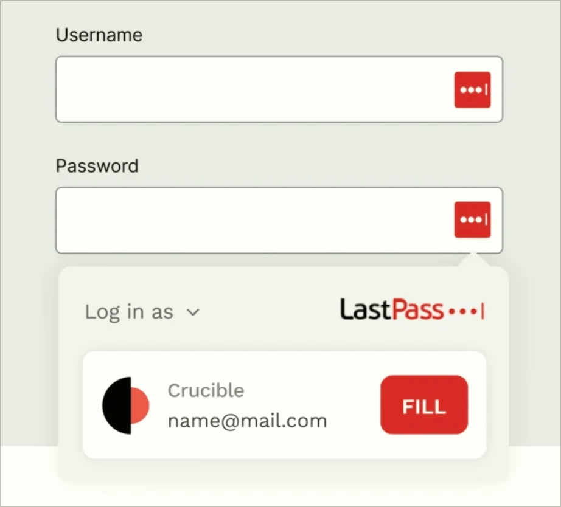
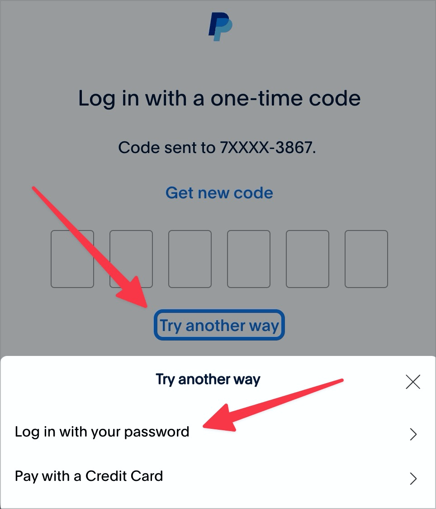
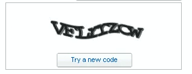
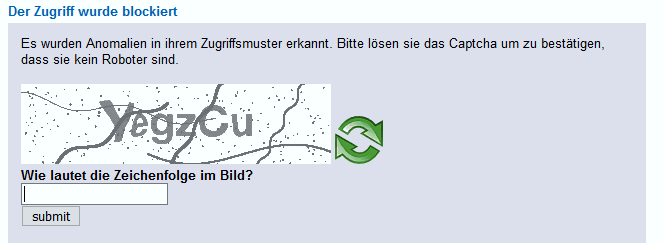

# ✅ Barrierefreies Authentifizieren

## Beschreibung

Mindestens eine der angebotenen Möglichkeiten zur Authentifizierung ist für die unterschiedlichen Nutzer-Gruppen barrierefrei. Insbesondere Copy & Paste ist nicht unterbunden.

## Prüfmethode (in Kürze)

**Manuelle Prüfung:** Angebotene Möglichkeiten zur Authentifizierung für unterschiedliche Nutzer-Gruppen prüfen.

## Prüfmethode für Web (ausführlich)

### Prüf-Schritte

1. Seite mit Authentifizierung öffnen
1. Sicherstellen, dass diese barrierefrei ist
    - **🙂 Beispiel:** Ein Nutzername und Passwort muss eingegeben werden
        - ⚠️ Wichtig ist, dass beim Nutzername `autocomplete="username"` sowie beim Passwort `autocomplete="current-password"` gesetzt sind, siehe **📜-1.3.5 Eingabezweck bestimmen**!
        - **🙂 Beispiel:** Statt ein Passwort zu fordern, wird eine Email an den Nutzer geschickt, welches z.B. einen Direkt-Link zum Einloggen anbietet (oder einen Code, der eingegeben werden muss bzw. via Copy&Paste übertragen werden kann)
    - **🙂 Beispiel:** Eine Webseite erlaubt das Einloggen über einen Drittanbieter (z.B. OAuth) oder das Wiederverwenden eines anderen Kontos (z.B. Github)
        - ⚠️ Wichtig hierbei ist natürlich, dass diese Anbieter barrierefreies Einloggen ermöglichen
    - **😡 Beispiel:** Eine Sicherheitsabfrage fordert logisches Denken, z.B. "Das Gegenteil von Süden ist?" oder "17 minus 5 ergibt?"
    - **🙄 Beispiel:** Eine Sicherheitsabfrage fordert Erkennen, z.B. "Wähle das Fahrrad" oder "Welches Tier hörst du?"
        - ⚠️ Solche Aufgaben, die z.B. nur über den visuellen oder auditiven Kanal lösbar sind, bringen natürlich eine Menge weiterer Probleme mit sich (ein typisches Problem von CAPTCHAs, siehe **✅-14 Grafische CAPTCHAs**)! Sie sind nur dann akzeptabel, wenn sie für alle anderen Kanäle alternative Mechanismen anbieten.

## Screenshots typischer Fälle

