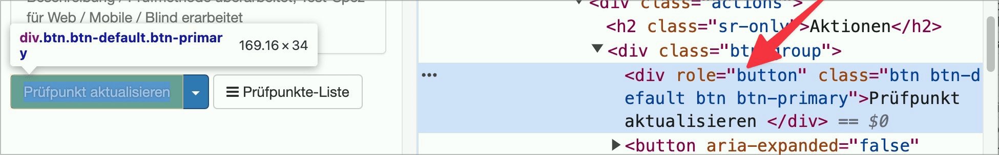

# ✅ Formular-Schalter korrekt umgesetzt

WCAG-Kriterium: [📜 4.1.2 Name, Rolle, Wert - A](..)

## Beschreibung

Formular-Schalter sind korrekt umgesetzt (als `<button>`-Element oder `<input type="submit">`-Element).

## Prüfmethode (in Kürze)

Formularelemente auflisten und prüfen, ob Schalter korrekt umgesetzt sind.

## Prüfmethode für Web (ausführlich)

1. Seite öffnen
1. Sicherstellen, dass Formular-Schalter korrekt umgesetzt sind
    - **🙂 Beispiel:** Schalter sind als `<input type="submit">` oder `<button>` umgesetzt
    - **🙄 Beispiel:** Schalter sind als `
` o.ä. umgesetzt → ⚠️ Das ist technisch zwar in Ordnung, aber dennoch nicht empfehlenswert
    - **😡 Beispiel:** Schalter sind als `
` o.ä. umgesetzt

## Screenshots typischer Fälle

