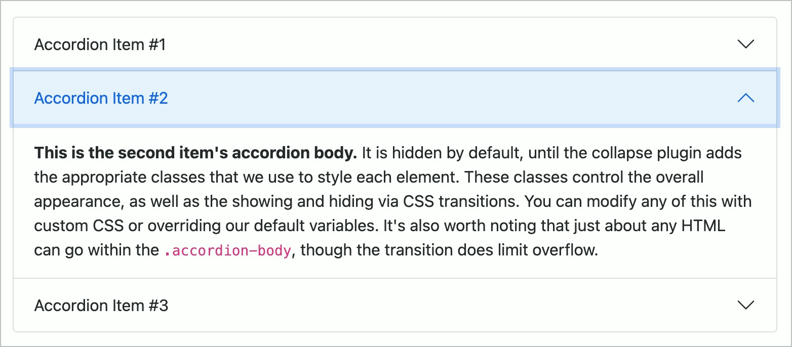

# ✅ Akkordeons

WCAG-Kriterium: [📜 4.1.2a Erweiterte Steuerelemente (Widgets)](..)

## Beschreibung

Akkordeons sind barrierefrei umgesetzt. Sie werden durch Screenreader korrekt angesagt, ihr Status wird vermittelt (z.B. "reduziert" bzw. "erweitert").

## Prüfmethode (in Kürze)

**Screenreader:** Mit Akkordeons interagieren und sicherstellen, dass sie sich wie erwartet verhalten.

## Prüfmethode für Web (ausführlich)

### Prüf-Schritte

Die Implementierungen von Akkordeons können sich stark von einander unterscheiden.

Die folgende Anleitung ist eine Annäherung an die aus der Praxis gebräuchlichsten Konventionen (siehe unten). Sie muss beim Testen an die jeweilige Situation angepasst werden. Generell gilt: wenn eine einzige Anforderung nicht erfüllt wird, so ist im Normalfall das gesamte Element als unzugänglich einzustufen!

1. Seite öffnen
1. Akkordeon mit Tastatur alleine bedienen und prüfen:
    - ⚠️ Probleme mit Tastatur alleine sind unter [✅ Mit der Tastatur bedienbar](/de/wcag/2.1.1-tastatur/mit-der-tastatur-bedienbar) zu bemängeln!
    - Bedien-Elemente zum Öffnen/Schliessen eines Inhalts fokussieren und mit `Enter` aktivieren (z.B. "Liefer-Adresse")!
    - Wird der Inhalt eingeblendet?
        - **🙂 Beispiel:** Der gewünschte Akkordeon-Inhalt wird angezeigt, z.B. Eingabe-Felder für Liefer-Adresse
        - **😡 Beispiel:** Es passiert nichts
    - Falls sich interaktive Elemente im Inhalt befinden: können diese per `Tab` erreicht werden?
        - **🙂 Beispiel:** Die Formular-Felder können erreicht werden
        - **😡 Beispiel:** Solche Elemente können **nicht** erreicht werden
1. Akkordeon wie zuvor bedienen, dieses mal **mit Screenreader** (ggf. Seite neu laden), und prüfen:
    - ⚠️ Bedienung dürfte in etwa gleich sein wie mit Tastatur alleine
    - Vermittelt der Screenreader das Element adäquat?
        - **🙂 Beispiel:** "Eingeklappt" / "Ausgeklappt" oder ähnlich
        - **😡 Beispiel:** Kein Hinweis
    - Vermittelt der Screenreader, wenn ein Akkordeon-Inhalt ein/ausgeklappt wird?
        - **🙂 Beispiel:** Beim Einklappen der "Liefer-Adresse" ertönt der Hinweis "Eingeklappt"
        - **🙂 Beispiel:** Beim Ausklappen der "Rechnungs-Adresse" ertönt der Hinweis "Ausgeklappt"
        - **😡 Beispiel:** Es ertönt kein Hinweis
    - Kann der Inhalt gelesen werden?
        - **🙂 Beispiel:** Der Inhalt wird mit `Runter` schnell erreicht
        - **😡 Beispiel:** Der Inhalt wird nicht erreicht
    - Beim Aktivieren eines "Alle/Keine öffnen"-Schalters: wird eine entsprechende Rückmeldung gegeben?
        - **🙂 Beispiel:** "Gedrückt" / "Aktiv" oder ähnlich
        - **😡 Beispiel:** Keine Rückmeldung

### Konventionen

- Akkordeons ähneln Tabs ([✅ Tabs / Tablisten](/de/wcag/4.1.2a-erweiterte-steuerelemente-widgets/tabs-tablisten)), ihre Kontroll-Elemente befinden sich aber aufgeteilt zwischen den einzelnen Inhalts-Bereichen
- Manche Akkordeons erlauben das **Öffnen mehrerer Inhalts-Bereiche gleichzeitig** → es braucht keinen Hinweis darauf; der Nutzer findet das Verhalten selber heraus
- Manche Akkordeons bieten Schalter zum **Öffnen/Schliessen aller Inhalts-Bereiche** an
- Oft wird eine ausgefeilte ARIA-Implementierung verwendet (siehe [APG: Accordion Pattern (Sections With Show/Hide Functionality)
](https://www.w3.org/WAI/ARIA/apg/patterns/accordion/)) → es gibt allerdings kein `role="accordion"`
    - Es kann aber auch ein einfaches `
` mit Links oder Buttons als Auf-/Zuklapp-Elemente sein; in Formularen können sogar Checkboxen oder Radiobuttons sinnvoll sein, siehe [ADG: Accordion](https://www.accessibility-developer-guide.com/examples/widgets/accordions/)

## Screenshots typischer Fälle

