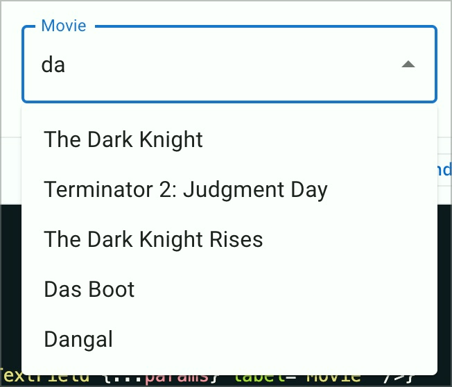
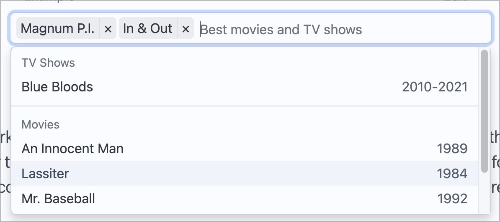
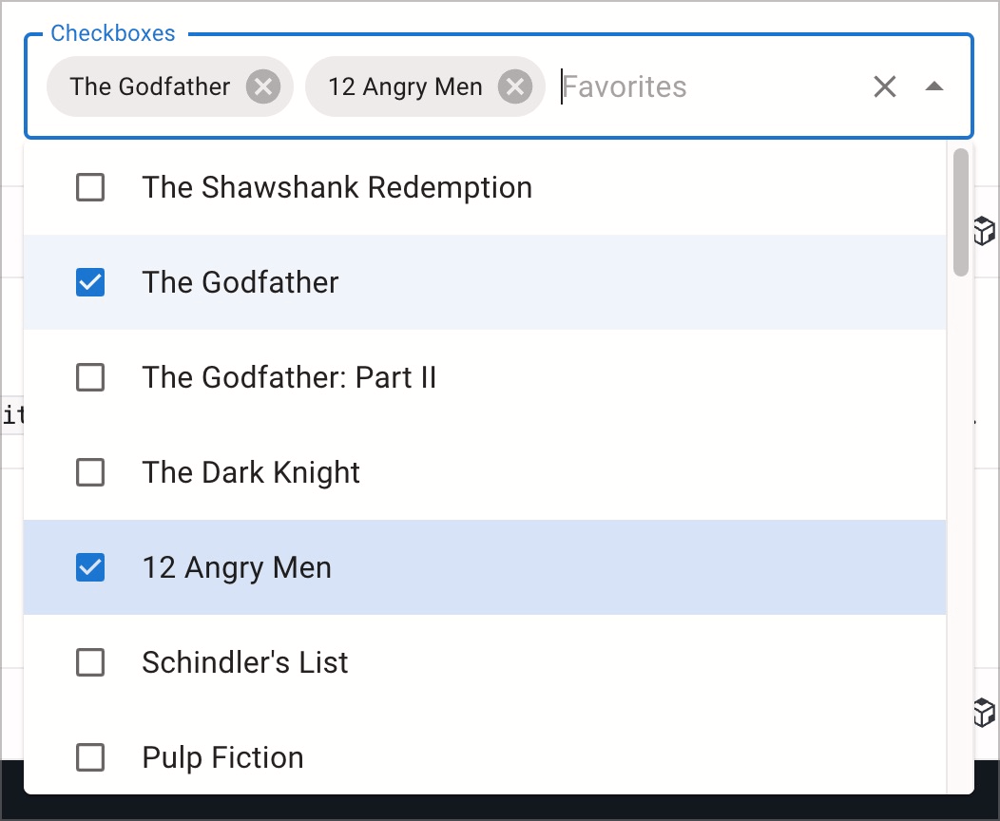

# ✅ Autocompletes (Comboboxen)

WCAG-Kriterium: [📜 4.1.2a Erweiterte Steuerelemente (Widgets)](..)

## Beschreibung

Autocompletes sind barrierefrei umgesetzt. Sie werden durch Screenreader korrekt angesagt, die Anzahl aktuell verfügbarer Vorschläge, der aktuelle Eintrag beim Navigieren der Optionen sowie die schlussendlich gewählte Option werden durch Screenreader vermittelt.

## Prüfmethode (in Kürze)

**Screenreader:** Mit Autocompletes interagieren und sicherstellen, dass sie sich wie erwartet verhalten.

## Prüfmethode für Web (ausführlich)

### Prüf-Schritte

Die Implementierungen von Autocompletes können sich stark von einander unterscheiden.

Die folgende Anleitung ist eine Annäherung an die aus der Praxis gebräuchlichsten Konventionen (siehe unten). Sie muss beim Testen an die jeweilige Situation angepasst werden. Generell gilt: wenn eine einzige Anforderung nicht erfüllt wird, so ist im Normalfall das gesamte Element als unzugänglich einzustufen!

1. Seite öffnen
1. Autocomplete **mit Maus und Tastatur** bedienen:
    - ⚠️ Dies gibt einem ein Gefühl, wie sich das Element später auch mit Tastatur und Screenreader bedienen lassen sollte
    - Falls möglich: Options-Liste aufklappen, Optionen an-/abwählen, Options-Liste zuklappen
    - Suchbegriff eingeben
    - Erneut Optionen an-/abwählen, Options-Liste zuklappen
1. Autocomplete wie zuvor bedienen, dieses mal **mit Tastatur** alleine (ggf. Seite neu laden), und prüfen:
    - ⚠️ Probleme mit Tastatur alleine sind unter [✅ Mit der Tastatur bedienbar](/de/wcag/2.1.1-tastatur/mit-der-tastatur-bedienbar) zu bemängeln!
    - Wird mit `Hoch`/`Runter` durch die Optionen navigiert (manchmal auch `Tab` / `Shift`-`Tab`)?
        - **🙂 Beispiel:** Die vorherige/nächste Option wird an-navigiert
            - ⚠️ Falls die Options-Liste zuvor noch zugeklappt war, so ist sie jetzt aufgeklappt
        - **😡 Beispiel:** Es passiert nichts
    - Bei Formular-Feld (z.B. "Meine Hobbys"): wird mit `Enter` die an-navigierte Option an-/abgewählt?
        - **🙂 Beispiel:** Die an-navigierte Option wird an-/abgewählt
            - ⚠️ Einfach-Auswahl: die Options-Liste wird beim Wählen einer Option zugeklappt
        - **😡 Beispiel:** Es passiert nichts
    - Bei Navigation (z.B. Suchmaschine): wird mit `Enter` die angewählte Option im Detail angezeigt?
        - **🙂 Beispiel:** Gewählte Seite wird geladen
        - **🙂 Beispiel:** Teil der aktuellen Seite wird ersetzt mit neuem Inhalt (In-Page-Änderung)
        - **😡 Beispiel:** Es passiert nichts
    - Werden mit `Tab` etwaige weitere Bedien-Elemente erreicht?
        - **🙂 Beispiel:** "Eingabe löschen"-Schalter
        - **🙂 Beispiel:** "Alle an-/abwählen"-Schalter
    - Wird mit `Esc` (manchmal auch `Enter`) die Options-Liste zugeklappt?
        - **🙂 Beispiel:** Die Options-Liste klappt zu
        - **🙄 Beispiel:** Es passiert nichts → nur ein Nice-to-Have
    - Bei Pills: Wird mit `Rücktaste` eine an-navigierte Option gelöscht'
        - **🙂 Beispiel:** Die an-navigierte Option wird entfernt
        - **🙄 Beispiel:** Es passiert nichts → okay, solange man Option auch in der Options-Liste abwählen kann
        - **😡 Beispiel:** Es passiert nichts → nicht okay, wenn man Option nicht in der Options-Liste abwählen kann
1. Autocomplete wie zuvor bedienen, dieses mal **mit Screenreader** (ggf. Seite neu laden), und prüfen:
    - ⚠️ Bedienung dürfte in etwa gleich sein wie mit Tastatur alleine
    - Vermittelt der Screenreader das Element adäquat?
        - **🙂 Beispiel:** "Eingabe mit Auto-Vervollständigung" oder ähnlich, in Verbindung mit [✅ Formularfelder Labels](/de/wcag/1.3.1c-formular-beziehungen/formularfelder-labels)
        - **😡 Beispiel:** "Eingabe"
        - ⚠️ Screenreader-Nutzende benötigen keine zusätzliche Hilfe zur Bedienung einer Autocomplete (solange diese sich mit den genannten Tasten wie erwartet bedienen lässt)
    - Beim Erreichen des Elements: vermittelt der Screenreader den Ausklapp-Zustand der Options-Liste adäquat?
        - **🙂 Beispiel:** "eingeklappt"
        - **🙂 Beispiel:** "ausgeklappt"
        - **😡 Beispiel:** Kein Hinweis
    - Beim Öffnen/Schliessen der Options-Liste: vermittelt der Screenreader deren Ausklapp-Zustand adäquat?
        - **🙂 Beispiel:** "eingeklappt"
        - **🙂 Beispiel:** "ausgeklappt"
        - **😡 Beispiel:** Keine Rückmeldung
    - Beim Durch-Navigieren der angezeigten Optionen:
        - Vermittelt der Screenreader die an-navigierte Option, ob sie bereits gewählt ist, und ggf. ihre Position in der Liste (optional)?
            - **🙂 Beispiel:** "Tanzen"
            - **🙂 Beispiel:** "Tanzen (gewählt)"
            - **🙂 Beispiel:** "Tanzen (3 von 15)"
            - **😡 Beispiel:** Keine (oder eine falsche) Angabe
            - **😡 Beispiel:** "3 von 15" (nur Position, Option selber bleibt unklar)
        - Vermittelt der Screenreader die an-navigierte Option kurz und bündig?
            - **🙂 Beispiel:** "Der Herr der Ringe, Teil 1"
            - **😡 Beispiel:** "ISBN 3608964290, CHF 27.90, Klett-Cotta Verlag, J. R. R. Tolkien, Der Herr der Ringe, Teil 1"
                - ⚠️ Viel Zusatz-Information vor dem eigentlich relevanten Buch-Titel! Dies stört das Navigieren mittels Screenreader.
            - **🙄 Beispiel:** "Der Herr der Ringe, Teil 1: Der Herr der Ringe (englischer Originaltitel: The Lord of the Rings) ist eine Romantrilogie von J. R. R. Tolkien. Er gehört zu den kommerziell erfolgreichsten Romanwerken des 20. Jahrhunderts..."
                - ⚠️ Da die zusätzliche Information nach dem Buch-Titel folgt, kann sie von Screenreader-Nutzenden übersprungen werden.
    - Bei Formular-Feld (z.B. "Meine Hobbys"): vermittelt der Screenreader das An-/Abwählen der an-navigierten Option?
        - **🙂 Beispiel:** "Tanzen (gewählt)" beim Anwählen
        - **🙂 Beispiel:** "Tanzen (nicht gewählt)" beim Abwählen
        - **😡 Beispiel:** Kein Hinweis
    - Haben alle grafischen Elemente einen sinnvollen Alternativtext?
        - **🙂 Beispiel:** "X"-Schalter (zum Löschen des Such-Begriffs) wird als "Suchbegriff löschen" angesagt
        - **🙄 Beispiel:** "X"-Schalter wird als "Löschen" angesagt → ggf. nicht sehr eindeutig: wird der Suchbegriff gelöscht? Wird die aktuell gewählte Option gelöscht? Wird das gesamte Element zurück gesetzt?
        - **😡 Beispiel:** "X"-Schalter wird als "X" angesagt
    - Bei Navigation (z.B. Suchmaschine): vermittelt der Screenreader die angewählte Option?
        - **🙂 Beispiel:** Neue Seite wird geladen → `<title>` wird automatisch ausgegeben ([✅ Aussagekräftiger Titel](/de/wcag/2.4.2-seite-mit-titel/aussagekraeftiger-titel))
        - **🙂 Beispiel:** "Der Herr der Ringe, Teil 1" → Fokus-Führung ([✅ Fokus-Führung](/de/wcag/2.4.3-fokus-reihenfolge/fokus-fuehrung)) oder Status-Meldung ([✅ Statusmeldungen](/de/wcag/4.1.3-statusmeldungen/statusmeldungen)) bei In-Page-Änderung
        - **😡 Beispiel:** Kein Hinweis
    - Vermittelt der Screenreader die Anzahl aktuell angezeigter Optionen beim Suchen?
        - **🙂 Beispiel:** "16 Ergebnisse"
        - **🙂 Beispiel:** "3 Städte für 'Luz'"
        - **🙂 Beispiel:** "2 von 7 Ergebnissen verfügbar"
        - **🙂 Beispiel:** "Keine Ergebnisse"
        - **😡 Beispiel:** Kein Hinweis
    - Wenn ein Suchbegriff mit einer Mindest-Länge gefordert ist: vermittelt dies der Screenreader?
        - **🙂 Beispiel:** "Bitte mind. 3 Buchstaben eingeben"
        - **😡 Beispiel:** Kein Hinweis
    - Wenn Ergebnisse remote geladen werden: vermittelt dies der Screenreader?
        - **🙂 Beispiel:** "Ergebnisse laden, bitte warten"
            - ⚠️ Nur notwendig, wenn das Laden eine gewisse Zeit überschreitet (ca. 1 Sekunde)
        - **😡 Beispiel:** Kein Hinweis
    - Bei Mehrfach-Auswahl: wird die Möglichkeit, mehrere Optionen zu wählen, vom Screenreader vermittelt?
        - **🙂 Beispiel:** "Deine Hobbys" → Mehrzahl im Label
        - **🙂 Beispiel:** "Hobbys (Mehrfach-Auswahl möglich)" → expliziter Hinweis
        - **😡 Beispiel:** Kein Hinweis
    - Wenn eine Mindest- oder maximale Anzahl an gewählten Optionen gefordert ist: vermittelt dies der Screenreader?
        - **🙂 Beispiel:** "Wähle drei Hobbys" → Anzahl im Label
        - **🙂 Beispiel:** "Hobbys (mindestens zwei, maximal fünf)" → expliziter Hinweis
        - **😡 Beispiel:** Kein Hinweis
        - ⚠️ Ein solcher Hinweis kann auch als Fehler-Meldung implementiert werden, siehe [✅ Fehlermeldungen in Formularen](/de/wcag/3.3.1-fehlerkennzeichnung/fehlermeldungen-in-formularen)
    - Wenn eine noch nicht existierende Option mittels Suchbegriff und `Enter` erstellt werden kann: vermittelt dies der Screenreader und gibt ein entsprechendes Feedback?
        - **🙂 Beispiel:** "Drücke Enter, um 'Gärtnern' zu erstellen" → beim Fokussieren der Autocomplete
        - **😡 Beispiel:** Kein Hinweis auf Funktionalität
        - **🙂 Beispiel:** "'Gärtnern' erstellt" → nach Drücken von `Enter`
        - **😡 Beispiel:** Kein Hinweis → nach Erstellung
    - Bei Pills: ist die Liste der Optionen mit Screenreader verständlich und bedienbar?
        - **🙂 Beispiel:** Beim Navigieren durch die Elemente werden diese angesagt
        - **😡 Beispiel:** Navigieren durch die Elemente ergibt kein sinnvolles Feedback
        - **🙂 Beispiel:** Beim Löschen eines Elements erfolgt ein entsprechendes Feedback
        - **😡 Beispiel:** Löschen eines Elements ergibt kein sinnvolles Feedback
        - ⚠️ Falls die Pills keine zusätzlichen Informationen und Funktionalitäten anbieten, so können sie als redundant angesehen werden und müssen nicht barrierefrei sein; sie sollten dann aber möglichst vor Screenreadern versteckt (oder als redundant deklariert) werden.

### Konventionen

#### Funktionalitäten

- Bei **Einfach-Auswahl** kann ein einzelner Wert gewählt werden (z.B. eine Hotel-Bewertung zwischen "1 Stern" und "5 Sterne")
    - Manchmal handelt es sich um ein **Pflicht-Feld** → siehe [✅ Pflichtfelder](/de/wcag/3.3.2-beschriftungen-labels-oder-anweisungen/pflichtfelder)
- Bei **Mehrfach-Auswahl** können mehrere Werte gewählt werden (z.B. "Ihre Hobbys")
    - Manchmal wird eine **Mindest-** und/oder eine **maximale Anzahl** gewählter Werte gefordert (z.B. "Wählen Sie zwischen 2 und 5 Hobbys aus")
- Manchmal wird ein **Suchbegriff gefordert**, damit Optionen angezeigt werden
    - Manchmal muss der Suchbegriff eine **Mindest-Länge** aufweisen (z.B. 3 Buchstaben)
    - Manchmal werden **Ergebnisse remote geladen**, was zu einer Verzögerung führen kann
- Manchmal kann man eine noch nicht existierende **Option erstellen**, indem der gewünschte Wert als Suchfilter eingegeben und mit `Enter` bestätigt wird (z.B. beim Taggen eines YouTube-Videos)
- Oft handelt es sich um ein **Formular-Feld**, bei welchem man das Formular nach Ausfüllen mit einem Schalter abschicken kann
- Manchmal handelt es sich um eine **Navigation**, bei welcher man sofort zur gewählten Option geleitet wird (z.B. bei einer Suchmaschine)

#### Bedienung

- Manchmal wird die Liste an Optionen automatisch ausgeklappt bei Fokus (bzw. Klick)
    - Manchmal wird eine eigene Schaltfläche angeboten zum Ein-/Ausklappen
- Meist wird mit `Hoch`/`Runter` durch die Optionen navigiert
    - Manchmal aber auch mit `Tab`
- Beim Navigieren durch die Options-Liste bleibt der Fokus manchmal im Suchfeld
    - Manchmal springt er in die Options-Liste hinein
    - Beim Verändern des Suchbegriffs wird zudem manchmal die jeweils erste verfügbare Option vor-selektiert (sodass man nur noch `Enter` drücken muss, um sie zu wählen)

#### Visuelles Erscheinungs-Bild

- Oft ähnelt die Darstellung einer klassischen, relativ kompakten Auswahl-Liste (`<select>` oder [✅ Dropdowns (Aufklapp-Elemente)](/de/wcag/4.1.2a-erweiterte-steuerelemente-widgets/dropdowns-aufklapp-elemente)), insbesondere wenn es sich um ein **Formular-Feld** handelt
    - Oft mit einem zusätzlichen Schalter "Such-Begriff löschen" (visuell als "X" dargestellt)
- Manchmal handelt es sich aber auch um recht komplexe, auch seitenbreite ausklappbare Elemente, welche eher einem Dialog ([✅ Dialoge](/de/wcag/4.1.2a-erweiterte-steuerelemente-widgets/dialoge)) ähneln, insbesondere wenn es sich um eine **Navigation** handelt
    - Diese können zusätzliche Schaltflächen anbieten (etwa "Suchbegriff löschen" oder "Alle / keine auswählen"), welche typischerweise mit `Tab` erreicht werden
    - Aber auch Hinweise zum Status der Suche (etwa "12 Resultate verfügbar" oder "Ergebnisse werden geladen")
    - Sowie zusätzliche Informationen zu den einzelnen angezeigten Such-Resultaten (etwa die Beschreibung der Artikel in einem Online-Shop).
- **Pills:** Manchmal werden gewählte Optionen nicht nur in der ausklappbaren Options-Liste angezeigt, sondern auch als Liste von Elementen z.B. unterhalb des Suchfelds
    - Diese Liste bietet manchmal weitere Optionen an, etwa ein "X"-Schalter zum Löschen eines Elements

#### Implementierung

- Oft wird eine ausgefeilte ARIA-Implementierung verwendet (siehe [APG: Editable Combobox With List Autocomplete Example](https://www.w3.org/WAI/ARIA/apg/patterns/combobox/examples/combobox-autocomplete-list/))
    - Es kann aber auch ein simples Eingabe-Feld sein, welches z.B. eine Liste von Radiobuttons oder Checkboxen filtert und mit wenig ARIA angereichert ist (siehe [ADG: Autosuggest](https://www.accessibility-developer-guide.com/examples/widgets/autosuggest/))

⚠️ Für die Tastatur-Nutzung macht dies oft wenig Unterschied; mit Screenreader kann sich die Bedienung aber erheblich unterscheiden, was in Ordnung ist (Hauptsache, die Implementierung ist verständlich und zielführend nutzbar).

## Screenshots typischer Fälle

