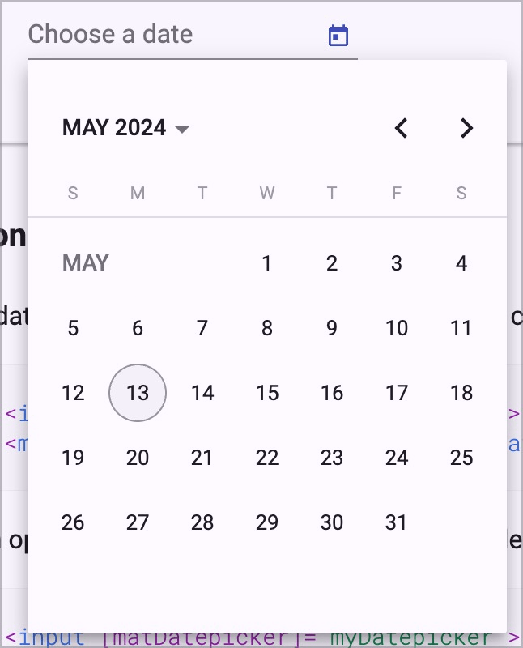

# Prüfpunkt: Datepicker / Timepicker

## Beschreibung

Datepicker sind barrierefrei umgesetzt, sofern keine Alternative dazu besteht (z.B. manuelle Datumseingabe in Formularfeld). Sie werden durch Screenreader korrekt angesagt, der aktuelle Eintrag beim Navigieren der Optionen sowie die schlussendlich gewählte Option werden durch Screenreader vermittelt.

## Prüfmethode (in Kürze)

**Screenreader:** Mit Datumswählern interagieren und sicherstellen, dass sie sich wie erwartet verhalten.

## Prüfmethode für Web (ausführlich)

### Prüf-Schritte

Die Implementierungen von Datepickern können sich stark von einander unterscheiden.

Die folgende Anleitung ist eine Annäherung an die aus der Praxis gebräuchlichsten Konventionen (siehe unten). Sie muss beim Testen an die jeweilige Situation angepasst werden. Generell gilt: wenn eine einzige Anforderung nicht erfüllt wird, so ist im Normalfall das gesamte Element als unzugänglich einzustufen!

1. Seite öffnen
1. Datepicker **mit Maus und Tastatur** bedienen:
    - ⚠️ Dies gibt einem ein Gefühl, wie sich das Element später auch mit Tastatur und Screenreader bedienen lassen sollte
    - Falls möglich: Kalender aufklappen, Datum an-/abwählen, Kalender zuklappen
    - Versuchen, ein Datum manuell einzugeben
1. Datepicker wie zuvor bedienen, dieses mal **mit Tastatur** alleine (ggf. Seite neu laden), und prüfen:
    - ⚠️ Probleme mit Tastatur alleine sind unter **✅-63 Mit der Tastatur bedienbar** zu bemängeln!
    - Wird mit `Hoch`/`Runter` durch Optionen navigiert (manchmal auch `Tab` / `Shift`-`Tab`)?
        - **🙂 Beispiel:** Das vorherige/nächste Datum wird an-navigiert
            - ⚠️ Falls der Kalender zuvor noch zugeklappt war, so ist er jetzt aufgeklappt
        - **😡 Beispiel:** Es passiert nichts
    - Wird mit `Enter` (manchmal auch `Leer`) das an-navigierte Datum gewählt?
        - **🙂 Beispiel:** Das an-navigierte Datum wird gewählt und der Kalender zugeklappt
        - **😡 Beispiel:** Es passiert nichts
    - Werden mit `Tab` etwaige weitere Bedien-Elemente erreicht?
        - **🙂 Beispiel:** "Eingabe zurücksetzen"-Schalter
    - Wird mit `Esc` (manchmal auch `Enter`) die Options-Liste zugeklappt?
        - **🙂 Beispiel:** Die Options-Liste klappt zu
        - **🙄 Beispiel:** Es passiert nichts → nur ein Nice-to-Have
    - Kann ein Datum auch manuell eingegeben werden?
        - **🙂 Beispiel:** Das Datum kann sowohl manuell eingegeben als auch im Kalender gewählt werden
        - **🙄 Beispiel:** Das Datum kann manuell eingegeben, aber nicht im Kalender gewählt werden
        - **😡 Beispiel:** Das Datum kann weder manuell eingegeben noch im Kalender gewählt werden
        - ⚠️ Falls Datum manuell eingegeben werden kann, so kann der Kalender als redundant angesehen werden und muss nicht barrierefrei sein; er sollte dann aber möglichst vor Screenreadern versteckt oder als redundant deklariert werden. Ausnahme: der Kalender bietet zusätzliche Hinweise, etwa dass gewisse Daten nicht verfügbar sind.
1. Datepicker wie zuvor bedienen, dieses mal **mit Screenreader** (ggf. Seite neu laden), und prüfen:
    - ⚠️ Bedienung dürfte in etwa gleich sein wie mit Tastatur alleine
    - Vermittelt der Screenreader das Element adäquat?
        - **🙂 Beispiel:** "Datums-Wahl" oder ähnlich, in Verbindung mit **✅-37 Formularfelder Labels**
        - **😡 Beispiel:** "Eingabe"
        - ⚠️ Screenreader-Nutzende benötigen keine zusätzliche Hilfe zur Bedienung eines Datepickers (solange dieses sich mit den genannten Tasten wie erwartet bedienen lässt)
    - Vermittelt der Screenreader den Ausklapp-Zustand des Kalenders adäquat?
        - **🙂 Beispiel:** "eingeklappt"
        - **🙂 Beispiel:** "ausgeklappt"
        - **😡 Beispiel:** Kein Hinweis (weder beim Fokussieren, noch beim Aus-/Zuklappen)
    - Beim Durch-Navigieren der angezeigten Daten:
        - Vermittelt der Screenreader das an-navigierte Datum und ob es bereits gewählt ist?
            - **🙂 Beispiel:** "Donnerstag, 9. Mai 2024" → der explizite Wochentag ist optional (aber erwünscht, wenn visuell sichtbar)
            - **🙂 Beispiel:** "9. Mai" → wenn aus dem Kontext bereits klar ist, um welches Jahr es sich handelt
            - **🙂 Beispiel:** "9" → wenn aus dem Kontext bereits klar ist, um welchen Monat und welches Jahr es sich handelt
            - **🙂 Beispiel:** "9.5.24" → auch Zahlen-Werte sind in Ordnung
            - **🙄 Beispiel:** "Di 9 Sept." → ausgeschriebene Wochentage und Monate sind wünschenswert
            - **😡 Beispiel:** Keine (oder eine falsche) Angabe
    - Haben alle grafischen Elemente einen sinnvollen Alternativtext?
        - **🙂 Beispiel:** ">>"-Schalter (zum Verändern des Monats) wird als "Nächster Monat" angesagt
        - **🙂 Beispiel:** ">>"-Schalter wird als "Juni" angesagt (wenn aktuell Mai)
        - **😡 Beispiel:** ">>"-Schalter wird als ">>" angesagt
    - Beim Wechseln des aktuellen Monats: wird dies angesagt?
        - **🙂 Beispiel:** "Juni 2024" → Ansage des Jahres ist optional
        - **😡 Beispiel:** Keine Rückmeldung
    - Beim Wechseln des aktuellen Jahres: wird dies angesagt?
        - **🙂 Beispiel:** "Mai 2025" → Ansage des Monats ist optional
        - **😡 Beispiel:** Keine Rückmeldung
    - Bei nicht verfügbaren Daten: vermittelt dies der Screenreader verständlich?
        - **🙂 Beispiel:** "Donnerstag, 9. Mai 2024 (nicht verfügbar)" → manchmal werden nicht verfügbare Daten bei der Navigation mit `Hoch`/`Runter` bzw. `Tab` auch einfach übersprungen, was in Ordnung ist
        - **😡 Beispiel:** "Donnerstag, 9. Mai 2024" → kein Hinweis, aber Option kann nicht gewählt werden (`Enter` bewirkt nichts)
        - ⚠️ Ein solcher Hinweis kann auch als Fehler-Meldung implementiert werden, siehe ✅ 93

### Konventionen

#### Funktionalitäten

- Manchmal handelt es sich um ein Pflicht-Feld → siehe **✅-94 Pflichtfelder**
- Manchmal kann/muss zusätzlich eine **Zeit** gewählt werden → hier ist beim Testen sinngemäss vorzugehen
- Manchmal sind einzelne **Daten nicht verfügbar** (z.B. wenn ein Hotel zeitweilig bereits ausgebucht ist)
- Manchmal ist die **manuelle Eingabe** eines Datums per Tastatur möglich (ohne dass mit dem Kalender interagiert werden muss)
- Manchmal kann im selben Datepicker ein **Start- und End-Datum** ausgewählt werden → hier ist beim Testen sinngemäss vorzugehen (Hauptsache, es ist verständlich, was zu tun ist)
- Auf Mobile-Geräten wird statt einer Kalender-Ansicht oft eine Art Rotor-Ansicht verwendet (vergleichbar mit der Anzeige eines [Einarmigen Banditen](https://duckduckgo.com/?q=einarmiger+bandit&atb=v385-1&iax=images&ia=images)) → hier ist beim Testen sinngemäss vorzugehen

#### Bedienung

- Manchmal wird der Kalender automatisch ausgeklappt bei Fokus (bzw. Klick)
    - Manchmal wird eine eigene Schaltfläche angeboten zum Ein-/Ausklappen
- Meist wird mit `Hoch`/`Runter` durch die Daten navigiert
    - Manchmal aber auch mit `Tab`
- Beim Navigieren durch die Daten bleibt der Fokus manchmal im Eingabefeld
    - Manchmal springt er in den Kalender hinein

#### Visuelles Erscheinungs-Bild

- Fast immer ähnelt die Darstellung einem kleinen Monats-Kalender (ausser auf Mobile)
    - Oft mit einem zusätzlichen Schalter "Eingabe zurücksetzen" (visuell als "X" dargestellt)
- Oft kann zwischen Monaten oder Jahren hin und her gewechselt werden über entsprechende Schalter (z.B. "Nächster Monat" oder "Vorhergehendes Jahr")
    - Manchmal werden stattdessen Auswahl-Listen (`<select>` oder **✅-104 Dropdowns (Aufklapp-Elemente)**) angeboten

#### Implementierung

- Oft wird eine ausgefeilte ARIA-Implementierung verwendet (siehe [APG: Date Picker Combobox Example](https://www.w3.org/WAI/ARIA/apg/patterns/combobox/examples/combobox-datepicker/))
    - Es kann aber auch ein simples Eingabe-Feld sein, welches z.B. eine Liste von Radiobuttons oder Checkboxen filtert und mit wenig ARIA angereichert ist (siehe [ADG: Datepicker](https://www.accessibility-developer-guide.com/examples/widgets/datepicker/))

⚠️ Für die Tastatur-Nutzung macht dies oft wenig Unterschied; mit Screenreader kann sich die Bedienung aber erheblich unterscheiden, was in Ordnung ist (Hauptsache, die Implementierung ist verständlich und zielführend nutzbar).

## Screenshots typischer Fälle

