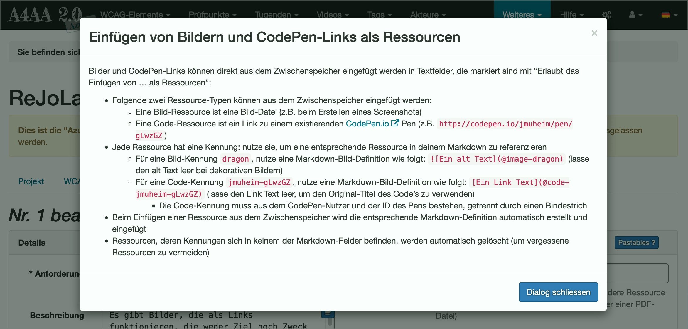
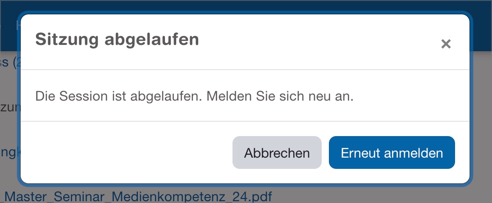

# ✅ Dialoge

WCAG-Kriterium: [📜 4.1.2a Erweiterte Steuerelemente (Widgets)](..)

## Beschreibung

Dialoge (auch Modale, Overlays, Lightboxes, etc. genannt) sind barrierefrei umgesetzt. Sie werden durch Screenreader korrekt angesagt.

## Prüfmethode (in Kürze)

**Screenreader:** Mit Dialogen interagieren und sicherstellen, dass sie sich wie erwartet verhalten.

## Prüfmethode für Web (ausführlich)

### Prüf-Schritte

Die Implementierungen von Dialogen können sich stark von einander unterscheiden.

Die folgende Anleitung ist eine Annäherung an die aus der Praxis gebräuchlichsten Konventionen (siehe unten). Sie muss beim Testen an die jeweilige Situation angepasst werden. Generell gilt: wenn eine einzige Anforderung nicht erfüllt wird, so ist im Normalfall das gesamte Element als unzugänglich einzustufen!

1. Seite öffnen
1. Dialog **mit Tastatur** alleine bedienen und prüfen:
    - ⚠️ Probleme mit Tastatur alleine sind unter [✅ Mit der Tastatur bedienbar](/de/wcag/2.1.1-tastatur/mit-der-tastatur-bedienbar) zu bemängeln!
    - Element zum Öffnen des Dialogs fokussieren und aktivieren (z.B. "AGBs lesen"-Link)!
    - Wird der Fokus in den Dialog hinein gesetzt?
        - **🙂 Beispiel:** Der Fokus wird auf ein interaktives Dialog-Element gesetzt (z.B. den "Schliessen"- oder "Bestätigen"-Schalter)
        - **🙄 Beispiel:** Der Fokus wird auf den gesamten Dialog gesetzt (mit `tabindex="0"`)
            - ⚠️ Für Screenreader nicht optimal, da dann der gesamte Dialog-Inhalt automatisch vorgelesen wird
        - **😡 Beispiel:** Der Fokus verharrt auf dem gerade aktivierten Element (z.B. "AGBs lesen"-Link) → `Tab` bewegt den Fokus im Hintergrund des Dialogs und springt irgendwann ggf. in den Dialog hinein
    - Kann mit `Tab` durch die interaktiven Elemente des Dialogs navigiert werden?
        - **🙂 Beispiel:** Alle Elemente werden erreicht: Dialog-eigene Elemente (etwa der "Schliessen"-Schalter) sowie interaktive Elemente im Inhalt (etwa Links oder Formular-Elemente)
        - **😡 Beispiel:** Elemente werden nicht erreicht
        - **😡 Beispiel:** Gewisse Elemente werden nur rückwärts (`Shift`-`Tab`) erreicht
    - Bei modal Dialog: Bleibt der Fokus auf den Dialog beschränkt?
        - **🙂 Beispiel:** Der Fokus erreicht die interaktiven Elemente im Hintergrund des Dialogs **nicht**
        - **🙄 Beispiel:** Der Fokus erreicht die interaktiven Elemente im Hintergrund des Dialogs → ist meistens kein Killer, sollte aber wenn möglich optimiert werden
    - Bei non-modal Dialog: Kann der Fokus den Dialog verlassen?
        - **🙂 Beispiel:** Der Fokus erreicht die interaktiven Elemente im Hintergrund des Dialogs
        - **😡 Beispiel:** Der Fokus erreicht die interaktiven Elemente im Hintergrund des Dialogs **nicht** (obwohl man z.B. mit der Maus Elemente im Hintergrund bedienen kann)
    - Wenn verschiebbar (Drag & Drop): kann der Dialog auch per Tastatur verschoben werden?
        - **🙂 Beispiel:** Der Dialog kann mit Tastatur verschoben werden → z.B. mit entsprechendem "Verschieben"-Schalter
        - **😡 Beispiel:** Der Dialog kann mit Tastatur **nicht** verschoben werden
    - Kann der Dialog mit `Esc` geschlossen werden?
        - **🙂 Beispiel:** Der Dialog wird geschlossen → Nice-to-Have
        - **🙄 Beispiel:** Der Dialog wird **nicht** geschlossen
    - Wird der Fokus beim Schliessen sinnvoll gesetzt?
        - **🙂 Beispiel:** Der Fokus wird wieder zurück gesetzt auf das **ursprüngliche** Element, mit welchem der Dialog geöffnet worden ist (z.B. "AGBs lesen"-Schalter)
        - **😡 Beispiel:** Der Fokus geht "verloren" → man startet mit `Tab` wieder am Anfang der Seite
    - ⚠️ Dialoge, die sich ohne das Zutun des Nutzers öffnen, sind schwierig zu testen (z.B. ein "Session verlängern"-Dialog), da man sie nicht beliebig triggern kann
        - Die Anforderungen an sie gelten sinngemäss, mit folgenden Eigenheiten:
            - Wenn der Dialog keine sofortige Interaktion fordert, muss der Fokus nicht automatisch in den Dialog gesetzt werden
                - **🙂 Beispiel:** Auf einer Webseite poppt eine Einladung zu einem Fragebogen auf; der Nutzer kann ihn ignorieren, oder per mehrmaligem Drücken von `Tab` hinein navigieren und damit interagieren.
            - Beim Schliessen kann der Fokus oft nicht sinnvoll zurück gesetzt werden, da es kein explizites **ursprüngliches** Element gibt, siehe auch [✅ Fokus-Führung](/de/wcag/2.4.3-fokus-reihenfolge/fokus-fuehrung)
    - ⚠️ Wenn der Dialog ein reiner Hinweis ist (ohne Schaltfläche oder sonstige interaktive Elemente), so handelt es sich eher um eine Status-Nachricht, siehe [✅ Statusmeldungen](/de/wcag/4.1.3-statusmeldungen/statusmeldungen).
1. Dialog wie zuvor bedienen, dieses mal **mit Screenreader** (ggf. Seite neu laden), und prüfen:
    - ⚠️ Bedienung dürfte in etwa gleich sein wie mit Tastatur alleine
    - Vermittelt der Screenreader beim Erreichen des aufrufenden Elements adäquat, dass sich ein Dialog öffnen wird?
        - **🙂 Beispiel:** "AGBs öffnen (zugeklappt)" → Nice-to-Have
        - **🙄 Beispiel:** "AGBs öffnen" → reicht auch ohne Hinweis
    - Haben alle grafischen Elemente einen sinnvollen Alternativtext?
        - **🙂 Beispiel:** "X"-Schalter (zum Schliessen) wird als "Dialog schliessen" angesagt
        - **🙂 Beispiel:** "X"-Schalter wird als "Schliessen" angesagt
        - **😡 Beispiel:** "X"-Schalter wird als "X" angesagt
    - Können die Inhalte im Browse-Mode gelesen werden?
        - **🙂 Beispiel:** Die Inhalte werden mit `Runter` schnell erreicht
        - **😡 Beispiel:** Die Inhalte werden mit `Runter` übersprungen (sie sind nur mit `Hoch` erreichbar)
        - **😡 Beispiel:** Die Inhalte werden nicht erreicht
    - Bei modal Dialog: Kann im Browse-Modus der Dialog verlassen (und die Inhalte im Hintergrund gelesen) werden?
        - **🙂 Beispiel:** Die Inhalte im Hintergrund können nicht gelesen werden
        - **🙄 Beispiel:** Die Inhalte im Hintergrund können gelesen werden → es ist aber klar, dass Dialog verlassen wurde
        - **😡 Beispiel:** Die Inhalte im Hintergrund können gelesen werden → es ist **nicht** klar, dass Dialog verlassen wurde

### Konventionen

- **Modale Dialoge** deaktivieren die umgebende Seite im Hintergrund, sodass zwingend erst mit dem Dialog interagiert werden muss.
- **Nicht-modale** Dialoge hingegen erlauben weiterhin das Lesen des (und Interagieren mit dem) Hintergrund.
- Sie zeigen normalerweise komplexe Inhalte an und sind oft relativ gross.
- Sie verfügen über eigene interaktive Elemente (z.B. "Bestätigen"- sowie "Abbrechen"-Schalter).
- Oft wird eine ausgefeilte ARIA-Implementierung verwendet (siehe [APG: Dialog (Modal) Pattern](https://www.w3.org/WAI/ARIA/apg/patterns/dialog-modal/))
    - Das HTML5-Element [`<dialog>`](https://developer.mozilla.org/en-US/docs/Web/HTML/Element/dialog) wird mittlerweile ebenfalls gut unterstützt
    - Es kann aber auch ein einfaches `
` o.ä. sein (siehe [ADG: Dialog](https://www.accessibility-developer-guide.com/examples/widgets/dialog/))

⚠️ Dem gegenüber stehen die kleineren und simpleren **Tooltips** / **Toggletips**, siehe [✅ Tooltips / Toggletips](/de/wcag/4.1.2a-erweiterte-steuerelemente-widgets/tooltips-toggletips).

## Prüfmethode für Mobile (Ergänzungen zu Web)

Einerseits können in einer Mobile App beliebige Web-Inhalte (inkl. Dialoge) eingebettet sein; andererseits gibt es auch native Implementierungen.

## Prüfmethode für PDF (Ergänzungen zu Web)

So komplexe interaktive Elemente gibt's in PDFs nicht.

## Details zum blinden Testen

Dialoge **müssen** sogar mit einem Screenreader wie [🏷️ NVDA Screenreader](/de/tags/nvda-screenreader) geprüft werden!

## Screenshots typischer Fälle

## Videos

Keine Videos verfügbar.
