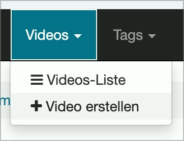
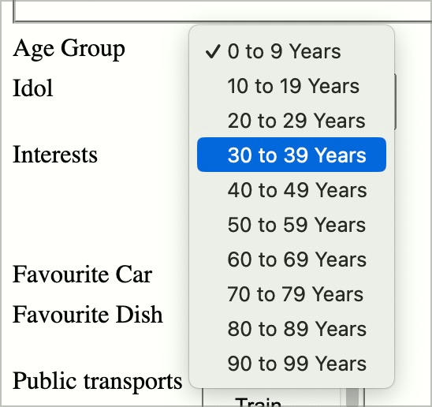
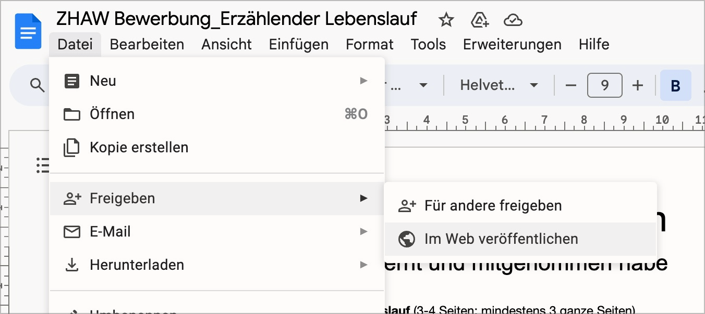

# ✅ Dropdowns (Aufklapp-Elemente)

WCAG-Kriterium: [📜 4.1.2a Erweiterte Steuerelemente (Widgets)](..)

## Beschreibung

Dropdowns (auch Mega-Dropdowns) sind barrierefrei umgesetzt. Sie werden durch Screenreader korrekt angesagt, ihr Status wird vermittelt (z.B. "erweitert" bzw. "reduziert"), der aktuelle Eintrag beim Navigieren der Optionen wird durch Screenreader vermittelt.

## Prüfmethode (in Kürze)

**Screenreader:** Mit Dropdowns interagieren und sicherstellen, dass sie sich wie erwartet verhalten.

## Prüfmethode für Web (ausführlich)

### Prüf-Schritte

Die Implementierungen von Dropdowns können sich stark von einander unterscheiden.

Die folgende Anleitung ist eine Annäherung an die aus der Praxis gebräuchlichsten Konventionen (siehe unten). Sie muss beim Testen an die jeweilige Situation angepasst werden. Generell gilt: wenn eine einzige Anforderung nicht erfüllt wird, so ist im Normalfall das gesamte Element als unzugänglich einzustufen!

1. Seite öffnen
1. Dropdown mit **Tastatur** alleine bedienen und prüfen:
    - ⚠️ Probleme mit Tastatur alleine sind unter [✅ Mit der Tastatur bedienbar](/de/wcag/2.1.1-tastatur/mit-der-tastatur-bedienbar) zu bemängeln!
    - Dropdown fokussieren und mit `Enter` und/oder `Hoch`/`Runter` öffnen
        - **🙂 Beispiel:** Das Element öffnet sich sowohl bei `Enter` als auch `Hoch/Runter`
        - **😡 Beispiel:** Das Element öffnet sich nicht
    - Können die ausgeklappten Optionen mit `Tab` und/oder `Hoch`/`Runter` erreicht werden?
        - **🙂 Beispiel:** Man kann durch die Optionen navigieren
        - **😡 Beispiel:** Man kann nicht durch die Optionen navigieren
    - Können die ausgeklappten Optionen mit `Enter` aktiviert werden?
        - **🙂 Beispiel:** Die Optionen können aktiviert werden
        - **😡 Beispiel:** Die Optionen können **nicht** aktiviert werden
    - Kann das Dropdown mit `Esc` (oder einem "X"-Schalter) geschlossen werden?
        - **🙂 Beispiel:** Er wird geschlossen → Nice-to-Have
        - **🙄 Beispiel:** Er wird nicht geschlossen → je nach Situation kann das dennoch inakzeptabel sein, siehe auch [✅ Inhalte per Hover oder Fokus](/de/wcag/1.4.13-eingeblendeter-inhalt-bei-darueberschweben-hover-oder-fokus/inhalte-per-hover-oder-fokus)
    - ⚠️ Bei komplexeren Elementen wie verschachtelten Navigationen ("Angebote → Dienstleistungen") oder Menü-Leisten (z.B. "Bearbeiten → Einfügen → Text") wird sinngemäss vorgegangen; manchmal sind hier auch die Tasten `Links`/`Rechts` oder `Tab` zu verwenden
1. Dropdown wie zuvor bedienen, dieses mal mit **Screenreader** (ggf. Seite neu laden), und prüfen:
    - Vermittelt der Screenreader die Rolle des Elements adäquat?
        - **🙂 Beispiel:** Es wird eine explizite Rolle ausgegeben, die einen Hinweis darauf gibt, dass das Element ausgeklappt werden kann, z.B. "Menü", "Menüleiste", "Menü-Eintrag", "Unter-Menü", "Kombinations-Feld" o.ä.
        - **🙂 Beispiel:** Es wird nur ein Klapp-Status ("eingeklappt" oder "ausgeklappt") ausgegeben → ⚠️ Dies reicht meistens vollauf (ein einfaches `aria-expanded`-Attribut genügt hierzu, siehe [🏷️ aria-expanded](/de/tags/aria-attribute/aria-expanded))
        - **😡 Beispiel:** Es wird weder ein Hinweis auf eine Rolle noch auf den Klapp-Status gegeben
    - Beim Öffnen/Schliessen: wird der Status vermittelt?
        - **🙂 Beispiel:** Es wird "Aufgeklappt" bzw. "Zugeklappt" ausgegeben
        - **🙂 Beispiel:** Oder "Menü öffnen" bzw. "Menü schliessen"
        - **🙂 Beispiel:** Oder "Menü geöffnet" bzw. "Menü geschlossen"
        - **😡 Beispiel:** Es wird nichts angesagt
    - Beim Schliessen mit `Esc`: wird der Status vermittelt?
        - **🙂 Beispiel:** "Zugeklappt"
        - **😡 Beispiel:** Es wird nichts angesagt

### Konventionen

#### Namensgebung

Die Nutzung des Begriffs "Dropdown" wird kontrovers diskutiert, da er zu allgemein sei (siehe z.B. [Adrian Roselli: Stop using 'drop-down'](https://adrianroselli.com/2020/03/stop-using-drop-down.html)). Auch die APG verwenden den Begriff nicht, sondern setzen auf [Disclosure (Show/Hide)](https://www.w3.org/WAI/ARIA/apg/patterns/disclosure/) (und weitere Begriffe, siehe unten). Bei uns hat sich "Dropdown" aber fest eingebürgert und bewährt, indem wir den Begriff weiter konkretisieren (siehe unten).

#### Funktionalitäten

- **Formular-Dropdowns** dienen dem Auswählen eines **Werts** (z.B. ob "Mann", "Frau" oder "Divers")
    - Sie sind meist ein Ersatz für traditionelle `<select>`-Elemente (denn diese können nur begrenzt visuell gestaltet werden)
    - Wenn zusätzlich nach einer Option gesucht werden kann, handelt es sich hingegen um Autocompletes (siehe [✅ Autocompletes (Comboboxen)](/de/wcag/4.1.2a-erweiterte-steuerelemente-widgets/autocompletes-comboboxen))
- **Navigations-Dropdowns** dienen dem Auswählen eines **Ziels** (z.B. "Gehe zu Login-Seite" oder "Gehe zu Startseite")
- **Aktions-Dropdowns** dienen dem Auswählen einer **Aktion**
    - Typischerweise in einer Auflistung von Elementen, z.B. "Bearbeite Nutzer X" oder "Lösche Artikel Y"
    - Oder als Menübar in einer komplexen Web-App, z.B. "Datei", "Bearbeiten", etc. in Google Docs → oft mehrstufig verschachtelt, z.B. "Datei → Neu" oder "Bearbeiten → Einfügen → Als Text"
- **Mega-Dropdowns** sind an sich Navigations-Dropdowns, beinhalten aber oft weitere Inhalte (z.B. Bilder oder mehrzeilige Texte) und sind deshalb deutlich grösser (oft so breit wie der Bildschirm)
- `Esc` erlaubt oft das Schliessen von Dropdowns

#### Implementierung

- Oft wird eine ausgefeilte ARIA-Implementierung verwendet, siehe:
    - [APG: Disclosure (Show/Hide) Pattern](https://www.w3.org/WAI/ARIA/apg/patterns/disclosure/)
    - [APG: Combobox Pattern](https://www.w3.org/WAI/ARIA/apg/patterns/combobox/)
    - [APG: Menu and Menubar Pattern](https://www.w3.org/WAI/ARIA/apg/patterns/menubar/)
    - [APG: Menu Button Pattern](https://www.w3.org/WAI/ARIA/apg/patterns/menu-button/))
- Es kann aber auch ein einfacher `<button>` o.ä. sein (siehe [ADG: Dropdowns](https://www.accessibility-developer-guide.com/examples/widgets/dropdown/))

⚠️ Für die Tastatur-Nutzung macht dies oft wenig Unterschied; mit Screenreader kann sich die Bedienung aber erheblich unterscheiden, was in Ordnung ist (Hauptsache, die Implementierung ist verständlich und zielführend nutzbar).

#### Abgrenzung

Dropdowns können **Toggletips** (siehe [✅ Tooltips / Toggletips](/de/wcag/4.1.2a-erweiterte-steuerelemente-widgets/tooltips-toggletips)) stark ähneln, enthalten aber typischerweise vor allem interaktive Elemente, also Menü-Einträge (und nicht hauptsächlich lesbare Inhalte).

## Screenshots typischer Fälle

## Videos

- [🎬 Bei Aufklappen eines Hamburger-Menüs wird der Fokus nicht in dasselbe gesetzt - Watson](/videos/bei-aufklappen-eines-hamburger-menues-wird-der-fokus-nicht-in-dasselbe-gesetzt-watson)
- [🎬 Hamburger-Menü mit aria-expanded (und direkt darunter liegendem Menü-Inhalt) - WOZ](/videos/hamburger-menue-mit-aria-expanded-und-direkt-darunter-liegendem-menue-inhalt-woz)
- [🎬 Hamburger-Menü schlecht umgesetzt (kein Schalter / aria-expanded, schlechte Benennung) - Atupri](/videos/hamburger-menue-schlecht-umgesetzt-kein-schalter-aria-expanded-schlechte-benennung-atupri)