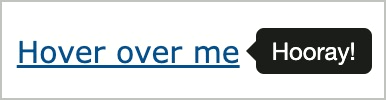
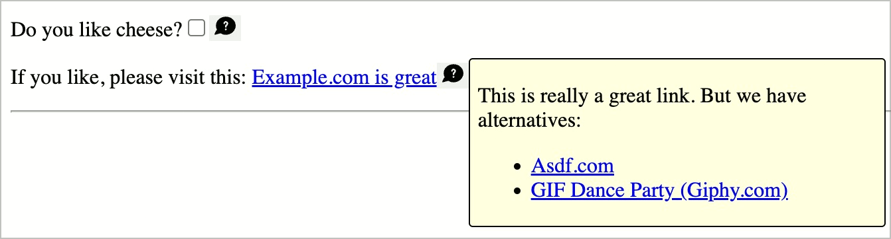

# ✅ Tooltips / Toggletips

WCAG-Kriterium: [📜 4.1.2a Erweiterte Steuerelemente (Widgets)](..)

## Beschreibung

Tooltips sind barrierefrei umgesetzt. Einfache, kurze Inhalte werden durch Screenreader sogleich angesagt. Beinhalten Tooltips komplexe Inhalte, so müssen diese manuell gelesen werden können (in diesem Fall handelt es sich eher um einen Dialog).

## Prüfmethode (in Kürze)

**Screenreader:** Mit Tooltips interagieren und sicherstellen, dass sie sich wie erwartet verhalten.

**Tastatur:** Obige Prozedur wiederholen.

## Prüfmethode für Web (ausführlich)

### Prüf-Schritte

Die Implementierungen von Tooltips / Toggletips können sich stark von einander unterscheiden.

Die folgende Anleitung ist eine Annäherung an die aus der Praxis gebräuchlichsten Konventionen (siehe unten). Sie muss beim Testen an die jeweilige Situation angepasst werden. Generell gilt: wenn eine einzige Anforderung nicht erfüllt wird, so ist im Normalfall das gesamte Element als unzugänglich einzustufen!

1. Seite öffnen
1. Tooltip / Toggletip mit Tastatur alleine bedienen und prüfen:
    - ⚠️ Probleme mit Tastatur alleine sind unter [✅ Mit der Tastatur bedienbar](/de/wcag/2.1.1-tastatur/mit-der-tastatur-bedienbar) zu bemängeln!
    - Element zum Öffnen des Tooltips / Toggletips fokussieren (z.B. visuell hervor gehobenes Akronym "WCAG" in einem Fliesstext)!
        - ⚠️ Tooltips werden bei Fokus automatisch eingeblendet; Toggletips müssen mit `Enter` aktiviert werden
    - Wird der Inhalt eingeblendet?
        - **🙂 Beispiel:** "Web Content Accessibility Guidelines" wird eingeblendet in einer Art "Sprechblase" oberhalb des Akronyms "WCAG"
        - **😡 Beispiel:** Es passiert nichts, weder bei Fokus noch mit `Enter`
    - Falls sich interaktive Elemente im Inhalt befinden: können diese per `Tab` erreicht werden?
        - **🙂 Beispiel:** Ein Link zu weiteren Informationen über die "WCAG" kann erreicht werden
        - **😡 Beispiel:** Ein solcher Link kann **nicht** erreicht werden
        - **😡 Beispiel:** Ein solcher Link kann nur rückwärts (`Shift`-`Tab`) erreicht werden
    - Kann der Tooltip / Toogletip mit `Esc` (oder einem "X"-Schalter) geschlossen werden?
        - **🙂 Beispiel:** Er wird geschlossen → Nice-to-Have
        - **🙄 Beispiel:** Er wird nicht geschlossen → je nach Situation kann das dennoch inakzeptabel sein, siehe auch [✅ Inhalte per Hover oder Fokus](/de/wcag/1.4.13-eingeblendeter-inhalt-bei-darueberschweben-hover-oder-fokus/inhalte-per-hover-oder-fokus)
1. Tooltip / Toggletip wie zuvor bedienen, dieses mal **mit Screenreader** (ggf. Seite neu laden), und prüfen:
    - ⚠️ Bedienung dürfte in etwa gleich sein wie mit Tastatur alleine
    - Bei Tooltip: Vermittelt der Screenreader beim Erreichen des Elements die zusätzlich angezeigte Information adäquat?
        - **🙂 Beispiel:** Zusätzlich zu "WCAG" wird "Web Content Accessibility Guidelines" angesagt
        - **😡 Beispiel:** "WCAG"
    - Bei Toggletip: Vermittelt der Screenreader beim Erreichen des Elements adäquat, dass sich zusätzliche Information öffnen lässt?
        - **🙂 Beispiel:** "Link WCAG (zugeklappt)" → oder Schalter
        - **🙄 Beispiel:** "WCAG (zugeklappt)" → ein expliziter Hinweis auf ein interaktives Element wäre besser
        - **😡 Beispiel:** "WCAG"
        - **😡 Beispiel:** "Link WCAG" → bei einem normalen Link erwartet der Nutzer, dass eine neue Seite geladen wird
        - **😡 Beispiel:** "Schalter WCAG" → bei einem normalen Schalter ist ebenfalls unklar, was passieren wird
    - Beim Öffnen/Schliessen mit `Enter`: wird der Status vermittelt?
        - **🙂 Beispiel:** Es wird "Aufgeklappt" bzw. "Zugeklappt" ausgegeben
        - **😡 Beispiel:** Es wird nichts angesagt
    - Kann der Inhalt gelesen werden?
        - **🙂 Beispiel:** Der Inhalt wird beim Aufklappen sofort vorgelesen
        - **🙂 Beispiel:** Der Inhalt wird mit `Runter` schnell erreicht
        - **😡 Beispiel:** Der Inhalt wird mit `Runter` übersprungen (er ist nur mit `Hoch` erreichbar)
        - **😡 Beispiel:** Der Inhalt wird nicht erreicht
    - Beim Schliessen mit `Esc`: wird der Status vermittelt?
        - **🙂 Beispiel:** "Zugeklappt"
        - **😡 Beispiel:** Es wird nichts angesagt
    - Haben alle grafischen Elemente einen sinnvollen Alternativtext?
        - **🙂 Beispiel:** "X"-Schalter (zum Schliessen) wird als "Tooltip schliessen" angesagt
        - **🙂 Beispiel:** "X"-Schalter wird als "Schliessen" angesagt
        - **😡 Beispiel:** "X"-Schalter wird als "X" angesagt

### Konventionen

- **Tooltips** zeigen nur einfachen, kaum strukturierten Text an und sind im Normalfall sehr klein. Sie werden über, unter, links oder rechts von einem Element angezeigt bei Hover oder Fokus desselben
- Manchmal können/müssen sie bei Fokus mit `Enter` ein-/ausgeblendet werden → dann werden sie **Toggletips** genannt.
- Auch `Esc` erlaubt oft das Schliessen von fokussierten Tooltips / Toggletips.
- Sie beinhalten meist keine interaktiven Elemente, sondern nur einfachen Text.
- Oft wird eine ausgefeilte ARIA-Implementierung verwendet (siehe [APG: Tooltip Pattern](https://www.w3.org/WAI/ARIA/apg/patterns/tooltip/))
    - Es kann aber auch ein einfaches `` o.ä. sein (siehe [ADG: Tooltip](https://www.accessibility-developer-guide.com/examples/widgets/tooltips/))
- Toggletips können **Dropdowns** (siehe [✅ Dropdowns (Aufklapp-Elemente)](/de/wcag/4.1.2a-erweiterte-steuerelemente-widgets/dropdowns-aufklapp-elemente)) stark ähneln, enthalten aber typischerweise vor allem lesbare Inhalte (und nicht hauptsächlich interaktive Elemente, also Menü-Einträge)

⚠️ Dem gegenüber stehen die grösseren und komplexeren **Dialoge**, siehe [✅ Dialoge](/de/wcag/4.1.2a-erweiterte-steuerelemente-widgets/dialoge).

## Screenshots typischer Fälle

