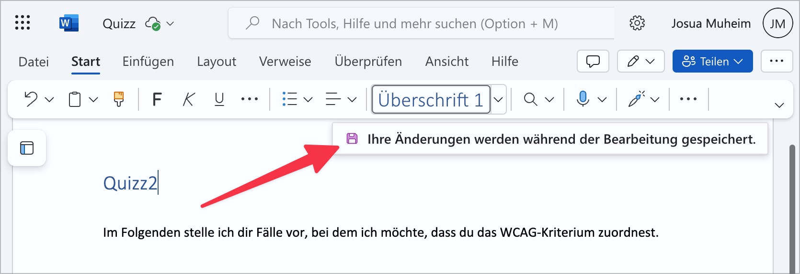
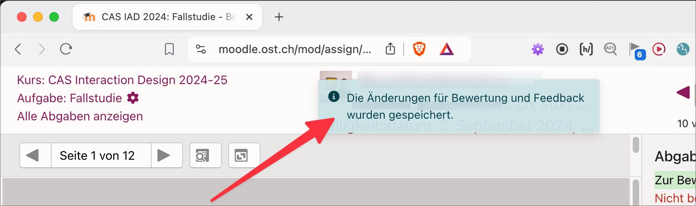

# ✅ Statusmeldungen

WCAG-Kriterium: [📜 4.1.3 Statusmeldungen - AA](..)

## Beschreibung

Statusmeldungen sind für assistierende Technologien zugänglich und überstrapazieren den Audiokanal nicht.

## Prüfmethode (in Kürze)

**Screenreader:** Sicherstellen, dass Statusmeldungen sich wie erwartet verhalten.

## Prüfmethode für Web (ausführlich)

### Prüf-Schritte

1. Seite öffnen
1. Sicherstellen, dass Status-Nachrichten in [🏷️ NVDA Screenreader](/de/tags/nvda-screenreader) ausgegeben werden
    - **🙂 Beispiel:** Auf einer Such-Seite werden die Such-Filter angepasst, wodurch die Ergebnisse neu geladen werden (ohne Neuladen der Seite); der Hinweis "15 Such-Resultate gefunden" wird vom Screenreader angesagt.
        - **😡 Beispiel:** Es wird vom Screenreader nichts angesagt.
    - **🙂 Beispiel:** In einem Online-Shop wird ein Artikel in den Warenkorb gelegt, wodurch die Zahl beim Warenkorb-Symbol um 1 hochgezählt wird (ohne Neuladen der Seite); der Screenreader sagt "Artikel hinzugefügt", "4 Artikel im Warenkorb" oder ähnlich.
        - **🙄 Beispiel:** Der Screenreader sagt nur die Zahl an, z.B. "4" → ⚠️ Kann in gewissen Fällen okay sein, aber wir empfehlen normalerweise, hier etwas aussagekräftigere Status-Nachrichten anzubieten
        - **😡 Beispiel:** Es wird vom Screenreader nichts angesagt.
    - **🙂 Beispiel:** Beim Absenden eines Formulars erkennt das System fehlerhafte Eingaben und zeigt eine allgemeine Fehler-Meldung oberhalb des Formulars an (ohne Neuladen der Seite); der Screenreader sagt "Vier fehlerhafte Eingaben", "Bitte korrigieren Sie Vorname, Alter und Email" oder ähnlich.
        - **🙄 Beispiel:** Statt einer allgemeinen Fehler-Meldung wird für jedes fehlerhafte Eingabefeld eine Meldung angesagt, in etwa "Vorname ist Pflichtfeld, Alter muss eine Zahl sein, Email hat falsches Format" → ⚠️ Kann durchaus sinnvoll sein, allerdings wird es bei vielen Eingabefeldern schnell mal zuviel
            - **🙄 Beispiel:** Diese einzelnen Fehler-Meldungen werden nicht beim Abschicken des Formulars angesagt, sondern jeweils einzeln gleich beim Verlassen (`onblur`) eines Eingabefelds (und springen zum nächsten) → ⚠️ Dies ist verwirrend, weil die Fehler-Meldung des vorherigen Eingabefelds zusammen mit dem nachfolgenden Feld ausgegeben wird.
                - **🙄 Beispiel:** Die einzelnen Fehler-Meldungen werden nicht erst beim Verlassen des Eingabefelds ausgegeben, sondern schon während der Eingabe (mit leichter Verzögerung, sodass nicht gleich nach jedem eingegebenen Buchstaben die Status-Nachricht getriggert wird, sondern erst wenn der Nutzer eine kurze Pause macht) → ⚠️ Kann sinnvoll sein, führt aber schnell zur Überstrapazierung des Audiokanals
                    - **😡 Beispiel:** Es gibt keine Verzögerung - man hört vor lauter Fehler-Meldungen kaum noch etwas anderes!
        - **😡 Beispiel:** Es wird vom Screenreader nichts angesagt.
    - **🙂 Beispiel:** Ein eingeloggter Nutzer erhält die Meldung "Sie werden in 2 Minuten ausgeloggt, bitte hier klicken zum Verlängern" (mit einem entsprechenden Schalter); der Hinweis wird vom Screenreader ausgegeben.
        - ⚠️ Hier macht es zudem Sinn, den Tastatur-Fokus direkt auf die Meldung (bzw. den Schalter) zu setzen, damit der Nutzer die Sitzung sofort verlängern kann.
        - **😡 Beispiel:** Es wird vom Screenreader nichts angesagt.
    - **🙂 Beispiel:** Eine Minute vor Ablauf einer Online-Auktion erscheint eine Meldung "Auktion wird in 60 Sekunden beendet"; der Hinweis wird vom Screenreader ausgegeben.
        - ⚠️ Hier macht es keinen Sinn, den Tastatur-Fokus auf die Meldung zu setzen, denn der Nutzer kann hier nichts ändern.
        - **😡 Beispiel:** Es wird vom Screenreader nichts angesagt.

⚠️ Gewisse Status-Nachrichten lassen sich nicht manuell auslösen, was es schwierig macht, sie zu prüfen (z.B. "Ihre Sitzung läuft bald ab"). Hier muss ggf. mit dem Seitenbetreiber geschaut werden, ob solche Status-Nachrichten existieren, und wie man sie testen kann.

## Prüfmethode für Mobile (Ergänzungen zu Web)

Sowohl auf Web-Views als auch native Inhalte 1:1 übertragbar.

## Prüfmethode für PDF (Ergänzungen zu Web)

Auf PDF nicht anwendbar.

## Details zum blinden Testen

Nur sehr eingeschränkt testbar - wenn es nicht korrekt implementiert ist, weiss der Screenreader-Nutzer oft gar nicht, dass eine Status-Meldung angezeigt wird.

Generell gilt ja: wenn der Screenreader-Nutzer etwas tut, muss in irgendeiner Form eine Rückmeldung passieren. Etwa wenn er einen Schalter "Nur ungelesene Nachrichten anzeigen" drückt: dies kann manchmal eine Statusmeldung triggern ("Es werden 13 Nachrichten angezeigt" o.ä.), oft passiert es aber auch durch andere Techniken (etwa indem `aria-pressed` auf `true` gesetzt wird und der Screenreader deshalb "Gedrückt" o.ä. ausgibt).

## Screenshots typischer Fälle

## Videos

- [🎬 Bei Aufklappen eines Hamburger-Menüs wird der Fokus nicht in dasselbe gesetzt - Watson](/de/videos/bei-aufklappen-eines-hamburger-menues-wird-der-fokus-nicht-in-dasselbe-gesetzt-watson)
- [🎬 Bei Auswählen eines Menü-Eintrags erfolgt keine Rückmeldung durch Screenreader - EWB](/de/videos/bei-auswaehlen-eines-menue-eintrags-erfolgt-keine-rueckmeldung-durch-screenreader-ewb)
- [🎬 Hamburger-Menü mit aria-expanded (und direkt darunter liegendem Menü-Inhalt) - WOZ](/de/videos/hamburger-menue-mit-aria-expanded-und-direkt-darunter-liegendem-menue-inhalt-woz)