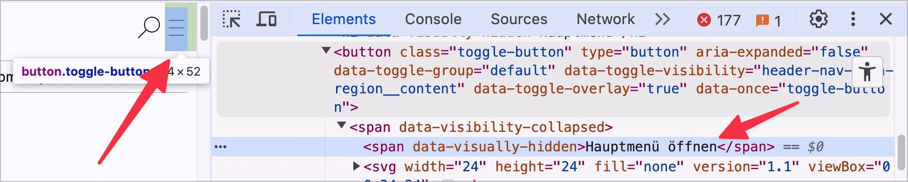
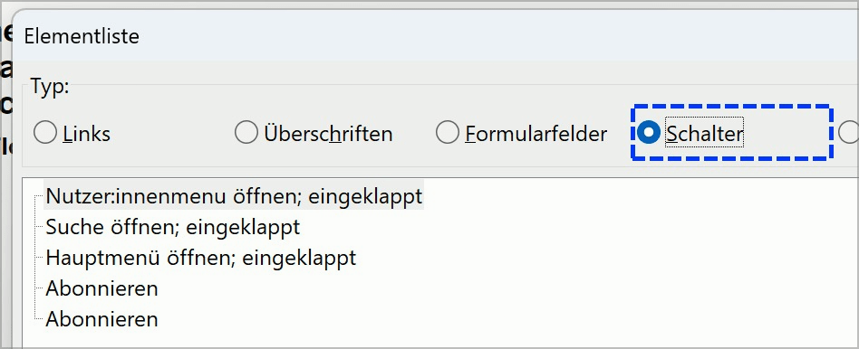

# Checkpoint: Graphic buttons

## Description

Graphic buttons are correctly labeled.

## Method

**Web Developer Toolbar:** Images > Display Alt Attributes: Match displayed alternative texts with images.

## Details on web applicability (specific test steps)

🇩🇪 Currently only available in German.

## Screenshots

