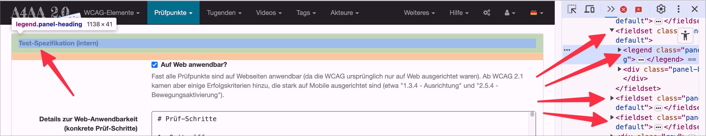

# Checkpoint: Feldset / Legend

## Description

In extensive forms, form fields with related content are grouped using the `<fieldset>`/`<legend>` combination.

## Method

In extensive forms, form fields with related content are grouped using the `<fieldset>`/`<legend>` combination.

## Details on web applicability (specific test steps)

🇩🇪 Currently only available in German.

## Screenshots

