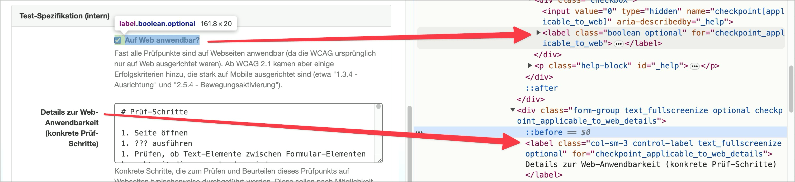

# Checkpoint: Form fields Labels

## Description

Form fields have correctly linked labels.

## Method

**Mouse:** Click on label and check whether the keyboard focus jumps to/selects the input field.

**Screen reader:** Navigate through input fields using the Tab key and check whether `<label>` elements are also output.

## Details on web applicability (specific test steps)

🇩🇪 Currently only available in German.

## Screenshots

