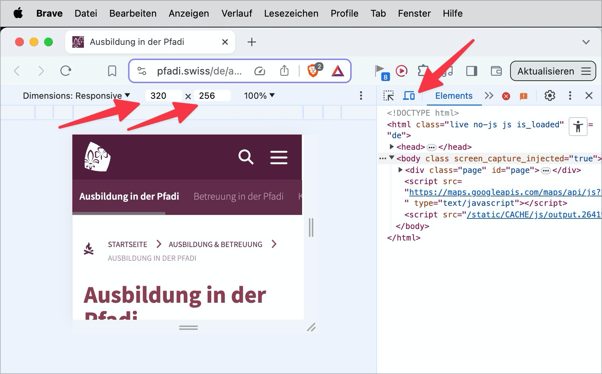

# Checkpoint: Viewport minimum dimensions

## Description

Content can be displayed without restrictions (e.g. overlapping) and without horizontal scrolling in the viewport minimum dimensions of `320x256` CSS pixels. This corresponds to an enlargement to 400%.

## Method

**Browser:** Gradually increase the zoom to 400% and ensure that no display problems occur (e.g. overlapping) and that scrolling is only necessary in one direction at most.

## Details on web applicability (specific test steps)

🇩🇪 Currently only available in German.

## Screenshots

