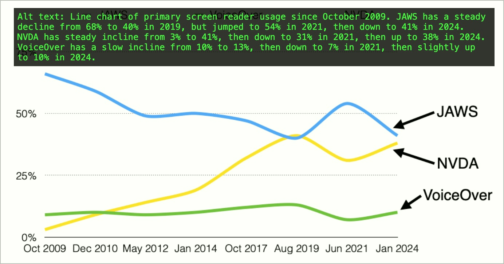
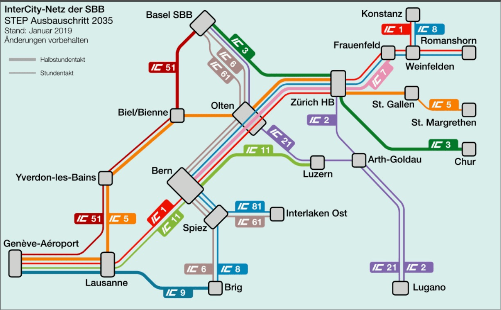
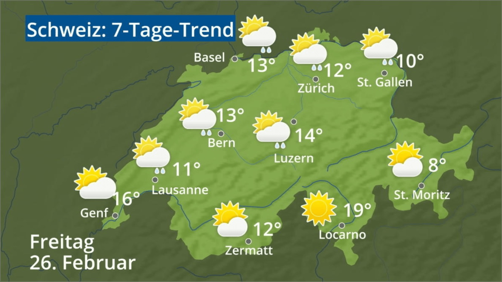

# ✅ Complex graphics

Wcag criterion: [📜 1.1.1 Non-text Content - A](..)

## Description

If alternative text is not sufficient (e.g. for complex graphics such as infographics or diagrams), a long description is provided and referred to in the alternative text.

## Method

**Web Developer Toolbar:** Images > Display Alt Attributes: Compare displayed alternative texts and long descriptions with images.

## Details on web applicability (specific test steps)

🇩🇪 Currently only available in German.

## Details on mobile applicability (additions to web)

🇩🇪 Currently only available in German.

## Details on PDF applicability (additions to web)

🇩🇪 Currently only available in German.

## Blind testable details

🇩🇪 Currently only available in German.

## Screenshots

## Videos

- [🎬 Diagramm ohne Alt-Attribut - EWB Portal](/en/videos/diagramm-ohne-alt-attribut-ewb-portal)
