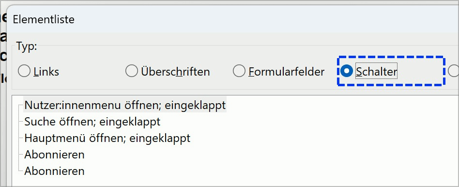
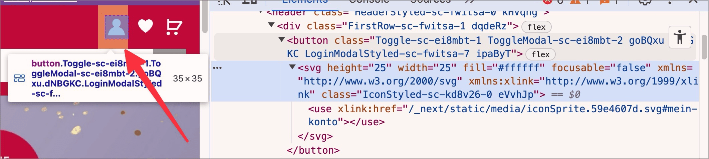

# ✅ Graphic buttons

Wcag criterion: [📜 1.1.1 Non-text Content - A](..)

## Description

Graphic buttons are correctly labeled.

## Method

**Web Developer Toolbar:** Images > Display Alt Attributes: Match displayed alternative texts with images.

## Details on web applicability (specific test steps)

🇩🇪 Currently only available in German.

## Details on mobile applicability (additions to web)

🇩🇪 Currently only available in German.

## Details on PDF applicability (additions to web)

🇩🇪 Currently only available in German.

## Blind testable details

🇩🇪 Currently only available in German.

## Screenshots

## Videos

- [🎬 Hamburger-Menü schlecht umgesetzt (kein Schalter / aria-expanded, schlechte Benennung) - Atupri](/en/videos/hamburger-menu-schlecht-umgesetzt-kein-schalter-aria-expanded-schlechte-benennung-atupri)
- [🎬 Schalter ohne Namen - EWB](/en/videos/schalter-ohne-namen-ewb)