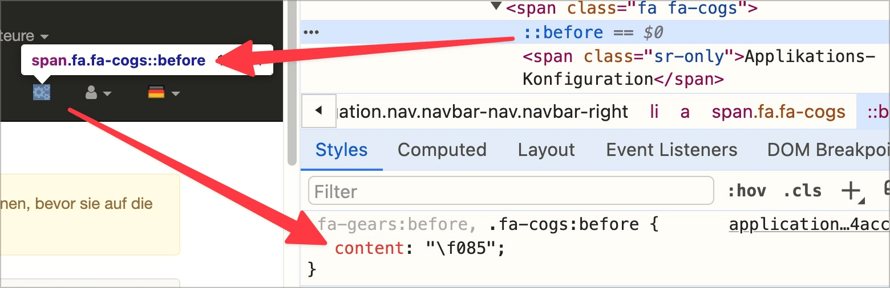

# ✅ Graphic symbols

Wcag criterion: [📜 1.1.1 Non-text Content - A](..)

## Description

Graphic symbols (e.g. web fonts or emojis) are implemented in such a way that they do not lead to incomprehensible output by screen readers.

## Method

**Screenreader:** Read out symbols and ensure that no unexpected/inappropriate output occurs.

## Details on web applicability (specific test steps)

🇩🇪 Currently only available in German.

## Details on mobile applicability (additions to web)

🇩🇪 Currently only available in German.

## Details on PDF applicability (additions to web)

🇩🇪 Currently only available in German.

## Blind testable details

🇩🇪 Currently only available in German.

## Screenshots

## Videos

🇩🇪 Currently only available in German.
