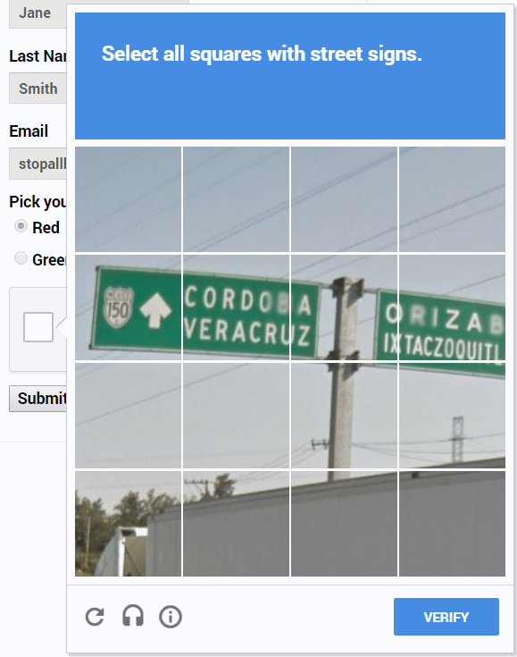
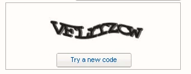
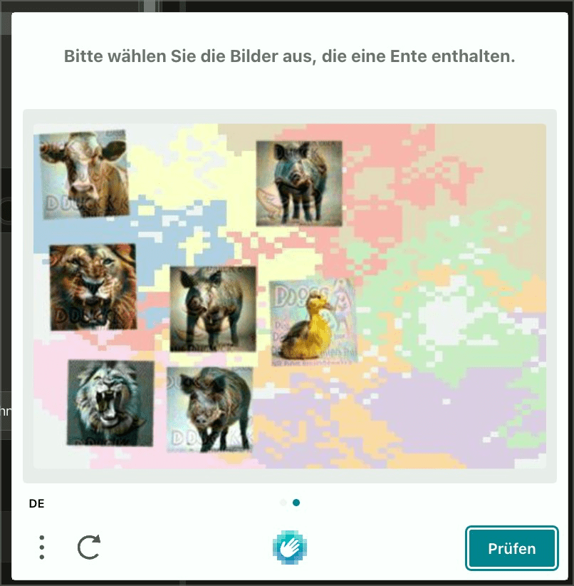

# ✅ Graphical CAPTCHAs

Wcag criterion: [📜 1.1.1 Non-text Content - A](..)

## Description

Graphical CAPTCHAs offer an alternative (e.g. audio CAPTCHA).

## Method

**Screenreader:** Try to submit the captcha successfully.

## Details on web applicability (specific test steps)

🇩🇪 Currently only available in German.

## Screenshots

