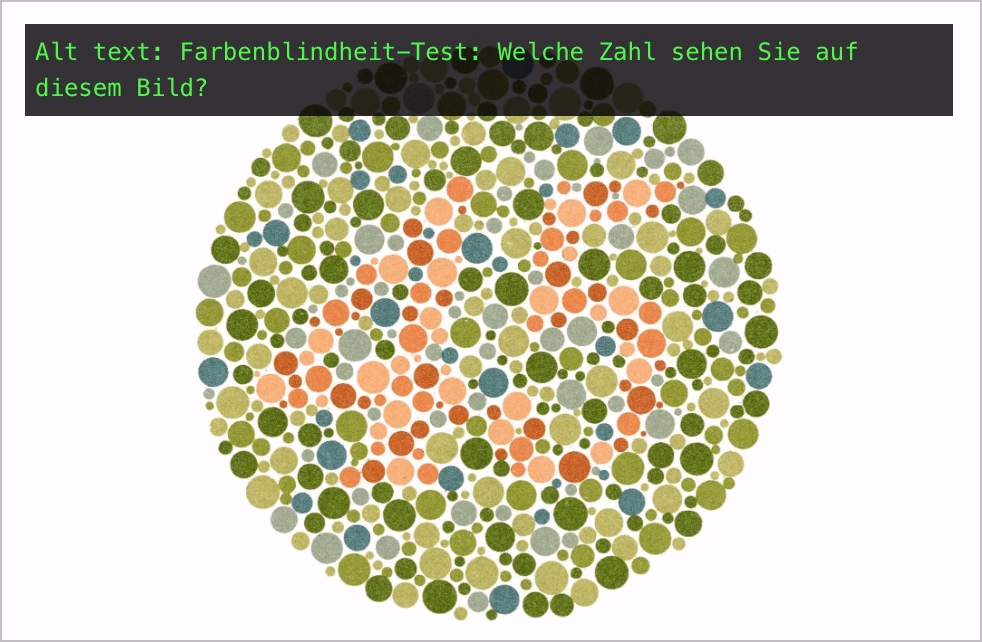

# ✅ Graphical tests and exercises

Wcag criterion: [📜 1.1.1 Non-text Content - A](..)

## Description

Tests and exercises whose content must consist of non-text content have an alternative text that describes their purpose (without the information needed to pass the test or exercise).

## Method

**Web Developer Toolbar:** Images > Display Alt Attributes: Compare displayed alternative text with content: Does this appropriately describe the purpose of the content?

## Details on web applicability (specific test steps)

🇩🇪 Currently only available in German.

## Details on mobile applicability (additions to web)

🇩🇪 Currently only available in German.

## Details on PDF applicability (additions to web)

🇩🇪 Currently only available in German.

## Blind testable details

🇩🇪 Currently only available in German.

## Screenshots

